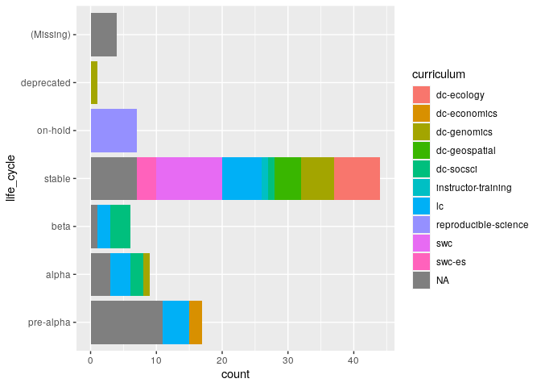
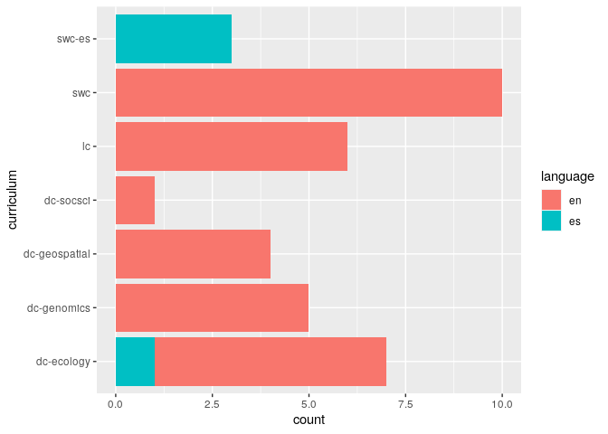

# Setup

The source for all the repositories is located at
<https://carpentries.github.io/curriculum-feed/carpentries_lessons.json>.
To avoid having to pull from it multiple times I’m going to set up a
folder:

``` r
library("fs")       # Filesystem navigation
library("jsonlite") # parsing JSON files
library("purrr")    # handling lists (JSON files)
library("dplyr")    # handling data frames and magic
library("tidyr")    # separating values
library("ggplot2")  # visualization
library("forcats")  # ordering factors
library("magrittr") # for the %T>% pipe I love so well
library("gh")       # accessing GitHub's API
library("polite")   # being respectful when downloading files
library("here")     # so I can always remember where I started
library("pegboard") # parsing and analysis of carpentries episodes
library("git2r")    # downloading github repositories
library("waldo")    # comparing objects
```

``` r
raw_data <- here::here("data", "raw")
raw_lessons <- fs::path(raw_data, "carpentries_lessons.json")
if (fs::file_exists(raw_lessons)) {
  
} else {
  fs::dir_create(raw_data)
  res <- download.file(
    url = "https://carpentries.github.io/curriculum-feed/carpentries_lessons.json",
    destfile = raw_lessons
  )
  if (res == 0L) {
    fs::file_chmod(raw_lessons, "a-wx")
  }
}
```

    ## NULL

``` r
lessons <- read_json(raw_lessons, simplifyVector = FALSE) %>%
  purrr::map_dfr(.f = dplyr::as_tibble) %>%
  dplyr::mutate_if(is.character, 
    ~dplyr::if_else(. == "NA", as.character(NA), .)) %>%
  dplyr::mutate(life_cycle = forcats::fct_relevel(life_cycle,
      "pre-alpha", "alpha", "beta", "stable", "on-hold", "deprecated"
    )) %>%
  dplyr::mutate(life_cycle = forcats::fct_explicit_na(life_cycle)) %>%
  print()
```

    ## # A tibble: 88 x 6
    ##    repository        curriculum   life_cycle language `_row` URL                
    ##    <chr>             <chr>        <fct>      <chr>    <chr>  <chr>              
    ##  1 capstone-novice-… <NA>         pre-alpha  en       1      <NA>               
    ##  2 lc-spreadsheets   lc           beta       en       2      https://github.com…
    ##  3 rr-automation     reproducibl… on-hold    en       3      https://github.com…
    ##  4 lesson-example    <NA>         stable     en       4      https://github.com…
    ##  5 git-novice-es     swc-es       stable     es       5      https://github.com…
    ##  6 shell-economics   dc-economics pre-alpha  en       6      https://github.com…
    ##  7 openrefine-ecolo… dc-ecology   stable     en       7      https://github.com…
    ##  8 python-humanitie… <NA>         pre-alpha  en       8      <NA>               
    ##  9 hg-novice         swc          stable     en       9      https://github.com…
    ## 10 spreadsheet-huma… <NA>         pre-alpha  en       10     <NA>               
    ## # … with 78 more rows

# First look at available lessons

I’m going to take a look at all of the software carpentry lessons first.
There are currently 88 available lessons, but they are in different
stages of completion:

``` r
ggplot(lessons, aes(y = life_cycle, fill = curriculum)) +
  geom_bar(orientation = "y")
```

<!-- -->

Let’s inspect the ones that are stable and then look at the ones that
are lower down, first we should filter for those that are stable and
actually have GitHub URLs:

``` r
stable <- lessons %>% filter(
  life_cycle == "stable", 
  curriculum != "instructor-training",
  !is.na(curriculum), # these are template repositories
  !is.na(URL)         # no GitHub URL is not very useful for me
)
stable
```

    ## # A tibble: 36 x 6
    ##    repository       curriculum life_cycle language `_row` URL                   
    ##    <chr>            <chr>      <fct>      <chr>    <chr>  <chr>                 
    ##  1 git-novice-es    swc-es     stable     es       5      https://github.com/sw…
    ##  2 openrefine-ecol… dc-ecology stable     en       7      https://github.com/da…
    ##  3 hg-novice        swc        stable     en       9      https://github.com/sw…
    ##  4 matlab-novice-i… swc        stable     en       11     https://github.com/sw…
    ##  5 r-novice-inflam… swc        stable     en       12     https://github.com/sw…
    ##  6 spreadsheet-eco… dc-ecology stable     en       13     https://github.com/da…
    ##  7 python-novice-g… swc        stable     en       16     https://github.com/sw…
    ##  8 lc-data-intro    lc         stable     en       19     https://github.com/Li…
    ##  9 R-ecology-lesson dc-ecology stable     en       20     https://github.com/da…
    ## 10 git-novice       swc        stable     en       24     https://github.com/sw…
    ## # … with 26 more rows

I end up with 36 repositories to play with:

``` r
ggplot(stable, aes(y = curriculum, fill = language)) +
  geom_bar(orientation = "y")
```

<!-- -->

# Inspection of repository features

I will use the {gh} package to inspect the features of each repository:

  - tags
  - directory structure
  - dependencies

I can use the GitHub API to get the contents of the repositories:
<https://developer.github.com/v3/repos/contents/#get-contents>. The {gh}
package allows me to write the responses to disk so that I don’t have to
query every time I want to re-run the analysis. If I wanted to do this
with fresh data, all I would need to do is to clear the data folder.

One of the tripping points here is that not all of the repositories will
have `_episodes_rmd/` directories, so I will need to walk over these
with `purrr::possibly()`, a nice little failsafe function.

``` r
safegh <- purrr::possibly(gh::gh, otherwise = list(NA))

rmd_episodes <- function(owner, repo) {
  safegh <- purrr::slowly(
    f    = purrr::possibly(gh::gh, otherwise = list(NA)),
    rate = rate_delay(pause = 2)
  )
  OR <- glue::glue("{owner}--{repo}")
  safegh("/repos/:owner/:repo/contents/_episodes_rmd", 
    owner = owner, 
    repo = repo, 
    .destfile = here::here(fs::path("data", "rmd_JSON", OR, ext = "json"))
  )
}

vorhees <- purrr::possibly(jsonlite::read_json, otherwise = list())

lesson_has_rmd <- . %>%
  tidyr::separate(URL, into = c(NA, NA, NA, "user", NA), sep = "/", remove = FALSE) %>%
  mutate(user = purrr::walk2(.x = user, .y = repository, .f = rmd_episodes)) %>%
  mutate(JSON = purrr::map2(.x = user, .y = repository,
    .f = ~vorhees(
      here::here("data", "rmd_JSON", glue::glue("{.x}--{.y}.json"))
    )
  )) %>%
  filter(repository == "R-ecology-lesson" | lengths(JSON) > 2)
has_rmd <- stable %>% lesson_has_rmd
has_rmd_all <- lessons %>% 
  lesson_has_rmd %>% 
  filter(repository != "lesson-example") %>%
  arrange(life_cycle)
```

    ## Warning: Expected 5 pieces. Additional pieces discarded in 1 rows [6].

    ## Warning in open.connection(con, "rb"): cannot open file '/home/zhian/Documents/
    ## Carpentries/Git/zkamvar--postmaul/data/rmd_JSON/NA--capstone-novice-spreadsheet-
    ## biblio.json': No such file or directory

    ## Warning in open.connection(con, "rb"): cannot open file '/home/zhian/Documents/
    ## Carpentries/Git/zkamvar--postmaul/data/rmd_JSON/NA--python-humanities-
    ## lesson.json': No such file or directory

    ## Warning in open.connection(con, "rb"): cannot open file '/home/zhian/Documents/
    ## Carpentries/Git/zkamvar--postmaul/data/rmd_JSON/NA--spreadsheet-humanities-
    ## lesson.json': No such file or directory

    ## Warning in open.connection(con, "rb"): cannot open file '/home/zhian/Documents/
    ## Carpentries/Git/zkamvar--postmaul/data/rmd_JSON/NA--R-genomics.json': No such
    ## file or directory

    ## Warning in open.connection(con, "rb"): cannot open file '/home/zhian/Documents/
    ## Carpentries/Git/zkamvar--postmaul/data/rmd_JSON/NA--geospatial-python.json': No
    ## such file or directory

    ## Warning in open.connection(con, "rb"): cannot open file '/home/zhian/Documents/
    ## Carpentries/Git/zkamvar--postmaul/data/rmd_JSON/NA--deep-learning_intro.json':
    ## No such file or directory

    ## Warning in open.connection(con, "rb"): cannot open file '/home/zhian/Documents/
    ## Carpentries/Git/zkamvar--postmaul/data/rmd_JSON/NA--docker-introduction.json':
    ## No such file or directory

    ## Warning in open.connection(con, "rb"): cannot open file '/home/zhian/Documents/
    ## Carpentries/Git/zkamvar--postmaul/data/rmd_JSON/NA--sql-humanities-lesson.json':
    ## No such file or directory

    ## Warning in open.connection(con, "rb"): cannot open file '/home/zhian/Documents/
    ## Carpentries/Git/zkamvar--postmaul/data/rmd_JSON/NA--NA.json': No such file or
    ## directory

    ## Warning in open.connection(con, "rb"): cannot open file '/home/zhian/Documents/
    ## Carpentries/Git/zkamvar--postmaul/data/rmd_JSON/NA--Data-Science-for-Docs.json':
    ## No such file or directory

    ## Warning in open.connection(con, "rb"): cannot open file '/home/zhian/Documents/
    ## Carpentries/Git/zkamvar--postmaul/data/rmd_JSON/NA--gap-lesson.json': No such
    ## file or directory

    ## Warning in open.connection(con, "rb"): cannot open file '/home/zhian/Documents/
    ## Carpentries/Git/zkamvar--postmaul/data/rmd_JSON/NA--git-Rstudio-course.json': No
    ## such file or directory

    ## Warning in open.connection(con, "rb"): cannot open file '/home/zhian/Documents/
    ## Carpentries/Git/zkamvar--postmaul/data/rmd_JSON/NA--jupyter-notebooks-
    ## intro.json': No such file or directory

    ## Warning in open.connection(con, "rb"): cannot open file '/home/zhian/Documents/
    ## Carpentries/Git/zkamvar--postmaul/data/rmd_JSON/NA--shell-extras.json': No such
    ## file or directory

    ## Warning in open.connection(con, "rb"): cannot open file '/home/zhian/Documents/
    ## Carpentries/Git/zkamvar--postmaul/data/rmd_JSON/NA--NA.json': No such file or
    ## directory
    
    ## Warning in open.connection(con, "rb"): cannot open file '/home/zhian/Documents/
    ## Carpentries/Git/zkamvar--postmaul/data/rmd_JSON/NA--NA.json': No such file or
    ## directory

    ## Warning in open.connection(con, "rb"): cannot open file '/home/zhian/
    ## Documents/Carpentries/Git/zkamvar--postmaul/data/rmd_JSON/NA--python-packaging-
    ## publishing.json': No such file or directory

    ## Warning in open.connection(con, "rb"): cannot open file '/home/zhian/Documents/
    ## Carpentries/Git/zkamvar--postmaul/data/rmd_JSON/NA--NA.json': No such file or
    ## directory

    ## Warning in open.connection(con, "rb"): cannot open file '/home/zhian/Documents/
    ## Carpentries/Git/zkamvar--postmaul/data/rmd_JSON/NA--jupyter_maps.json': No such
    ## file or directory

    ## Warning in open.connection(con, "rb"): cannot open file '/home/zhian/Documents/
    ## Carpentries/Git/zkamvar--postmaul/data/rmd_JSON/NA--IoT_arduino_nano.json': No
    ## such file or directory

    ## Warning in open.connection(con, "rb"): cannot open file '/home/zhian/Documents/
    ## Carpentries/Git/zkamvar--postmaul/data/rmd_JSON/NA--OpenRefine-humanities-
    ## lesson.json': No such file or directory

After parsing, we find that we have RMarkdown files for a grand total of
16 lessons and 8 stable lessons. From here, we can grab these lessons to
see if we can build them with our docker container.

## Lessons that use R

Below is a table with all the lessons the use R in our curriculum. There
are links within the table that take you further down this document to
display a diff between output from R 3.6 and R 4.0. One issue with these
diffs is that sometimes the ordering of messages shifts the entire diff,
but for the most part, it’s clear where they came from.

``` r
has_rmd_all %>% 
  mutate(results = glue::glue("[results](#lesson-{repository})")) %>%
  select(URL, curriculum, life_cycle, language, results) %>%
  knitr::kable()
```

| URL                                                           | curriculum           | life\_cycle | language | results                                       |
| :------------------------------------------------------------ | :------------------- | :---------- | :------- | :-------------------------------------------- |
| <https://github.com/LibraryCarpentry/lc-r>                    | lc                   | pre-alpha   | en       | [results](#lesson-lc-r)                       |
| <https://github.com/datacarpentry/genomics-r-intro>           | dc-genomics          | alpha       | en       | [results](#lesson-genomics-r-intro)           |
| <https://github.com/swcarpentry/r-novice-inflammation>        | swc                  | stable      | en       | [results](#lesson-r-novice-inflammation)      |
| <https://github.com/datacarpentry/R-ecology-lesson>           | dc-ecology           | stable      | en       | [results](#lesson-R-ecology-lesson)           |
| <https://github.com/swcarpentry/r-novice-gapminder>           | swc                  | stable      | en       | [results](#lesson-r-novice-gapminder)         |
| <https://github.com/datacarpentry/organization-geospatial>    | dc-geospatial        | stable      | en       | [results](#lesson-organization-geospatial)    |
| <https://github.com/swcarpentry/r-novice-gapminder-es>        | swc-es               | stable      | es       | [results](#lesson-r-novice-gapminder-es)      |
| <https://github.com/datacarpentry/r-intro-geospatial>         | dc-geospatial        | stable      | en       | [results](#lesson-r-intro-geospatial)         |
| <https://github.com/datacarpentry/r-raster-vector-geospatial> | dc-geospatial        | stable      | en       | [results](#lesson-r-raster-vector-geospatial) |
| <https://github.com/datacarpentry/r-socialsci>                | dc-socsci            | stable      | en       | [results](#lesson-r-socialsci)                |
| <https://github.com/datacarpentry/rr-automation>              | reproducible-science | on-hold     | en       | [results](#lesson-rr-automation)              |
| <https://github.com/datacarpentry/rr-publication>             | reproducible-science | on-hold     | en       | [results](#lesson-rr-publication)             |
| <https://github.com/datacarpentry/rr-intro>                   | reproducible-science | on-hold     | en       | [results](#lesson-rr-intro)                   |
| <https://github.com/datacarpentry/rr-version-control>         | reproducible-science | on-hold     | en       | [results](#lesson-rr-version-control)         |
| <https://github.com/datacarpentry/rr-organization1>           | reproducible-science | on-hold     | en       | [results](#lesson-rr-organization1)           |
| <https://github.com/datacarpentry/rr-literate-programming>    | reproducible-science | on-hold     | en       | [results](#lesson-rr-literate-programming)    |

The command to use is:

``` bash
docker run --rm -it -e USER=$(id -u) -e GROUP=$(id -g) -v ${PWD}:/home/rstudio rocker/verse:4.0.0 make -C /home/rstudio lesson-md
```

Let’s download these repos:

``` r
rmdpath <- path("data", "rmd-repos")
if (!dir_exists(rmdpath)) {
  dir_create(path = rmdpath)
}
g <- function(u, r, path = rmdpath) {
  URL <- glue::glue("https://github.com/{u}/{r}.git")
  path <- glue::glue("{path}/{u}--{r}R{c(3, 4)}")
  if (fs::dir_exists(path[[1]])) {
    git2r::pull(repo = path[[1]])
    git2r::pull(repo = path[[2]])
  } else {
    git2r::clone(URL, local_path = path[[1]])
    git2r::clone(URL, local_path = path[[2]])
  }
}
purrr::walk2(has_rmd_all$user, has_rmd_all$repository, g, rmdpath) 
standard_rmd <- has_rmd_all %>% filter(repository != "R-ecology-lesson")
```

Now all the repos have been downloaded, we can render the episodes under
different versions of R and see how they go. Note that I have to use the
geospatial R container in order to get things to work properly.

``` r
get_path <- function(u, r) {
  fs::path_abs(fs::path("data", "rmd-repos", glue::glue("{u}--{r}")))
}

run_docker <- function(the_path, R_VERSION, cmd = '-C /home/rstudio lesson-md') {
  make____it <- glue::glue("install2.r checkpoint && make -B -j 4 {cmd}")
  docker_run <- "docker run --rm -it -v {the_path}:/home/rstudio"
  contai_ner <- "rocker/geospatial:{R_VERSION} /bin/bash -c '{make____it}'"
  system(glue::glue("{glue::glue(docker_run)} {glue::glue(contai_ner)}"))
}

dockin <- function(u, r) {

  the_path <- get_path(u, r)

  # Run with R 3.6.3 ---------------------------
  r3_path <- glue::glue("{the_path}R3")
  if (params$build_md) run_docker(r3_path, "3.6.3")
  r3 <- try(Lesson$new(r3_path, rmd = FALSE))

  # Run with R 4.0.0 ---------------------------
  r4_path <- glue::glue("{the_path}R4")
  if (params$build_md) run_docker(r4_path, "4.0.0")
  r4 <- try(Lesson$new(r4_path, rmd = FALSE))

  list(r3, r4)

}

res <- purrr::map2(standard_rmd$user, standard_rmd$repository, dockin)
```

    ## Error: PCDATA invalid Char value 27 [9]
    ## Error: PCDATA invalid Char value 27 [9]

``` r
names(res) <- standard_rmd$repository
```

We can iterate and compare:

```` r
if (!dir_exists(path("data", "diffs"))) {
  dir_create(path("data", "diffs"))
}
cmpr <- function(lesson, name) {

  cat(glue::glue("\n## Lesson: {name}\n\n"))
  if (!inherits(lesson[[1]], "Lesson")) {
    cat("\n\n----ERRORED----\n\n")
    return(invisible(NULL))
  }

  o1 <- map(lesson[[1]]$episodes, ~setNames(xml2::xml_text(.x$output), xml2::xml_attr(.x$output, "sourcepos")))
  o2 <- map(lesson[[2]]$episodes, ~setNames(xml2::xml_text(.x$output), xml2::xml_attr(.x$output, "sourcepos")))

  for (i in seq_along(lesson[[1]]$episodes)) {
    episode <- glue::glue("{name}--{basename(lesson[[1]]$files[i])}")
    dpath <- path("data", "diffs", sub("md$", "diff", episode))
    diffcmd <- "git diff --no-index -- {lesson[[1]]$files[[i]]} {lesson[[2]]$files[[i]]} > {dpath}"
    system(glue::glue(diffcmd))
    cat(glue::glue("\n#### Episode: {episode}\n"))
    cat(glue::glue("\n\n[Link to full diff]({dpath})\n"))
    cat("\n```diff\n")
    print(waldo::compare(o2[[i]], o1[[i]], x_arg = "Rv4", y_arg = "Rv3"))
    cat("\n```\n")
  }
}

purrr::walk2(res, names(res), cmpr)
````

## Lesson: lc-r

#### Episode: lc-r–00-before-we-start.md

[Link to full diff](data/diffs/lc-r--00-before-we-start.diff)

``` diff
✔ No differences
```

#### Episode: lc-r–01-intro-to-r.md

[Link to full diff](data/diffs/lc-r--01-intro-to-r.diff)

``` diff
✔ No differences
```

#### Episode: lc-r–02-starting-with-data.md

[Link to full diff](data/diffs/lc-r--02-starting-with-data.diff)

``` diff
lines(Rv4[[2]]) vs lines(Rv3[[2]])
+ "✔ ggplot2 3.3.1     ✔ dplyr   1.0.0"
- "✔ ggplot2 3.3.0     ✔ dplyr   0.8.5"
  "✔ tibble  3.0.1     ✔ stringr 1.4.0"
+ "✔ tidyr   1.1.0     ✔ forcats 0.5.0"
- "✔ tidyr   1.0.2     ✔ forcats 0.5.0"
  "✔ purrr   0.3.4     "
  ""
```

#### Episode: lc-r–03-data-cleaning-and-transformation.md

[Link to full
diff](data/diffs/lc-r--03-data-cleaning-and-transformation.diff)

``` diff
     names(Rv4)    | names(Rv3)        
[11] "422:1-437:3" | "422:1-437:3" [11]
[12] "467:1-483:3" | "467:1-483:3" [12]
[13] "557:1-572:3" | "557:1-572:3" [13]
[14] "625:1-627:3" - "625:1-639:3" [14]
[15] "632:1-646:3" - "659:1-674:3" [15]
[16] "666:1-668:3" -                   
[17] "673:1-688:3" -                   

lines(Rv4[[2]]) vs lines(Rv3[[2]])
+ "✔ ggplot2 3.3.1     ✔ dplyr   1.0.0"
- "✔ ggplot2 3.3.0     ✔ dplyr   0.8.5"
  "✔ tibble  3.0.1     ✔ stringr 1.4.0"
+ "✔ tidyr   1.1.0     ✔ forcats 0.5.0"
- "✔ tidyr   1.0.2     ✔ forcats 0.5.0"
  "✔ purrr   0.3.4     "
  ""

lines(Rv4[[14]]) vs lines(Rv3[[14]])
+ "`summarise()` ungrouping output (override with `.groups` argument)"
- "# A tibble: 10 x 2"
- "   format       mean_checkouts"
- "   <chr>                 <dbl>"
- " 1 book                3.23   "
- " 2 cd-rom              0.333  "
- " 3 database            0      "
- " 4 e-gov doc           0.0402 "
- " 5 image               0.0275 "
- " 6 kit/object          1.33   "
- " 7 map                10.6    "
- " 8 microform           0.00122"
- " 9 online video        0      "
- "10 serial              0      "
  ""

lines(Rv4[[15]]) vs lines(Rv3[[15]])
+ "# A tibble: 10 x 2"
- "# A tibble: 34 x 3"
+ "   format       mean_checkouts"
- "   call_class count sum_tot_chkout"
+ "   <chr>                 <dbl>"
- "   <chr>      <int>          <dbl>"
+ " 1 book                3.23   "
- " 1 E            487           3114"
+ " 2 cd-rom              0.333  "
- " 2 <NA>         459           3024"
+ " 3 database            0      "
- " 3 H           1142           2902"
+ " 4 e-gov doc           0.0402 "
- " 4 P            800           2645"
+ " 5 image               0.0275 "
- " 5 F            240           1306"
+ " 6 kit/object          1.33   "
- " 6 Q            333           1305"
+ " 7 map                10.6    "
- " 7 B            426           1233"
and 8 more ...

`lines(Rv4[[16]])` is a character vector ('`summarise()` ungrouping output (override with `.groups` argument)', '')
`lines(Rv3[[16]])` is absent

`lines(Rv4[[17]])` is a character vector ('# A tibble: 34 x 3', '   call_class count sum_tot_chkout', '   <chr>      <int>          <dbl>', ' 1 E            487           3114', ' 2 <NA>         459           3024', ...)
`lines(Rv3[[17]])` is absent
```

#### Episode: lc-r–04-data-viz-ggplot.md

[Link to full diff](data/diffs/lc-r--04-data-viz-ggplot.diff)

``` diff
     names(Rv4)    | names(Rv3)        
 [3] "68:1-72:3"   | "68:1-72:3"   [3] 
 [4] "84:1-87:3"   | "84:1-87:3"   [4] 
 [5] "92:1-96:3"   | "92:1-96:3"   [5] 
 [6] "273:1-275:3" - "101:1-105:3" [6] 
 [7] "334:1-344:3" - "282:1-284:3" [7] 
 [8] "610:1-612:3" - "343:1-353:3" [8] 
 [9] "624:1-626:3" - "619:1-621:3" [9] 
[10] "880:5-882:7" - "633:1-635:3" [10]

lines(Rv4[[2]]) vs lines(Rv3[[2]])
+ "✔ ggplot2 3.3.1     ✔ dplyr   1.0.0"
- "✔ ggplot2 3.3.0     ✔ dplyr   0.8.5"
  "✔ tibble  3.0.1     ✔ stringr 1.4.0"
+ "✔ tidyr   1.1.0     ✔ forcats 0.5.0"
- "✔ tidyr   1.0.2     ✔ forcats 0.5.0"
  "✔ purrr   0.3.4     "
  ""

lines(Rv4[[5]]) vs lines(Rv3[[5]])
+ "The following objects are masked from 'package:base':"
- "The following objects are masked from 'package:dplyr':"
  ""
+ "    date, intersect, setdiff, union"
- "    intersect, setdiff, union"
  ""

lines(Rv4[[6]]) vs lines(Rv3[[6]])
+ "`stat_bin()` using `bins = 30`. Pick better value with `binwidth`."
- "The following objects are masked from 'package:base':"
- ""
- "    date, intersect, setdiff, union"
  ""

lines(Rv4[[7]]) vs lines(Rv3[[7]])
+ ""
- "`stat_bin()` using `bins = 30`. Pick better value with `binwidth`."
+ "   0    1    2    3    4    5    6    7    8    9   10   11   12   13   14   15 "
+ "2348  875  638  464  362  282  199  146  118   97   84   50   41   46   40   33 "
+ "  16   17   18   19   20   21   22   23   24   25   26   27   28   29   30   31 "
+ "  17   20   26   17   14   12    7   15    7    8    6    6    3    3    2    4 "
+ "  32   33   34   35   36   38   39   40   41   43   47   61   63   69   79  106 "
+ "   1    5    4    3    2    2    3    1    1    1    1    1    2    1    1    1 "
+ " 113 "
+ "   1 "
  ""

lines(Rv4[[8]]) vs lines(Rv3[[8]])
+ "[1] \"numeric\""
- ""
- "   0    1    2    3    4    5    6    7    8    9   10   11   12   13   14   15 "
- "2348  875  638  464  362  282  199  146  118   97   84   50   41   46   40   33 "
- "  16   17   18   19   20   21   22   23   24   25   26   27   28   29   30   31 "
- "  17   20   26   17   14   12    7   15    7    8    6    6    3    3    2    4 "
- "  32   33   34   35   36   38   39   40   41   43   47   61   63   69   79  106 "
- "   1    5    4    3    2    2    3    1    1    1    1    1    2    1    1    1 "
- " 113 "
- "   1 "
  ""

`lines(Rv4[[9]])`: "[1] \"Date\""    ""
`lines(Rv3[[9]])`: "[1] \"numeric\"" ""

lines(Rv4[[10]]) vs lines(Rv3[[10]])
+ "`summarise()` ungrouping output (override with `.groups` argument)"
- "[1] \"Date\""
  ""
```

## Lesson: genomics-r-intro

#### Episode: genomics-r-intro–01-introduction.md

[Link to full diff](data/diffs/genomics-r-intro--01-introduction.diff)

``` diff
✔ No differences
```

#### Episode: genomics-r-intro–02-r-basics.md

[Link to full diff](data/diffs/genomics-r-intro--02-r-basics.diff)

``` diff
✔ No differences
```

#### Episode: genomics-r-intro–03-basics-factors-dataframes.md

[Link to full
diff](data/diffs/genomics-r-intro--03-basics-factors-dataframes.diff)

``` diff
```

## Warning in diff\_myers(args\[\[“a”\]\], args\[\[“b”\]\], max.diffs =

## args\[\[“max.diffs”\]\], : Exceeded `max.diffs`: 29 vs 100 allowed. Diff is probably

## suboptimal.

``` 
```

## Warning in diff\_myers(args\[\[“a”\]\], args\[\[“b”\]\], max.diffs =

## args\[\[“max.diffs”\]\], : Exceeded `max.diffs`: 61 vs 100 allowed. Diff is probably

## suboptimal.

``` 

     names(Rv4)    | names(Rv3)                   
 [1] "148:1-205:3" - "148:1-213:3" [1]            
 [2] "231:1-262:3" - "239:1-270:3" [2]            
 [3] "304:1-306:3" - "312:1-315:3" [3]            
 [4] "324:1-326:3" - "333:1-335:3" [4]            
 [5] "449:4-451:6" - "430:4-433:6" [5]            
 [6] "463:4-465:6" - "445:4-447:6" [6]            
 [7] "477:4-479:6" - "459:4-462:6" [7]            
 [8] "491:4-500:6" - "474:4-483:6" [8]            
 [9] "511:4-540:6" - "494:4-523:6" [9]            
[10] "552:4-554:6" - "535:4-538:6" [10]           
 ... ...             ...           and 22 more ...

lines(Rv4[[1]]) vs lines(Rv3[[1]])
+ "  sample_id            CHROM                POS             ID         "
- "      sample_id          CHROM          POS             ID         "
+ " Length:801         Length:801         Min.   :   1521   Mode:logical  "
- " SRR2584863: 25   CP000819.1:801   Min.   :   1521   Mode:logical  "
+ " Class :character   Class :character   1st Qu.:1115970   NA's:801      "
- " SRR2584866:766                    1st Qu.:1115970   NA's:801      "
+ " Mode  :character   Mode  :character   Median :2290361                 "
- " SRR2589044: 10                    Median :2290361                 "
+ "                                       Mean   :2243682                 "
- "                                   Mean   :2243682                 "
+ "                                       3rd Qu.:3317082                 "
- "                                   3rd Qu.:3317082                 "
+ "                                       Max.   :4629225                 "
- "                                   Max.   :4629225                 "
+ "                                                                       "
- "                                                                   "
+ "     REF                ALT                 QUAL          FILTER       "
- "      REF            ALT           QUAL          FILTER          INDEL        "
+ " Length:801         Length:801         Min.   :  4.385   Mode:logical  "
- " G      :214   A       :211   Min.   :  4.385   Mode:logical   Mode :logical  "
and 101 more ...

lines(Rv4[[2]])[1:10] vs lines(Rv3[[2]])[1:10]
  "'data.frame':\t801 obs. of  29 variables:"
+ " $ sample_id    : chr  \"SRR2584863\" \"SRR2584863\" \"SRR2584863\" \"SRR2584863\" ..."
- " $ sample_id    : Factor w/ 3 levels \"SRR2584863\",\"SRR2584866\",..: 1 1 1 1 1 1 1 1 1 1 ..."
+ " $ CHROM        : chr  \"CP000819.1\" \"CP000819.1\" \"CP000819.1\" \"CP000819.1\" ..."
- " $ CHROM        : Factor w/ 1 level \"CP000819.1\": 1 1 1 1 1 1 1 1 1 1 ..."
  " $ POS          : int  9972 263235 281923 433359 473901 648692 1331794 1733343 2103887 2333538 ..."
  " $ ID           : logi  NA NA NA NA NA NA ..."
+ " $ REF          : chr  \"T\" \"G\" \"G\" \"CTTTTTTT\" ..."
- " $ REF          : Factor w/ 59 levels \"A\",\"ACAGCCAGCCAGCCAGCCAGCCAGCCAGCCAG\",..: 49 33 33 30 24 16 16 33 2 12 ..."
+ " $ ALT          : chr  \"G\" \"T\" \"T\" \"CTTTTTTTT\" ..."
- " $ ALT          : Factor w/ 57 levels \"A\",\"AC\",\"ACAGCCAGCCAGCCAGCCAGCCAGCCAGCCAGCCAG\",..: 31 46 46 29 25 46 1 1 4 15 ..."
  " $ QUAL         : num  91 85 217 64 228 210 178 225 56 167 ..."
  " $ FILTER       : logi  NA NA NA NA NA NA ..."
  " $ INDEL        : logi  FALSE FALSE FALSE TRUE TRUE FALSE ..."

lines(Rv4[[2]])[22:31] vs lines(Rv3[[2]])[22:31]
  " $ HOB          : logi  NA NA NA NA NA NA ..."
  " $ AC           : int  1 1 1 1 1 1 1 1 1 1 ..."
  " $ AN           : int  1 1 1 1 1 1 1 1 1 1 ..."
+ " $ DP4          : chr  \"0,0,0,4\" \"0,1,0,5\" \"0,0,4,5\" \"0,1,3,8\" ..."
- " $ DP4          : Factor w/ 217 levels \"0,0,0,2\",\"0,0,0,3\",..: 3 132 73 141 176 104 61 74 133 137 ..."
  " $ MQ           : int  60 33 60 60 60 60 60 60 60 60 ..."
+ " $ Indiv        : chr  \"/home/dcuser/dc_workshop/results/bam/SRR2584863.aligned.sorted.bam\" \"/home/dcuser/dc_workshop/results/bam/SRR2584863.aligned.sorted.bam\" \"/home/dcuser/dc_workshop/results/bam/SRR2584863.aligned.sorted.bam\" \"/home/dcuser/dc_workshop/results/bam/SRR2584863.aligned.sorted.bam\" ..."
- " $ Indiv        : Factor w/ 3 levels \"/home/dcuser/dc_workshop/results/bam/SRR2584863.aligned.sorted.bam\",..: 1 1 1 1 1 1 1 1 1 1 ..."
+ " $ gt_PL        : chr  \"121,0\" \"112,0\" \"247,0\" \"91,0\" ..."
- " $ gt_PL        : Factor w/ 206 levels \"100,0\",\"103,0\",..: 16 10 134 198 142 127 93 142 9 80 ..."
  " $ gt_GT        : int  1 1 1 1 1 1 1 1 1 1 ..."
+ " $ gt_GT_alleles: chr  \"G\" \"T\" \"T\" \"CTTTTTTTT\" ..."
- " $ gt_GT_alleles: Factor w/ 57 levels \"A\",\"AC\",\"ACAGCCAGCCAGCCAGCCAGCCAGCCAGCCAGCCAG\",..: 31 46 46 29 25 46 1 1 4 15 ..."
  ""

lines(Rv4[[3]]) vs lines(Rv3[[3]])
+ "[1] \"T\"        \"G\"        \"G\"        \"CTTTTTTT\" \"CCGC\"     \"C\"       "
- "[1] T        G        G        CTTTTTTT CCGC     C       "
- "59 Levels: A ACAGCCAGCCAGCCAGCCAGCCAGCCAGCCAG ACCCC ACCCCCCC ... TGGGGGGG"
  ""

lines(Rv4[[4]]) vs lines(Rv3[[4]])
+ " chr [1:801] \"T\" \"G\" \"G\" \"CTTTTTTT\" \"CCGC\" \"C\" \"C\" \"G\" ..."
- " Factor w/ 59 levels \"A\",\"ACAGCCAGCCAGCCAGCCAGCCAGCCAGCCAG\",..: 49 33 33 30 24 16 16 33 2 12 ..."
  ""

    lines(Rv4[[5]])      | lines(Rv3[[5]])                               
[1] "[1] \"SRR2584863\"" - "[1] SRR2584863"                           [1]
                         - "Levels: SRR2584863 SRR2584866 SRR2589044" [2]
[2] ""                   | ""                                         [3]

`lines(Rv4[[7]])`: "[1] \"T\""                                  ""
`lines(Rv3[[7]])`: "[1] T"     "57 Levels: A AC ... TGGGGGGGGG" ""

lines(Rv4[[10]]) vs lines(Rv3[[10]])
+ "[1] \"SRR2584863\" \"SRR2584863\" \"SRR2584863\" \"SRR2584863\""
- "[1] SRR2584863 SRR2584863 SRR2584863 SRR2584863"
- "Levels: SRR2584863 SRR2584866 SRR2589044"
  ""

lines(Rv4[[12]]) vs lines(Rv3[[12]])
+ "[1] \"SRR2584863\" \"SRR2584863\" \"SRR2584863\" \"SRR2584863\" \"SRR2584863\""
- "[1] SRR2584863 SRR2584863 SRR2584863 SRR2584863 SRR2584863 SRR2584863"
+ "[6] \"SRR2584863\""
- "Levels: SRR2584863 SRR2584866 SRR2589044"
  ""

And 3 more differences ...
```

#### Episode: genomics-r-intro–04-dplyr.md

[Link to full diff](data/diffs/genomics-r-intro--04-dplyr.diff)

``` diff
     names(Rv4)      | names(Rv3)          
 [7] "329:1-362:3"   | "329:1-362:3"   [7] 
 [8] "382:4-415:6"   | "382:4-415:6"   [8] 
 [9] "420:4-1223:6"  | "420:4-1223:6"  [9] 
[10] "1250:1-1252:3" - "1250:1-1257:3" [10]
[11] "1257:1-1264:3" - "1285:1-1292:3" [11]
[12] "1292:1-1294:3" -                     
[13] "1299:1-1306:3" -                     

lines(Rv4[[4]]) vs lines(Rv3[[4]])
  "Rows: 25"
  "Columns: 3"
+ "$ REF <chr> \"T\", \"G\", \"G\", \"CTTTTTTT\", \"CCGC\", \"C\", \"C\", \"G\", \"ACAGCCAGCCAGCC…"
- "$ REF <fct> T, G, G, CTTTTTTT, CCGC, C, C, G, ACAGCCAGCCAGCCAGCCAGCCAGCCAGCCA…"
+ "$ ALT <chr> \"G\", \"T\", \"T\", \"CTTTTTTTT\", \"CCGCGC\", \"T\", \"A\", \"A\", \"ACAGCCAGCCA…"
- "$ ALT <fct> G, T, T, CTTTTTTTT, CCGCGC, T, A, A, ACAGCCAGCCAGCCAGCCAGCCAGCCAG…"
  "$ DP  <int> 4, 6, 10, 12, 10, 10, 8, 11, 3, 7, 9, 20, 12, 19, 15, 10, 14, 9, …"
  ""

lines(Rv4[[7]])[1:11] vs lines(Rv3[[7]])[1:11]
  "Rows: 801"
  "Columns: 30"
+ "$ sample_id     <chr> \"SRR2584863\", \"SRR2584863\", \"SRR2584863\", \"SRR2584863\",…"
- "$ sample_id     <fct> SRR2584863, SRR2584863, SRR2584863, SRR2584863, SRR2584…"
+ "$ CHROM         <chr> \"CP000819.1\", \"CP000819.1\", \"CP000819.1\", \"CP000819.1\",…"
- "$ CHROM         <fct> CP000819.1, CP000819.1, CP000819.1, CP000819.1, CP00081…"
  "$ POS           <int> 9972, 263235, 281923, 433359, 473901, 648692, 1331794, …"
  "$ ID            <lgl> NA, NA, NA, NA, NA, NA, NA, NA, NA, NA, NA, NA, NA, NA,…"
+ "$ REF           <chr> \"T\", \"G\", \"G\", \"CTTTTTTT\", \"CCGC\", \"C\", \"C\", \"G\", \"ACAG…"
- "$ REF           <fct> T, G, G, CTTTTTTT, CCGC, C, C, G, ACAGCCAGCCAGCCAGCCAGC…"
+ "$ ALT           <chr> \"G\", \"T\", \"T\", \"CTTTTTTTT\", \"CCGCGC\", \"T\", \"A\", \"A\", \"A…"
- "$ ALT           <fct> G, T, T, CTTTTTTTT, CCGCGC, T, A, A, ACAGCCAGCCAGCCAGCC…"
  "$ QUAL          <dbl> 91.0000, 85.0000, 217.0000, 64.0000, 228.0000, 210.0000…"
  "$ FILTER        <lgl> NA, NA, NA, NA, NA, NA, NA, NA, NA, NA, NA, NA, NA, NA,…"
  "$ INDEL         <lgl> FALSE, FALSE, FALSE, TRUE, TRUE, FALSE, FALSE, FALSE, T…"

lines(Rv4[[7]])[23:33] vs lines(Rv3[[7]])[23:33]
  "$ HOB           <lgl> NA, NA, NA, NA, NA, NA, NA, NA, NA, NA, NA, NA, NA, NA,…"
  "$ AC            <int> 1, 1, 1, 1, 1, 1, 1, 1, 1, 1, 1, 1, 1, 1, 1, 1, 1, 1, 1…"
  "$ AN            <int> 1, 1, 1, 1, 1, 1, 1, 1, 1, 1, 1, 1, 1, 1, 1, 1, 1, 1, 1…"
+ "$ DP4           <chr> \"0,0,0,4\", \"0,1,0,5\", \"0,0,4,5\", \"0,1,3,8\", \"1,0,2,7\", …"
- "$ DP4           <fct> \"0,0,0,4\", \"0,1,0,5\", \"0,0,4,5\", \"0,1,3,8\", \"1,0,2,7\", …"
  "$ MQ            <int> 60, 33, 60, 60, 60, 60, 60, 60, 60, 60, 25, 60, 10, 60,…"
+ "$ Indiv         <chr> \"/home/dcuser/dc_workshop/results/bam/SRR2584863.aligne…"
- "$ Indiv         <fct> /home/dcuser/dc_workshop/results/bam/SRR2584863.aligned…"
+ "$ gt_PL         <chr> \"121,0\", \"112,0\", \"247,0\", \"91,0\", \"255,0\", \"240,0\", \"2…"
- "$ gt_PL         <fct> \"121,0\", \"112,0\", \"247,0\", \"91,0\", \"255,0\", \"240,0\", \"2…"
  "$ gt_GT         <int> 1, 1, 1, 1, 1, 1, 1, 1, 1, 1, 1, 1, 1, 1, 1, 1, 1, 1, 1…"
+ "$ gt_GT_alleles <chr> \"G\", \"T\", \"T\", \"CTTTTTTTT\", \"CCGCGC\", \"T\", \"A\", \"A\", \"A…"
- "$ gt_GT_alleles <fct> G, T, T, CTTTTTTTT, CCGCGC, T, A, A, ACAGCCAGCCAGCCAGCC…"
  "$ POLPROB       <dbl> 1.0000000, 1.0000000, 1.0000000, 0.9999996, 1.0000000, …"
  ""

lines(Rv4[[8]])[1:11] vs lines(Rv3[[8]])[1:11]
  "Rows: 801"
  "Columns: 30"
+ "$ sample_id     <chr> \"SRR2584863\", \"SRR2584863\", \"SRR2584863\", \"SRR2584863\",…"
- "$ sample_id     <fct> SRR2584863, SRR2584863, SRR2584863, SRR2584863, SRR2584…"
+ "$ CHROM         <chr> \"CP000819.1\", \"CP000819.1\", \"CP000819.1\", \"CP000819.1\",…"
- "$ CHROM         <fct> CP000819.1, CP000819.1, CP000819.1, CP000819.1, CP00081…"
  "$ POS           <int> 9972, 263235, 281923, 433359, 473901, 648692, 1331794, …"
  "$ ID            <lgl> NA, NA, NA, NA, NA, NA, NA, NA, NA, NA, NA, NA, NA, NA,…"
+ "$ REF           <chr> \"T\", \"G\", \"G\", \"CTTTTTTT\", \"CCGC\", \"C\", \"C\", \"G\", \"ACAG…"
- "$ REF           <fct> T, G, G, CTTTTTTT, CCGC, C, C, G, ACAGCCAGCCAGCCAGCCAGC…"
+ "$ ALT           <chr> \"G\", \"T\", \"T\", \"CTTTTTTTT\", \"CCGCGC\", \"T\", \"A\", \"A\", \"A…"
- "$ ALT           <fct> G, T, T, CTTTTTTTT, CCGCGC, T, A, A, ACAGCCAGCCAGCCAGCC…"
  "$ QUAL          <dbl> 91.0000, 85.0000, 217.0000, 64.0000, 228.0000, 210.0000…"
  "$ FILTER        <lgl> NA, NA, NA, NA, NA, NA, NA, NA, NA, NA, NA, NA, NA, NA,…"
  "$ INDEL         <lgl> FALSE, FALSE, FALSE, TRUE, TRUE, FALSE, FALSE, FALSE, T…"

lines(Rv4[[8]])[23:33] vs lines(Rv3[[8]])[23:33]
  "$ HOB           <lgl> NA, NA, NA, NA, NA, NA, NA, NA, NA, NA, NA, NA, NA, NA,…"
  "$ AC            <int> 1, 1, 1, 1, 1, 1, 1, 1, 1, 1, 1, 1, 1, 1, 1, 1, 1, 1, 1…"
  "$ AN            <int> 1, 1, 1, 1, 1, 1, 1, 1, 1, 1, 1, 1, 1, 1, 1, 1, 1, 1, 1…"
+ "$ DP4           <chr> \"0,0,0,4\", \"0,1,0,5\", \"0,0,4,5\", \"0,1,3,8\", \"1,0,2,7\", …"
- "$ DP4           <fct> \"0,0,0,4\", \"0,1,0,5\", \"0,0,4,5\", \"0,1,3,8\", \"1,0,2,7\", …"
  "$ MQ            <int> 60, 33, 60, 60, 60, 60, 60, 60, 60, 60, 25, 60, 10, 60,…"
+ "$ Indiv         <chr> \"/home/dcuser/dc_workshop/results/bam/SRR2584863.aligne…"
- "$ Indiv         <fct> /home/dcuser/dc_workshop/results/bam/SRR2584863.aligned…"
+ "$ gt_PL         <chr> \"121,0\", \"112,0\", \"247,0\", \"91,0\", \"255,0\", \"240,0\", \"2…"
- "$ gt_PL         <fct> \"121,0\", \"112,0\", \"247,0\", \"91,0\", \"255,0\", \"240,0\", \"2…"
  "$ gt_GT         <int> 1, 1, 1, 1, 1, 1, 1, 1, 1, 1, 1, 1, 1, 1, 1, 1, 1, 1, 1…"
+ "$ gt_GT_alleles <chr> \"G\", \"T\", \"T\", \"CTTTTTTTT\", \"CCGCGC\", \"T\", \"A\", \"A\", \"A…"
- "$ gt_GT_alleles <fct> G, T, T, CTTTTTTTT, CCGCGC, T, A, A, ACAGCCAGCCAGCCAGCC…"
  "$ POLPROB       <dbl> 1.0000000, 1.0000000, 1.0000000, 0.9999996, 1.0000000, …"
  ""

lines(Rv4[[10]]) vs lines(Rv3[[10]])
+ "`summarise()` ungrouping output (override with `.groups` argument)"
- "# A tibble: 3 x 2"
- "  sample_id  `n()`"
- "  <fct>      <int>"
- "1 SRR2584863    25"
- "2 SRR2584866   766"
- "3 SRR2589044    10"
  ""

    lines(Rv4[[11]])     | lines(Rv3[[11]])            
[1] "# A tibble: 3 x 2"  | "# A tibble: 3 x 2"      [1]
[2] "  sample_id  `n()`" - "  sample_id  `max(DP)`" [2]
[3] "  <chr>      <int>" - "  <fct>          <int>" [3]
[4] "1 SRR2584863    25" - "1 SRR2584863        20" [4]
[5] "2 SRR2584866   766" - "2 SRR2584866        79" [5]
[6] "3 SRR2589044    10" - "3 SRR2589044        16" [6]
[7] ""                   | ""                       [7]

`lines(Rv4[[12]])` is a character vector ('`summarise()` ungrouping output (override with `.groups` argument)', '')
`lines(Rv3[[12]])` is absent

`lines(Rv4[[13]])` is a character vector ('# A tibble: 3 x 2', '  sample_id  `max(DP)`', '  <chr>          <int>', '1 SRR2584863        20', '2 SRR2584866        79', ...)
`lines(Rv3[[13]])` is absent
```

#### Episode: genomics-r-intro–05-data-visualization.md

[Link to full
diff](data/diffs/genomics-r-intro--05-data-visualization.diff)

``` diff
✔ No differences
```

#### Episode: genomics-r-intro–XX-knitr-markdown.md

[Link to full diff](data/diffs/genomics-r-intro--XX-knitr-markdown.diff)

``` diff
✔ No differences
```

## Lesson: r-novice-inflammation

#### Episode: r-novice-inflammation–01-starting-with-data.md

[Link to full
diff](data/diffs/r-novice-inflammation--01-starting-with-data.diff)

``` diff
✔ No differences
```

#### Episode: r-novice-inflammation–02-func-R.md

[Link to full diff](data/diffs/r-novice-inflammation--02-func-R.diff)

``` diff
✔ No differences
```

#### Episode: r-novice-inflammation–03-loops-R.md

[Link to full diff](data/diffs/r-novice-inflammation--03-loops-R.diff)

``` diff
✔ No differences
```

#### Episode: r-novice-inflammation–04-cond.md

[Link to full diff](data/diffs/r-novice-inflammation--04-cond.diff)

``` diff
✔ No differences
```

#### Episode: r-novice-inflammation–05-cmdline.md

[Link to full diff](data/diffs/r-novice-inflammation--05-cmdline.diff)

``` diff
lines(Rv4[[2]])[1:9] vs lines(Rv3[[2]])[1:9]
+ "R version 4.0.0 (2020-04-24)"
- "R version 3.6.3 (2020-02-29)"
  "Platform: x86_64-pc-linux-gnu (64-bit)"
+ "Running under: Ubuntu 20.04 LTS"
- "Running under: Debian GNU/Linux 10 (buster)"
  ""
  "Matrix products: default"
+ "BLAS/LAPACK: /usr/lib/x86_64-linux-gnu/openblas-openmp/libopenblasp-r0.3.8.so"
- "BLAS/LAPACK: /usr/lib/x86_64-linux-gnu/libopenblasp-r0.3.5.so"
  ""
  "locale:"
  " [1] LC_CTYPE=en_US.UTF-8       LC_NUMERIC=C              "

lines(Rv4[[2]])[17:21] vs lines(Rv3[[2]])[17:21]
  "[1] stats     graphics  grDevices utils     datasets  methods   base     "
  ""
  "loaded via a namespace (and not attached):"
+ "[1] compiler_4.0.0"
- "[1] compiler_3.6.3"
  ""

    lines(Rv4[[4]])               | lines(Rv3[[4]])                  
[1] "/usr/local/lib/R/bin/exec/R" | "/usr/local/lib/R/bin/exec/R" [1]
[2] "--no-save"                   | "--no-save"                   [2]
[3] "--no-restore"                | "--no-restore"                [3]
[4] "--no-echo"                   - "--slave"                     [4]
[5] "--no-restore"                | "--no-restore"                [5]
[6] "--file=print-args.R"         | "--file=print-args.R"         [6]
[7] ""                            | ""                            [7]

    lines(Rv4[[6]])               | lines(Rv3[[6]])                  
[1] "/usr/local/lib/R/bin/exec/R" | "/usr/local/lib/R/bin/exec/R" [1]
[2] "--no-save"                   | "--no-save"                   [2]
[3] "--no-restore"                | "--no-restore"                [3]
[4] "--no-echo"                   - "--slave"                     [4]
[5] "--no-restore"                | "--no-restore"                [5]
[6] "--file=print-args.R"         | "--file=print-args.R"         [6]
[7] "--args"                      | "--args"                      [7]
```

#### Episode: r-novice-inflammation–06-best-practices-R.md

[Link to full
diff](data/diffs/r-novice-inflammation--06-best-practices-R.diff)

``` diff
✔ No differences
```

#### Episode: r-novice-inflammation–07-knitr-R.md

[Link to full diff](data/diffs/r-novice-inflammation--07-knitr-R.diff)

``` diff
✔ No differences
```

#### Episode: r-novice-inflammation–08-making-packages-R.md

[Link to full
diff](data/diffs/r-novice-inflammation--08-making-packages-R.diff)

``` diff
✔ No differences
```

#### Episode: r-novice-inflammation–09-supp-intro-rstudio.md

[Link to full
diff](data/diffs/r-novice-inflammation--09-supp-intro-rstudio.diff)

``` diff
✔ No differences
```

#### Episode: r-novice-inflammation–10-supp-addressing-data.md

[Link to full
diff](data/diffs/r-novice-inflammation--10-supp-addressing-data.diff)

``` diff
✔ No differences
```

#### Episode: r-novice-inflammation–11-supp-read-write-csv.md

[Link to full
diff](data/diffs/r-novice-inflammation--11-supp-read-write-csv.diff)

``` diff
lines(Rv4[[4]]) vs lines(Rv3[[4]])
+ "  [1] \"Green\" \" Red\"  \"Green\" \"White\" \"Red\"   \"Green\" \"Green\" \"Black\" \"White\""
- "  [1] \"Green\" \"1\"     \"Green\" \"5\"     \"4\"     \"Green\" \"Green\" \"2\"     \"5\"    "
+ " [10] \"Red\"   \"Red\"   \"White\" \"Green\" \"Green\" \"Black\" \"Red\"   \"Green\" \"Green\""
- " [10] \"4\"     \"4\"     \"5\"     \"Green\" \"Green\" \"2\"     \"4\"     \"Green\" \"Green\""
+ " [19] \"White\" \"Green\" \"Green\" \"Green\" \"Red\"   \"Green\" \"Red\"   \"Red\"   \"Red\"  "
- " [19] \"5\"     \"Green\" \"Green\" \"Green\" \"4\"     \"Green\" \"4\"     \"4\"     \"4\"    "
+ " [28] \"Red\"   \"White\" \"Green\" \"Red\"   \"White\" \"Black\" \"Red\"   \"Black\" \"Black\""
- " [28] \"4\"     \"5\"     \"Green\" \"4\"     \"5\"     \"2\"     \"4\"     \"2\"     \"2\"    "
+ " [37] \"Green\" \"Red\"   \"Black\" \"Red\"   \"Black\" \"Black\" \"Red\"   \"Red\"   \"White\""
- " [37] \"Green\" \"4\"     \"2\"     \"4\"     \"2\"     \"2\"     \"4\"     \"4\"     \"5\"    "
+ " [46] \"Black\" \"Green\" \"Red\"   \"Red\"   \"Black\" \"Black\" \"Red\"   \"White\" \"Red\"  "
- " [46] \"2\"     \"Green\" \"4\"     \"4\"     \"2\"     \"2\"     \"4\"     \"5\"     \"4\"    "
+ " [55] \"Green\" \"Green\" \"Black\" \"Green\" \"White\" \"Black\" \"Red\"   \"Green\" \"Green\""
- " [55] \"Green\" \"Green\" \"2\"     \"Green\" \"5\"     \"2\"     \"4\"     \"Green\" \"Green\""
+ " [64] \"White\" \"Black\" \"Red\"   \"Red\"   \"Black\" \"Green\" \"White\" \"Green\" \"Red\"  "
- " [64] \"5\"     \"2\"     \"4\"     \"4\"     \"2\"     \"Green\" \"5\"     \"Green\" \"4\"    "
+ " [73] \"White\" \"White\" \"Green\" \"Green\" \"Green\" \"Green\" \"Green\" \"White\" \"Black\""
- " [73] \"5\"     \"5\"     \"Green\" \"Green\" \"Green\" \"Green\" \"Green\" \"5\"     \"2\"    "
+ " [82] \"Green\" \"White\" \"Black\" \"Black\" \"Red\"   \"Red\"   \"White\" \"White\" \"White\""
- " [82] \"Green\" \"5\"     \"2\"     \"2\"     \"4\"     \"4\"     \"5\"     \"5\"     \"5\"    "
and 5 more ...

lines(Rv4[[5]]) vs lines(Rv3[[5]])
  "'data.frame':\t100 obs. of  3 variables:"
+ " $ Color: chr  \"Green\" \" Red\" \"Green\" \"White\" ..."
- " $ Color: chr  \"Green\" \"1\" \"Green\" \"5\" ..."
  " $ Speed: int  32 45 35 34 25 41 34 29 31 26 ..."
+ " $ State: chr  \"NewMexico\" \"Arizona\" \"Colorado\" \"Arizona\" ..."
- " $ State: Factor w/ 4 levels \"Arizona\",\"Colorado\",..: 3 1 2 1 1 1 3 2 1 2 ..."
  ""
```

#### Episode: r-novice-inflammation–12-supp-factors.md

[Link to full
diff](data/diffs/r-novice-inflammation--12-supp-factors.diff)

``` diff
✔ No differences
```

#### Episode: r-novice-inflammation–13-supp-data-structures.md

[Link to full
diff](data/diffs/r-novice-inflammation--13-supp-data-structures.diff)

``` diff
`lines(Rv4[[33]])`: "[1] \"matrix\" \"array\" " ""
`lines(Rv3[[33]])`: "[1] \"matrix\""            ""
```

#### Episode: r-novice-inflammation–14-supp-call-stack.md

[Link to full
diff](data/diffs/r-novice-inflammation--14-supp-call-stack.diff)

``` diff
✔ No differences
```

#### Episode: r-novice-inflammation–15-supp-loops-in-depth.md

[Link to full
diff](data/diffs/r-novice-inflammation--15-supp-loops-in-depth.diff)

``` diff
`lines(Rv4[[6]])`: "   user  system elapsed " "  0.019   0.000   0.019 " ""
`lines(Rv3[[6]])`: "   user  system elapsed " "  0.017   0.001   0.017 " ""

`lines(Rv4[[7]])`: "   user  system elapsed " "  0.016   0.000   0.016 " ""
`lines(Rv3[[7]])`: "   user  system elapsed " "  0.018   0.000   0.018 " ""
```

## Lesson: r-novice-gapminder

#### Episode: r-novice-gapminder–01-rstudio-intro.md

[Link to full
diff](data/diffs/r-novice-gapminder--01-rstudio-intro.diff)

``` diff
     lines(Rv4[[23]])                | lines(Rv3[[23]])                    
[29] "    }"                         | "    }"                         [29]
[30] "    else all.names"            | "    else all.names"            [30]
[31] "}"                             | "}"                             [31]
[32] "<bytecode: 0x55aefc8ac4f8>"    - "<bytecode: 0x55dc14efaf70>"    [32]
[33] "<environment: namespace:base>" | "<environment: namespace:base>" [33]
[34] ""                              | ""                              [34]
```

#### Episode: r-novice-gapminder–02-project-intro.md

[Link to full
diff](data/diffs/r-novice-gapminder--02-project-intro.diff)

``` diff
✔ No differences
```

#### Episode: r-novice-gapminder–03-seeking-help.md

[Link to full diff](data/diffs/r-novice-gapminder--03-seeking-help.diff)

``` diff
lines(Rv4[[1]])[1:9] vs lines(Rv3[[1]])[1:9]
+ "R version 4.0.0 (2020-04-24)"
- "R version 3.6.3 (2020-02-29)"
  "Platform: x86_64-pc-linux-gnu (64-bit)"
+ "Running under: Ubuntu 20.04 LTS"
- "Running under: Debian GNU/Linux 10 (buster)"
  ""
  "Matrix products: default"
+ "BLAS/LAPACK: /usr/lib/x86_64-linux-gnu/openblas-openmp/libopenblasp-r0.3.8.so"
- "BLAS/LAPACK: /usr/lib/x86_64-linux-gnu/libopenblasp-r0.3.5.so"
  ""
  "locale:"
  " [1] LC_CTYPE=en_US.UTF-8       LC_NUMERIC=C              "

lines(Rv4[[1]])[20:27] vs lines(Rv3[[1]])[20:27]
  "[1] knitr_1.28              requirements_0.0.0.9000 remotes_2.1.1          "
  ""
  "loaded via a namespace (and not attached):"
+ " [1] compiler_4.0.0  magrittr_1.5    htmltools_0.4.0 tools_4.0.0    "
- " [1] compiler_3.6.3  magrittr_1.5    htmltools_0.4.0 tools_3.6.3    "
+ " [5] yaml_2.2.1      Rcpp_1.0.4.6    stringi_1.4.6   rmarkdown_2.2  "
- " [5] yaml_2.2.1      Rcpp_1.0.4.6    stringi_1.4.6   rmarkdown_2.1  "
+ " [9] stringr_1.4.0   xfun_0.14       digest_0.6.25   rlang_0.4.6    "
- " [9] stringr_1.4.0   xfun_0.13       digest_0.6.25   rlang_0.4.5    "
  "[13] evaluate_0.14  "
  ""
```

#### Episode: r-novice-gapminder–04-data-structures-part1.md

[Link to full
diff](data/diffs/r-novice-gapminder--04-data-structures-part1.diff)

``` diff
```

## Warning in diff\_myers(args\[\[“a”\]\], args\[\[“b”\]\], max.diffs =

## args\[\[“max.diffs”\]\], : Exceeded `max.diffs`: 33 vs 100 allowed. Diff is probably

## suboptimal.

``` 

     names(Rv4)    | names(Rv3)                   
 [1] "43:1-48:3"   | "43:1-48:3"   [1]            
 [2] "73:1-75:3"   | "73:1-75:3"   [2]            
 [3] "87:1-89:3"   - "87:1-90:3"   [3]            
 [4] "103:1-105:3" - "104:1-106:3" [4]            
 [5] "117:1-119:3" - "118:1-120:3" [5]            
 [6] "154:1-156:3" - "140:1-142:3" [6]            
 [7] "169:1-171:3" - "162:1-164:3" [7]            
 [8] "183:1-185:3" - "177:1-179:3" [8]            
 [9] "197:1-199:3" - "191:1-193:3" [9]            
[10] "211:1-213:3" - "205:1-207:3" [10]           
 ... ...             ...           and 66 more ...

    lines(Rv4[[3]])                        | lines(Rv3[[3]])                 
[1] "[1] \"calico\" \"black\"  \"tabby\" " - "[1] calico black  tabby "   [1]
                                           - "Levels: black calico tabby" [2]
[2] ""                                     | ""                           [3]

`lines(Rv4[[6]])`: "[1] \"double\"" ""
`lines(Rv3[[6]])`: "[1] NA NA NA"   ""

`lines(Rv4[[8]])`: "[1] \"integer\"" ""
`lines(Rv3[[8]])`: "[1] \"double\""  ""

`lines(Rv4[[9]])`: "[1] \"complex\"" ""
`lines(Rv3[[9]])`: "[1] \"integer\"" ""

`lines(Rv4[[10]])`: "[1] \"logical\"" ""
`lines(Rv3[[10]])`: "[1] \"complex\"" ""

`lines(Rv4[[11]])`: "[1] \"character\"" ""
`lines(Rv3[[11]])`: "[1] \"logical\""   ""

`lines(Rv4[[13]])`: "[1] \"data.frame\"" ""
`lines(Rv3[[13]])`: "[1] \"integer\""    ""

`lines(Rv4[[14]])`: "[1] FALSE FALSE FALSE" ""
`lines(Rv3[[14]])`: "[1] NA NA NA NA"       ""

`lines(Rv4[[15]])`: "[1] \"\" \"\" \"\"" ""
`lines(Rv3[[15]])`: "[1] \"data.frame\"" ""

And 61 more differences ...
```

#### Episode: r-novice-gapminder–05-data-structures-part2.md

[Link to full
diff](data/diffs/r-novice-gapminder--05-data-structures-part2.diff)

``` diff
     names(Rv4)    | names(Rv3)                   
 [2] "44:1-49:3"   | "44:1-49:3"   [2]            
 [3] "94:1-96:3"   | "94:1-96:3"   [3]            
 [4] "108:1-110:3" | "108:1-110:3" [4]            
 [5] "142:1-148:3" - "150:1-156:3" [5]            
 [6] "171:1-173:3" - "179:1-181:3" [6]            
 [7] "204:1-210:3" | "204:1-210:3" [7]            
 [8] "223:1-229:3" | "223:1-229:3" [8]            
 [9] "259:1-266:3" | "259:1-266:3" [9]            
[10] "279:1-285:3" | "279:1-285:3" [10]           
[11] "303:1-307:3" - "303:1-309:3" [11]           
 ... ...             ...           and 16 more ...

lines(Rv4[[5]]) vs lines(Rv3[[5]])
+ "           coat weight likes_string age"
- "    coat weight likes_string age"
+ "1        calico    2.1            1   2"
- "1 calico    2.1            1   2"
+ "2         black    5.0            0   3"
- "2  black    5.0            0   3"
+ "3         tabby    3.2            1   5"
- "3  tabby    3.2            1   5"
+ "4 tortoiseshell    3.3            1   9"
- "4   <NA>    3.3            1   9"
  ""

`lines(Rv4[[6]])`: "NULL"                                 ""
`lines(Rv3[[6]])`: "[1] \"black\"  \"calico\" \"tabby\" " ""

lines(Rv4[[7]])[1:5] vs lines(Rv3[[7]])[1:5]
  "'data.frame':\t5 obs. of  4 variables:"
+ " $ coat        : Factor w/ 1 level \"tortoiseshell\": NA NA NA 1 1"
- " $ coat        : Factor w/ 4 levels \"black\",\"calico\",..: 2 1 3 NA 4"
  " $ weight      : num  2.1 5 3.2 3.3 3.3"
  " $ likes_string: int  1 0 1 1 1"
  " $ age         : num  2 3 5 9 9"

lines(Rv4[[8]])[1:5] vs lines(Rv3[[8]])[1:5]
  "'data.frame':\t5 obs. of  4 variables:"
+ " $ coat        : chr  NA NA NA \"tortoiseshell\" ..."
- " $ coat        : chr  \"calico\" \"black\" \"tabby\" NA ..."
  " $ weight      : num  2.1 5 3.2 3.3 3.3"
  " $ likes_string: int  1 0 1 1 1"
  " $ age         : num  2 3 5 9 9"

lines(Rv4[[9]]) vs lines(Rv3[[9]])
  "           coat weight likes_string age"
+ "1          <NA>    2.1            1   2"
- "1        calico    2.1            1   2"
+ "2          <NA>    5.0            0   3"
- "2         black    5.0            0   3"
+ "3          <NA>    3.2            1   5"
- "3         tabby    3.2            1   5"
+ "4 tortoiseshell    3.3            1   9"
- "4          <NA>    3.3            1   9"
  "5 tortoiseshell    3.3            1   9"
  ""

lines(Rv4[[10]]) vs lines(Rv3[[10]])
  "           coat weight likes_string age"
+ "1          <NA>    2.1            1   2"
- "1        calico    2.1            1   2"
+ "2          <NA>    5.0            0   3"
- "2         black    5.0            0   3"
+ "3          <NA>    3.2            1   5"
- "3         tabby    3.2            1   5"
  "5 tortoiseshell    3.3            1   9"
  ""

lines(Rv4[[11]]) vs lines(Rv3[[11]])
  "           coat weight likes_string age"
+ "4 tortoiseshell    3.3            1   9"
- "1        calico    2.1            1   2"
- "2         black    5.0            0   3"
- "3         tabby    3.2            1   5"
  "5 tortoiseshell    3.3            1   9"
  ""

lines(Rv4[[12]]) vs lines(Rv3[[12]])
  "           coat weight likes_string"
+ "4 tortoiseshell    3.3            1"
- "1        calico    2.1            1"
- "2         black    5.0            0"
- "3         tabby    3.2            1"
  "5 tortoiseshell    3.3            1"
  ""

lines(Rv4[[13]]) vs lines(Rv3[[13]])
  "           coat weight likes_string"
+ "4 tortoiseshell    3.3            1"
- "1        calico    2.1            1"
- "2         black    5.0            0"
- "3         tabby    3.2            1"
  "5 tortoiseshell    3.3            1"
  ""

And 6 more differences ...
```

#### Episode: r-novice-gapminder–06-data-subsetting.md

[Link to full
diff](data/diffs/r-novice-gapminder--06-data-subsetting.diff)

``` diff
✔ No differences
```

#### Episode: r-novice-gapminder–07-control-flow.md

[Link to full diff](data/diffs/r-novice-gapminder--07-control-flow.diff)

``` diff
✔ No differences
```

#### Episode: r-novice-gapminder–08-plot-ggplot2.md

[Link to full diff](data/diffs/r-novice-gapminder--08-plot-ggplot2.diff)

``` diff
✔ No differences
```

#### Episode: r-novice-gapminder–09-vectorization.md

[Link to full
diff](data/diffs/r-novice-gapminder--09-vectorization.diff)

``` diff
✔ No differences
```

#### Episode: r-novice-gapminder–10-functions.md

[Link to full diff](data/diffs/r-novice-gapminder--10-functions.diff)

``` diff
✔ No differences
```

#### Episode: r-novice-gapminder–11-writing-data.md

[Link to full diff](data/diffs/r-novice-gapminder--11-writing-data.diff)

``` diff
✔ No differences
```

#### Episode: r-novice-gapminder–12-plyr.md

[Link to full diff](data/diffs/r-novice-gapminder--12-plyr.diff)

``` diff
✔ No differences
```

#### Episode: r-novice-gapminder–13-dplyr.md

[Link to full diff](data/diffs/r-novice-gapminder--13-dplyr.diff)

``` diff
     names(Rv4)    | names(Rv3)                   
 [2] "31:1-33:3"   | "31:1-33:3"   [2]            
 [3] "45:1-47:3"   | "45:1-47:3"   [3]            
 [4] "175:1-183:3" | "175:1-183:3" [4]            
 [5] "195:1-213:3" - "195:1-212:3" [5]            
 [6] "242:1-244:3" - "275:4-281:6" [6]            
 [7] "281:4-283:6" - "298:4-303:6" [7]            
 [8] "296:4-302:6" - "317:4-322:6" [8]            
 [9] "319:4-324:6" - "371:1-380:3" [9]            
[10] "338:4-343:6" - "396:1-405:3" [10]           
[11] "361:1-363:3" - "424:1-433:3" [11]           
 ... ...             ...           and 10 more ...

lines(Rv4[[4]]) vs lines(Rv3[[4]])
  "'data.frame':\t1704 obs. of  6 variables:"
+ " $ country  : chr  \"Afghanistan\" \"Afghanistan\" \"Afghanistan\" \"Afghanistan\" ..."
- " $ country  : Factor w/ 142 levels \"Afghanistan\",..: 1 1 1 1 1 1 1 1 1 1 ..."
  " $ year     : int  1952 1957 1962 1967 1972 1977 1982 1987 1992 1997 ..."
  " $ pop      : num  8425333 9240934 10267083 11537966 13079460 ..."
+ " $ continent: chr  \"Asia\" \"Asia\" \"Asia\" \"Asia\" ..."
- " $ continent: Factor w/ 5 levels \"Africa\",\"Americas\",..: 3 3 3 3 3 3 3 3 3 3 ..."
  " $ lifeExp  : num  28.8 30.3 32 34 36.1 ..."
  " $ gdpPercap: num  779 821 853 836 740 ..."
  ""

lines(Rv4[[5]]) vs lines(Rv3[[5]])
  "tibble [1,704 × 6] (S3: grouped_df/tbl_df/tbl/data.frame)"
+ " $ country  : chr [1:1704] \"Afghanistan\" \"Afghanistan\" \"Afghanistan\" \"Afghanistan\" ..."
- " $ country  : Factor w/ 142 levels \"Afghanistan\",..: 1 1 1 1 1 1 1 1 1 1 ..."
  " $ year     : int [1:1704] 1952 1957 1962 1967 1972 1977 1982 1987 1992 1997 ..."
  " $ pop      : num [1:1704] 8425333 9240934 10267083 11537966 13079460 ..."
+ " $ continent: chr [1:1704] \"Asia\" \"Asia\" \"Asia\" \"Asia\" ..."
- " $ continent: Factor w/ 5 levels \"Africa\",\"Americas\",..: 3 3 3 3 3 3 3 3 3 3 ..."
  " $ lifeExp  : num [1:1704] 28.8 30.3 32 34 36.1 ..."
  " $ gdpPercap: num [1:1704] 779 821 853 836 740 ..."
  " - attr(*, \"groups\")= tibble [5 × 2] (S3: tbl_df/tbl/data.frame)"
+ "  ..$ continent: chr [1:5] \"Africa\" \"Americas\" \"Asia\" \"Europe\" ..."
- "  ..$ continent: Factor w/ 5 levels \"Africa\",\"Americas\",..: 1 2 3 4 5"
+ "  ..$ .rows    : list<int> [1:5] "
- "  ..$ .rows    :List of 5"
  "  .. ..$ : int [1:624] 25 26 27 28 29 30 31 32 33 34 ..."
  "  .. ..$ : int [1:300] 49 50 51 52 53 54 55 56 57 58 ..."
  "  .. ..$ : int [1:396] 1 2 3 4 5 6 7 8 9 10 ..."
  "  .. ..$ : int [1:360] 13 14 15 16 17 18 19 20 21 22 ..."
  "  .. ..$ : int [1:24] 61 62 63 64 65 66 67 68 69 70 ..."
+ "  .. ..@ ptype: int(0) "
and 2 more ...

lines(Rv4[[6]]) vs lines(Rv3[[6]])
+ "`summarise()` ungrouping output (override with `.groups` argument)"
- "# A tibble: 2 x 2"
- " country      mean_lifeExp"
- " <fct>               <dbl>"
- "1 Iceland              76.5"
- "2 Sierra Leone         36.8"
  ""

lines(Rv4[[7]]) vs lines(Rv3[[7]])
+ "`summarise()` ungrouping output (override with `.groups` argument)"
- "# A tibble: 1 x 2"
- " country      mean_lifeExp"
- " <fct>               <dbl>"
- "1 Sierra Leone         36.8"
  ""

    lines(Rv4[[8]])               | lines(Rv3[[8]])             
[1] "# A tibble: 2 x 2"           - "# A tibble: 1 x 2"      [1]
[2] " country      mean_lifeExp"  - " country mean_lifeExp"  [2]
[3] " <chr>               <dbl>"  - " <fct>          <dbl>"  [3]
[4] "1 Iceland              76.5" - "1 Iceland         76.5" [4]
[5] "2 Sierra Leone         36.8" -                             
[6] ""                            | ""                       [5]

    lines(Rv4[[9]])               | lines(Rv3[[9]])        
[1] "# A tibble: 1 x 2"           - "# A tibble: 5 x 2" [1]
[2] " country      mean_lifeExp"  - "  continent     n" [2]
[3] " <chr>               <dbl>"  - "  <fct>     <int>" [3]
[4] "1 Sierra Leone         36.8" - "1 Africa       52" [4]
                                  - "2 Asia         33" [5]
                                  - "3 Europe       30" [6]
                                  - "4 Americas     25" [7]
                                  - "5 Oceania       2" [8]
[5] ""                            | ""                  [9]

    lines(Rv4[[10]])         | lines(Rv3[[10]])       
[1] "# A tibble: 1 x 2"      - "# A tibble: 5 x 2" [1]
[2] " country mean_lifeExp"  - "  continent se_le" [2]
[3] " <chr>          <dbl>"  - "  <fct>     <dbl>" [3]
[4] "1 Iceland         76.5" - "1 Africa    0.366" [4]
                             - "2 Americas  0.540" [5]
                             - "3 Asia      0.596" [6]
                             - "4 Europe    0.286" [7]
                             - "5 Oceania   0.775" [8]
[5] ""                       | ""                  [9]

lines(Rv4[[11]]) vs lines(Rv3[[11]])
+ "`summarise()` regrouping output by 'continent' (override with `.groups` argument)"
- "# A tibble: 5 x 5"
- "  continent mean_le min_le max_le se_le"
- "  <fct>       <dbl>  <dbl>  <dbl> <dbl>"
- "1 Africa       48.9   23.6   76.4 0.366"
- "2 Americas     64.7   37.6   80.7 0.540"
- "3 Asia         60.1   28.8   82.6 0.596"
- "4 Europe       71.9   43.6   81.8 0.286"
- "5 Oceania      74.3   69.1   81.2 0.775"
  ""

`lines(Rv4[[12]])` is a character vector ('`summarise()` regrouping output by \'continent\' (override with `.groups` argument)', '')
`lines(Rv3[[12]])` is absent

And 9 more differences ...
```

#### Episode: r-novice-gapminder–14-tidyr.md

[Link to full diff](data/diffs/r-novice-gapminder--14-tidyr.diff)

``` diff
     names(Rv4)    | names(Rv3)                  
 [2] "123:1-163:3" | "123:1-163:3" [2]           
 [3] "188:1-194:3" | "188:1-194:3" [3]           
 [4] "228:1-234:3" | "228:1-234:3" [4]           
 [5] "269:4-271:6" - "269:4-289:6" [5]           
 [6] "276:4-296:6" - "314:1-316:3" [6]           
 [7] "321:1-323:3" - "328:1-330:3" [7]           
 [8] "335:1-337:3" - "342:1-344:3" [8]           
 [9] "349:1-351:3" - "356:1-358:3" [9]           
[10] "363:1-365:3" - "374:1-376:3" [10]          
[11] "381:1-389:3" - "388:1-398:3" [11]          
 ... ...             ...           and 8 more ...

lines(Rv4[[5]]) vs lines(Rv3[[5]])
+ "`summarise()` regrouping output by 'continent' (override with `.groups` argument)"
- "# A tibble: 15 x 3"
- "# Groups:   continent [5]"
- "  continent obs_type       means"
- "  <chr>     <chr>          <dbl>"
- "1 Africa    gdpPercap     2194. "
- "2 Africa    lifeExp         48.9"
- "3 Africa    pop        9916003. "
- "4 Americas  gdpPercap     7136. "
- "5 Americas  lifeExp         64.7"
- "6 Americas  pop       24504795. "
- "7 Asia      gdpPercap     7902. "
- "8 Asia      lifeExp         60.1"
- "9 Asia      pop       77038722. "
- "10 Europe    gdpPercap    14469. "
- "11 Europe    lifeExp         71.9"
- "12 Europe    pop       17169765. "
- "13 Oceania   gdpPercap    18622. "
- "14 Oceania   lifeExp         74.3"
- "15 Oceania   pop        8874672. "
and 1 more ...

     lines(Rv4[[6]])                    | lines(Rv3[[6]])                
 [1] "# A tibble: 15 x 3"               - "[1] 1704    6" [1]            
 [2] "# Groups:   continent [5]"        -                                
 [3] "  continent obs_type       means" -                                
 [4] "  <chr>     <chr>          <dbl>" -                                
 [5] "1 Africa    gdpPercap     2194. " -                                
 [6] "2 Africa    lifeExp         48.9" -                                
 [7] "3 Africa    pop        9916003. " -                                
 [8] "4 Americas  gdpPercap     7136. " -                                
 [9] "5 Americas  lifeExp         64.7" -                                
[10] "6 Americas  pop       24504795. " -                                
 ... ...                                  ...             and 10 more ...

lines(Rv4[[8]]) vs lines(Rv3[[8]])
+ "[1] 1704    6"
- "[1] \"continent\" \"country\"   \"year\"      \"gdpPercap\" \"lifeExp\"   \"pop\"      "
  ""

lines(Rv4[[9]]) vs lines(Rv3[[9]])
+ "[1] \"continent\" \"country\"   \"year\"      \"gdpPercap\" \"lifeExp\"   \"pop\"      "
- "[1] \"country\"   \"year\"      \"pop\"       \"continent\" \"lifeExp\"   \"gdpPercap\""
  ""

lines(Rv4[[10]]) vs lines(Rv3[[10]])
+ "[1] \"country\"   \"year\"      \"pop\"       \"continent\" \"lifeExp\"   \"gdpPercap\""
- "[1] TRUE"
  ""

lines(Rv4[[11]]) vs lines(Rv3[[11]])
+ "[1] \"Attributes: < Component \\\"class\\\": Lengths (3, 1) differ (string compare on first 1) >\""
- "# A tibble: 6 x 6"
+ "[2] \"Attributes: < Component \\\"class\\\": 1 string mismatch >\"                                "
- "  country  year      pop continent lifeExp gdpPercap"
+ "[3] \"Component \\\"country\\\": 1704 string mismatches\"                                         "
- "  <chr>   <int>    <dbl> <chr>       <dbl>     <dbl>"
+ "[4] \"Component \\\"pop\\\": Mean relative difference: 1.634504\"                                 "
- "1 Algeria  1952  9279525 Africa       43.1     2449."
+ "[5] \"Component \\\"continent\\\": 1212 string mismatches\"                                       "
- "2 Algeria  1957 10270856 Africa       45.7     3014."
+ "[6] \"Component \\\"lifeExp\\\": Mean relative difference: 0.203822\"                             "
- "3 Algeria  1962 11000948 Africa       48.3     2551."
+ "[7] \"Component \\\"gdpPercap\\\": Mean relative difference: 1.162302\"                           "
- "4 Algeria  1967 12760499 Africa       51.4     3247."
- "5 Algeria  1972 14760787 Africa       54.5     4183."
- "6 Algeria  1977 17152804 Africa       58.0     4910."
  ""

lines(Rv4[[12]]) vs lines(Rv3[[12]])
+ "# A tibble: 6 x 6"
- "      country year      pop continent lifeExp gdpPercap"
+ "  country  year      pop continent lifeExp gdpPercap"
- "1 Afghanistan 1952  8425333      Asia  28.801  779.4453"
+ "  <chr>   <int>    <dbl> <chr>       <dbl>     <dbl>"
- "2 Afghanistan 1957  9240934      Asia  30.332  820.8530"
+ "1 Algeria  1952  9279525 Africa       43.1     2449."
- "3 Afghanistan 1962 10267083      Asia  31.997  853.1007"
+ "2 Algeria  1957 10270856 Africa       45.7     3014."
- "4 Afghanistan 1967 11537966      Asia  34.020  836.1971"
+ "3 Algeria  1962 11000948 Africa       48.3     2551."
- "5 Afghanistan 1972 13079460      Asia  36.088  739.9811"
+ "4 Algeria  1967 12760499 Africa       51.4     3247."
- "6 Afghanistan 1977 14880372      Asia  38.438  786.1134"
+ "5 Algeria  1972 14760787 Africa       54.5     4183."
+ "6 Algeria  1977 17152804 Africa       58.0     4910."
  ""

lines(Rv4[[13]]) vs lines(Rv3[[13]])
+ "      country year      pop continent lifeExp gdpPercap"
- "[1] TRUE"
+ "1 Afghanistan 1952  8425333      Asia  28.801  779.4453"
+ "2 Afghanistan 1957  9240934      Asia  30.332  820.8530"
+ "3 Afghanistan 1962 10267083      Asia  31.997  853.1007"
+ "4 Afghanistan 1967 11537966      Asia  34.020  836.1971"
+ "5 Afghanistan 1972 13079460      Asia  36.088  739.9811"
+ "6 Afghanistan 1977 14880372      Asia  38.438  786.1134"
  ""

lines(Rv4[[14]]) vs lines(Rv3[[14]])
+ "[1] \"Attributes: < Component \\\"class\\\": Lengths (3, 1) differ (string compare on first 1) >\""
- "tibble [5,112 × 4] (S3: tbl_df/tbl/data.frame)"
+ "[2] \"Attributes: < Component \\\"class\\\": 1 string mismatch >\"                                "
- " $ var_ID    : chr [1:5112] \"Africa_Algeria\" \"Africa_Algeria\" \"Africa_Algeria\" \"Africa_Algeria\" ..."
- " $ obs_type  : chr [1:5112] \"gdpPercap\" \"gdpPercap\" \"gdpPercap\" \"gdpPercap\" ..."
- " $ year      : int [1:5112] 1952 1957 1962 1967 1972 1977 1982 1987 1992 1997 ..."
- " $ obs_values: num [1:5112] 2449 3014 2551 3247 4183 ..."
  ""

And 5 more differences ...
```

#### Episode: r-novice-gapminder–15-knitr-markdown.md

[Link to full
diff](data/diffs/r-novice-gapminder--15-knitr-markdown.diff)

``` diff
✔ No differences
```

#### Episode: r-novice-gapminder–16-wrap-up.md

[Link to full diff](data/diffs/r-novice-gapminder--16-wrap-up.diff)

``` diff
✔ No differences
```

## Lesson: organization-geospatial

#### Episode: organization-geospatial–01-intro-raster-data.md

[Link to full
diff](data/diffs/organization-geospatial--01-intro-raster-data.diff)

``` diff
✔ No differences
```

#### Episode: organization-geospatial–02-intro-vector-data.md

[Link to full
diff](data/diffs/organization-geospatial--02-intro-vector-data.diff)

``` diff
✔ No differences
```

#### Episode: organization-geospatial–03-crs.md

[Link to full diff](data/diffs/organization-geospatial--03-crs.diff)

``` diff
✔ No differences
```

#### Episode: organization-geospatial–04-geo-landscape.md

[Link to full
diff](data/diffs/organization-geospatial--04-geo-landscape.diff)

``` diff
✔ No differences
```

## Lesson: r-novice-gapminder-es

#### Episode: r-novice-gapminder-es–01-rstudio-intro.md

[Link to full
diff](data/diffs/r-novice-gapminder-es--01-rstudio-intro.diff)

``` diff
     lines(Rv4[[23]])                | lines(Rv3[[23]])                    
[29] "    }"                         | "    }"                         [29]
[30] "    else all.names"            | "    else all.names"            [30]
[31] "}"                             | "}"                             [31]
[32] "<bytecode: 0x55afeabb5448>"    - "<bytecode: 0x556359943ee0>"    [32]
[33] "<environment: namespace:base>" | "<environment: namespace:base>" [33]
[34] ""                              | ""                              [34]
```

#### Episode: r-novice-gapminder-es–02-project-intro.md

[Link to full
diff](data/diffs/r-novice-gapminder-es--02-project-intro.diff)

``` diff
✔ No differences
```

#### Episode: r-novice-gapminder-es–03-seeking-help.md

[Link to full
diff](data/diffs/r-novice-gapminder-es--03-seeking-help.diff)

``` diff
lines(Rv4[[1]])[1:9] vs lines(Rv3[[1]])[1:9]
+ "R version 4.0.0 (2020-04-24)"
- "R version 3.6.3 (2020-02-29)"
  "Platform: x86_64-pc-linux-gnu (64-bit)"
+ "Running under: Ubuntu 20.04 LTS"
- "Running under: Debian GNU/Linux 10 (buster)"
  ""
  "Matrix products: default"
+ "BLAS/LAPACK: /usr/lib/x86_64-linux-gnu/openblas-openmp/libopenblasp-r0.3.8.so"
- "BLAS/LAPACK: /usr/lib/x86_64-linux-gnu/libopenblasp-r0.3.5.so"
  ""
  "locale:"
  " [1] LC_CTYPE=en_US.UTF-8       LC_NUMERIC=C              "

lines(Rv4[[1]])[20:25] vs lines(Rv3[[1]])[20:25]
  "[1] checkpoint_0.4.9 stringr_1.4.0    knitr_1.28      "
  ""
  "loaded via a namespace (and not attached):"
+ "[1] compiler_4.0.0 magrittr_1.5   tools_4.0.0    stringi_1.4.6  xfun_0.14     "
- "[1] compiler_3.6.3 magrittr_1.5   tools_3.6.3    stringi_1.4.6  xfun_0.13     "
  "[6] evaluate_0.14 "
  ""
```

#### Episode: r-novice-gapminder-es–04-data-structures-part1.md

[Link to full
diff](data/diffs/r-novice-gapminder-es--04-data-structures-part1.diff)

``` diff
```

## Warning in diff\_myers(args\[\[“a”\]\], args\[\[“b”\]\], max.diffs =

## args\[\[“max.diffs”\]\], : Exceeded `max.diffs`: 16 vs 100 allowed. Diff is probably

## suboptimal.

``` 

     names(Rv4)    | names(Rv3)                   
 [1] "45:1-50:3"   | "45:1-50:3"   [1]            
 [2] "75:1-77:3"   | "75:1-77:3"   [2]            
 [3] "89:1-91:3"   - "89:1-92:3"   [3]            
 [4] "104:1-106:3" - "105:1-107:3" [4]            
 [5] "119:1-122:3" - "120:1-123:3" [5]            
 [6] "160:1-162:3" - "143:1-145:3" [6]            
 [7] "174:1-176:3" - "168:1-170:3" [7]            
 [8] "189:1-191:3" - "182:1-184:3" [8]            
 [9] "219:1-221:3" - "197:1-199:3" [9]            
[10] "258:1-260:3" - "227:1-229:3" [10]           
 ... ...             ...           and 55 more ...

lines(Rv4[[3]]) vs lines(Rv3[[3]])
+ "[1] \"mixto\"    \"negro\"    \"atigrado\""
- "[1] mixto    negro    atigrado"
- "Levels: atigrado mixto negro"
  ""

`lines(Rv4[[6]])`: "[1] \"character\"" ""
`lines(Rv3[[6]])`: "[1] NA NA NA"      ""

`lines(Rv4[[7]])`: "[1] \"numeric\"" ""
`lines(Rv3[[7]])`: "[1] \"factor\""  ""

`lines(Rv4[[8]])`: "[1] \"data.frame\"" ""
`lines(Rv3[[8]])`: "[1] \"numeric\""    ""

`lines(Rv4[[9]])`: " num [1:3] 2.1 5 3.2" ""
`lines(Rv3[[9]])`: "[1] \"data.frame\""   ""

`lines(Rv4[[10]])`: "[1] 2 6 3"            ""
`lines(Rv3[[10]])`: " num [1:3] 2.1 5 3.2" ""

`lines(Rv4[[11]])`: " num [1:3] 2 6 3" ""
`lines(Rv3[[11]])`: "[1] 2 6 3"        ""

`lines(Rv4[[12]])`: " chr [1:2] \"a\" \"TRUE\"" ""
`lines(Rv3[[12]])`: " num [1:3] 2 6 3"          ""

`lines(Rv4[[13]])`: " num [1:2] 0 1"            ""
`lines(Rv3[[13]])`: " chr [1:2] \"a\" \"TRUE\"" ""

And 51 more differences ...
```

#### Episode: r-novice-gapminder-es–05-data-structures-part2.md

[Link to full
diff](data/diffs/r-novice-gapminder-es--05-data-structures-part2.diff)

``` diff
     names(Rv4)    | names(Rv3)                   
 [1] "33:1-38:3"   | "33:1-38:3"   [1]            
 [2] "59:1-64:3"   | "59:1-64:3"   [2]            
 [3] "112:1-117:3" | "112:1-117:3" [3]            
 [4] "140:1-142:3" - "162:1-164:3" [4]            
 [5] "154:1-156:3" - "176:1-178:3" [5]            
 [6] "168:1-171:3" - "190:1-193:3" [6]            
 [7] "184:1-187:3" - "206:1-209:3" [7]            
 [8] "207:1-209:3" - "229:1-231:3" [8]            
 [9] "238:1-244:3" - "252:1-258:3" [9]            
[10] "257:1-263:3" - "271:1-277:3" [10]           
 ... ...             ...           and 21 more ...

`lines(Rv4[[8]])`: "NULL"                                       ""
`lines(Rv3[[8]])`: "[1] \"atigrado\" \"mixto\"    \"negro\"   " ""

lines(Rv4[[9]])[1:5] vs lines(Rv3[[9]])[1:5]
  "'data.frame':\t6 obs. of  4 variables:"
+ " $ color            : Factor w/ 1 level \"tortoiseshell\": NA NA NA 1 1 1"
- " $ color            : Factor w/ 4 levels \"atigrado\",\"mixto\",..: 2 3 1 NA NA 4"
  " $ peso             : num  2.1 5 3.2 3.3 3.3 3.3"
  " $ legusta_la_cuerda: num  1 0 1 1 1 1"
  " $ edad             : num  2 3 5 9 9 9"

lines(Rv4[[10]])[1:5] vs lines(Rv3[[10]])[1:5]
  "'data.frame':\t6 obs. of  4 variables:"
+ " $ color            : chr  NA NA NA \"tortoiseshell\" ..."
- " $ color            : chr  \"mixto\" \"negro\" \"atigrado\" NA ..."
  " $ peso             : num  2.1 5 3.2 3.3 3.3 3.3"
  " $ legusta_la_cuerda: num  1 0 1 1 1 1"
  " $ edad             : num  2 3 5 9 9 9"

lines(Rv4[[11]]) vs lines(Rv3[[11]])
  "          color peso legusta_la_cuerda edad"
+ "1          <NA>  2.1                 1    2"
- "1         mixto  2.1                 1    2"
+ "2          <NA>  5.0                 0    3"
- "2         negro  5.0                 0    3"
+ "3          <NA>  3.2                 1    5"
- "3      atigrado  3.2                 1    5"
+ "4 tortoiseshell  3.3                 1    9"
- "4          <NA>  3.3                 1    9"
+ "5 tortoiseshell  3.3                 1    9"
- "5          <NA>  3.3                 1    9"
  "6 tortoiseshell  3.3                 1    9"
  ""

lines(Rv4[[12]]) vs lines(Rv3[[12]])
  "          color peso legusta_la_cuerda edad"
+ "1          <NA>  2.1                 1    2"
- "1         mixto  2.1                 1    2"
+ "2          <NA>  5.0                 0    3"
- "2         negro  5.0                 0    3"
+ "3          <NA>  3.2                 1    5"
- "3      atigrado  3.2                 1    5"
+ "5 tortoiseshell  3.3                 1    9"
- "5          <NA>  3.3                 1    9"
  "6 tortoiseshell  3.3                 1    9"
  ""

lines(Rv4[[13]]) vs lines(Rv3[[13]])
  "          color peso legusta_la_cuerda edad"
+ "4 tortoiseshell  3.3                 1    9"
- "1         mixto  2.1                 1    2"
+ "5 tortoiseshell  3.3                 1    9"
- "2         negro  5.0                 0    3"
- "3      atigrado  3.2                 1    5"
  "6 tortoiseshell  3.3                 1    9"
  ""

lines(Rv4[[14]]) vs lines(Rv3[[14]])
  "          color peso legusta_la_cuerda"
+ "4 tortoiseshell  3.3                 1"
- "1         mixto  2.1                 1"
+ "5 tortoiseshell  3.3                 1"
- "2         negro  5.0                 0"
- "3      atigrado  3.2                 1"
  "6 tortoiseshell  3.3                 1"
  ""

lines(Rv4[[15]]) vs lines(Rv3[[15]])
  "          color peso legusta_la_cuerda"
+ "4 tortoiseshell  3.3                 1"
- "1         mixto  2.1                 1"
+ "5 tortoiseshell  3.3                 1"
- "2         negro  5.0                 0"
- "3      atigrado  3.2                 1"
  "6 tortoiseshell  3.3                 1"
  ""

lines(Rv4[[16]]) vs lines(Rv3[[16]])
  "           color peso legusta_la_cuerda edad"
+ "4  tortoiseshell  3.3                 1    9"
- "1          mixto  2.1                 1    2"
+ "5  tortoiseshell  3.3                 1    9"
- "2          negro  5.0                 0    3"
- "3       atigrado  3.2                 1    5"
  "6  tortoiseshell  3.3                 1    9"
+ "41 tortoiseshell  3.3                 1    9"
- "11         mixto  2.1                 1    2"
+ "51 tortoiseshell  3.3                 1    9"
- "21         negro  5.0                 0    3"
- "31      atigrado  3.2                 1    5"
  "61 tortoiseshell  3.3                 1    9"
  ""

And 5 more differences ...
```

#### Episode: r-novice-gapminder-es–06-data-subsetting.md

[Link to full
diff](data/diffs/r-novice-gapminder-es--06-data-subsetting.diff)

``` diff
✔ No differences
```

#### Episode: r-novice-gapminder-es–07-control-flow.md

[Link to full
diff](data/diffs/r-novice-gapminder-es--07-control-flow.diff)

``` diff
✔ No differences
```

#### Episode: r-novice-gapminder-es–08-plot-ggplot2.md

[Link to full
diff](data/diffs/r-novice-gapminder-es--08-plot-ggplot2.diff)

``` diff
✔ No differences
```

#### Episode: r-novice-gapminder-es–09-vectorization.md

[Link to full
diff](data/diffs/r-novice-gapminder-es--09-vectorization.diff)

``` diff
✔ No differences
```

#### Episode: r-novice-gapminder-es–10-functions.md

[Link to full diff](data/diffs/r-novice-gapminder-es--10-functions.diff)

``` diff
✔ No differences
```

#### Episode: r-novice-gapminder-es–11-writing-data.md

[Link to full
diff](data/diffs/r-novice-gapminder-es--11-writing-data.diff)

``` diff
✔ No differences
```

#### Episode: r-novice-gapminder-es–12-plyr.md

[Link to full diff](data/diffs/r-novice-gapminder-es--12-plyr.diff)

``` diff
✔ No differences
```

#### Episode: r-novice-gapminder-es–13-dplyr.md

[Link to full diff](data/diffs/r-novice-gapminder-es--13-dplyr.diff)

``` diff
     names(Rv4)    | names(Rv3)                   
 [2] "45:1-47:3"   | "45:1-47:3"   [2]            
 [3] "59:1-61:3"   | "59:1-61:3"   [3]            
 [4] "161:1-169:3" | "161:1-169:3" [4]            
 [5] "181:1-199:3" - "181:1-198:3" [5]            
 [6] "220:1-222:3" - "253:4-259:6" [6]            
 [7] "259:4-261:6" - "278:4-283:6" [7]            
 [8] "274:4-280:6" - "297:4-302:6" [8]            
 [9] "299:4-304:6" - "346:1-355:3" [9]            
[10] "318:4-323:6" - "370:1-379:3" [10]           
[11] "340:1-342:3" - "398:1-407:3" [11]           
 ... ...             ...           and 10 more ...

lines(Rv4[[4]]) vs lines(Rv3[[4]])
  "'data.frame':\t1704 obs. of  6 variables:"
+ " $ country  : chr  \"Afghanistan\" \"Afghanistan\" \"Afghanistan\" \"Afghanistan\" ..."
- " $ country  : Factor w/ 142 levels \"Afghanistan\",..: 1 1 1 1 1 1 1 1 1 1 ..."
  " $ year     : int  1952 1957 1962 1967 1972 1977 1982 1987 1992 1997 ..."
  " $ pop      : num  8425333 9240934 10267083 11537966 13079460 ..."
+ " $ continent: chr  \"Asia\" \"Asia\" \"Asia\" \"Asia\" ..."
- " $ continent: Factor w/ 5 levels \"Africa\",\"Americas\",..: 3 3 3 3 3 3 3 3 3 3 ..."
  " $ lifeExp  : num  28.8 30.3 32 34 36.1 ..."
  " $ gdpPercap: num  779 821 853 836 740 ..."
  ""

lines(Rv4[[5]]) vs lines(Rv3[[5]])
  "tibble [1,704 × 6] (S3: grouped_df/tbl_df/tbl/data.frame)"
+ " $ country  : chr [1:1704] \"Afghanistan\" \"Afghanistan\" \"Afghanistan\" \"Afghanistan\" ..."
- " $ country  : Factor w/ 142 levels \"Afghanistan\",..: 1 1 1 1 1 1 1 1 1 1 ..."
  " $ year     : int [1:1704] 1952 1957 1962 1967 1972 1977 1982 1987 1992 1997 ..."
  " $ pop      : num [1:1704] 8425333 9240934 10267083 11537966 13079460 ..."
+ " $ continent: chr [1:1704] \"Asia\" \"Asia\" \"Asia\" \"Asia\" ..."
- " $ continent: Factor w/ 5 levels \"Africa\",\"Americas\",..: 3 3 3 3 3 3 3 3 3 3 ..."
  " $ lifeExp  : num [1:1704] 28.8 30.3 32 34 36.1 ..."
  " $ gdpPercap: num [1:1704] 779 821 853 836 740 ..."
  " - attr(*, \"groups\")= tibble [5 × 2] (S3: tbl_df/tbl/data.frame)"
+ "  ..$ continent: chr [1:5] \"Africa\" \"Americas\" \"Asia\" \"Europe\" ..."
- "  ..$ continent: Factor w/ 5 levels \"Africa\",\"Americas\",..: 1 2 3 4 5"
+ "  ..$ .rows    : list<int> [1:5] "
- "  ..$ .rows    :List of 5"
  "  .. ..$ : int [1:624] 25 26 27 28 29 30 31 32 33 34 ..."
  "  .. ..$ : int [1:300] 49 50 51 52 53 54 55 56 57 58 ..."
  "  .. ..$ : int [1:396] 1 2 3 4 5 6 7 8 9 10 ..."
  "  .. ..$ : int [1:360] 13 14 15 16 17 18 19 20 21 22 ..."
  "  .. ..$ : int [1:24] 61 62 63 64 65 66 67 68 69 70 ..."
+ "  .. ..@ ptype: int(0) "
and 2 more ...

lines(Rv4[[6]]) vs lines(Rv3[[6]])
+ "`summarise()` ungrouping output (override with `.groups` argument)"
- "# A tibble: 2 x 2"
- " country      mean_lifeExp"
- " <fct>               <dbl>"
- "1 Iceland              76.5"
- "2 Sierra Leone         36.8"
  ""

lines(Rv4[[7]]) vs lines(Rv3[[7]])
+ "`summarise()` ungrouping output (override with `.groups` argument)"
- "# A tibble: 1 x 2"
- " country      mean_lifeExp"
- " <fct>               <dbl>"
- "1 Sierra Leone         36.8"
  ""

    lines(Rv4[[8]])               | lines(Rv3[[8]])             
[1] "# A tibble: 2 x 2"           - "# A tibble: 1 x 2"      [1]
[2] " country      mean_lifeExp"  - " country mean_lifeExp"  [2]
[3] " <chr>               <dbl>"  - " <fct>          <dbl>"  [3]
[4] "1 Iceland              76.5" - "1 Iceland         76.5" [4]
[5] "2 Sierra Leone         36.8" -                             
[6] ""                            | ""                       [5]

    lines(Rv4[[9]])               | lines(Rv3[[9]])        
[1] "# A tibble: 1 x 2"           - "# A tibble: 5 x 2" [1]
[2] " country      mean_lifeExp"  - "  continent     n" [2]
[3] " <chr>               <dbl>"  - "  <fct>     <int>" [3]
[4] "1 Sierra Leone         36.8" - "1 Africa       52" [4]
                                  - "2 Asia         33" [5]
                                  - "3 Europe       30" [6]
                                  - "4 Americas     25" [7]
                                  - "5 Oceania       2" [8]
[5] ""                            | ""                  [9]

    lines(Rv4[[10]])         | lines(Rv3[[10]])        
[1] "# A tibble: 1 x 2"      - "# A tibble: 5 x 2"  [1]
[2] " country mean_lifeExp"  - "  continent se_pop" [2]
[3] " <chr>          <dbl>"  - "  <fct>      <dbl>" [3]
[4] "1 Iceland         76.5" - "1 Africa     0.366" [4]
                             - "2 Americas   0.540" [5]
                             - "3 Asia       0.596" [6]
                             - "4 Europe     0.286" [7]
                             - "5 Oceania    0.775" [8]
[5] ""                       | ""                   [9]

lines(Rv4[[11]]) vs lines(Rv3[[11]])
+ "`summarise()` regrouping output by 'continent' (override with `.groups` argument)"
- "# A tibble: 5 x 5"
- "  continent mean_le min_le max_le se_le"
- "  <fct>       <dbl>  <dbl>  <dbl> <dbl>"
- "1 Africa       48.9   23.6   76.4 0.366"
- "2 Americas     64.7   37.6   80.7 0.540"
- "3 Asia         60.1   28.8   82.6 0.596"
- "4 Europe       71.9   43.6   81.8 0.286"
- "5 Oceania      74.3   69.1   81.2 0.775"
  ""

`lines(Rv4[[12]])` is a character vector ('`summarise()` regrouping output by \'continent\' (override with `.groups` argument)', '')
`lines(Rv3[[12]])` is absent

And 9 more differences ...
```

#### Episode: r-novice-gapminder-es–14-tidyr.md

[Link to full diff](data/diffs/r-novice-gapminder-es--14-tidyr.diff)

``` diff
     names(Rv4)    | names(Rv3)                  
 [2] "114:1-154:3" | "114:1-154:3" [2]           
 [3] "175:1-181:3" | "175:1-181:3" [3]           
 [4] "204:1-210:3" | "204:1-210:3" [4]           
 [5] "247:5-249:7" - "247:5-267:7" [5]           
 [6] "254:5-274:7" - "285:1-287:3" [6]           
 [7] "292:1-294:3" - "299:1-301:3" [7]           
 [8] "306:1-308:3" - "313:1-315:3" [8]           
 [9] "320:1-322:3" - "327:1-329:3" [9]           
[10] "334:1-336:3" - "346:1-352:3" [10]          
[11] "353:1-359:3" - "364:1-372:3" [11]          
 ... ...             ...           and 7 more ...

lines(Rv4[[5]]) vs lines(Rv3[[5]])
+ "`summarise()` regrouping output by 'continent' (override with `.groups` argument)"
- "# A tibble: 15 x 3"
- "# Groups:   continent [5]"
- "   continent obs_type       means"
- "   <chr>     <chr>          <dbl>"
- " 1 Africa    gdpPercap     2194. "
- " 2 Africa    lifeExp         48.9"
- " 3 Africa    pop        9916003. "
- " 4 Americas  gdpPercap     7136. "
- " 5 Americas  lifeExp         64.7"
- " 6 Americas  pop       24504795. "
- " 7 Asia      gdpPercap     7902. "
- " 8 Asia      lifeExp         60.1"
- " 9 Asia      pop       77038722. "
- "10 Europe    gdpPercap    14469. "
- "11 Europe    lifeExp         71.9"
- "12 Europe    pop       17169765. "
- "13 Oceania   gdpPercap    18622. "
- "14 Oceania   lifeExp         74.3"
- "15 Oceania   pop        8874672. "
and 1 more ...

     lines(Rv4[[6]])                     | lines(Rv3[[6]])                
 [1] "# A tibble: 15 x 3"                - "[1] 1704    6" [1]            
 [2] "# Groups:   continent [5]"         -                                
 [3] "   continent obs_type       means" -                                
 [4] "   <chr>     <chr>          <dbl>" -                                
 [5] " 1 Africa    gdpPercap     2194. " -                                
 [6] " 2 Africa    lifeExp         48.9" -                                
 [7] " 3 Africa    pop        9916003. " -                                
 [8] " 4 Americas  gdpPercap     7136. " -                                
 [9] " 5 Americas  lifeExp         64.7" -                                
[10] " 6 Americas  pop       24504795. " -                                
 ... ...                                   ...             and 10 more ...

lines(Rv4[[8]]) vs lines(Rv3[[8]])
+ "[1] 1704    6"
- "[1] \"continent\" \"country\"   \"year\"      \"gdpPercap\" \"lifeExp\"   \"pop\"      "
  ""

lines(Rv4[[9]]) vs lines(Rv3[[9]])
+ "[1] \"continent\" \"country\"   \"year\"      \"gdpPercap\" \"lifeExp\"   \"pop\"      "
- "[1] \"country\"   \"year\"      \"pop\"       \"continent\" \"lifeExp\"   \"gdpPercap\""
  ""

lines(Rv4[[10]]) vs lines(Rv3[[10]])
+ "[1] \"country\"   \"year\"      \"pop\"       \"continent\" \"lifeExp\"   \"gdpPercap\""
- "[1] \"Component \\\"country\\\": 1704 string mismatches\"              "
- "[2] \"Component \\\"pop\\\": Mean relative difference: 1.634504\"      "
- "[3] \"Component \\\"continent\\\": 1212 string mismatches\"            "
- "[4] \"Component \\\"lifeExp\\\": Mean relative difference: 0.203822\"  "
- "[5] \"Component \\\"gdpPercap\\\": Mean relative difference: 1.162302\""
  ""

lines(Rv4[[11]]) vs lines(Rv3[[11]])
+ "[1] \"Component \\\"country\\\": 1704 string mismatches\"              "
- "  country year      pop continent lifeExp gdpPercap"
+ "[2] \"Component \\\"pop\\\": Mean relative difference: 1.634504\"      "
- "1 Algeria 1952  9279525    Africa  43.077  2449.008"
+ "[3] \"Component \\\"continent\\\": 1212 string mismatches\"            "
- "2 Algeria 1957 10270856    Africa  45.685  3013.976"
+ "[4] \"Component \\\"lifeExp\\\": Mean relative difference: 0.203822\"  "
- "3 Algeria 1962 11000948    Africa  48.303  2550.817"
+ "[5] \"Component \\\"gdpPercap\\\": Mean relative difference: 1.162302\""
- "4 Algeria 1967 12760499    Africa  51.407  3246.992"
- "5 Algeria 1972 14760787    Africa  54.518  4182.664"
- "6 Algeria 1977 17152804    Africa  58.014  4910.417"
  ""

lines(Rv4[[12]]) vs lines(Rv3[[12]])
+ "  country year      pop continent lifeExp gdpPercap"
- "      country year      pop continent lifeExp gdpPercap"
+ "1 Algeria 1952  9279525    Africa  43.077  2449.008"
- "1 Afghanistan 1952  8425333      Asia  28.801  779.4453"
+ "2 Algeria 1957 10270856    Africa  45.685  3013.976"
- "2 Afghanistan 1957  9240934      Asia  30.332  820.8530"
+ "3 Algeria 1962 11000948    Africa  48.303  2550.817"
- "3 Afghanistan 1962 10267083      Asia  31.997  853.1007"
+ "4 Algeria 1967 12760499    Africa  51.407  3246.992"
- "4 Afghanistan 1967 11537966      Asia  34.020  836.1971"
+ "5 Algeria 1972 14760787    Africa  54.518  4182.664"
- "5 Afghanistan 1972 13079460      Asia  36.088  739.9811"
+ "6 Algeria 1977 17152804    Africa  58.014  4910.417"
- "6 Afghanistan 1977 14880372      Asia  38.438  786.1134"
  ""

lines(Rv4[[13]]) vs lines(Rv3[[13]])
+ "      country year      pop continent lifeExp gdpPercap"
- "[1] TRUE"
+ "1 Afghanistan 1952  8425333      Asia  28.801  779.4453"
+ "2 Afghanistan 1957  9240934      Asia  30.332  820.8530"
+ "3 Afghanistan 1962 10267083      Asia  31.997  853.1007"
+ "4 Afghanistan 1967 11537966      Asia  34.020  836.1971"
+ "5 Afghanistan 1972 13079460      Asia  36.088  739.9811"
+ "6 Afghanistan 1977 14880372      Asia  38.438  786.1134"
  ""

lines(Rv4[[14]]) vs lines(Rv3[[14]])
+ "[1] TRUE"
- "'data.frame':\t5112 obs. of  4 variables:"
- " $ var_ID    : chr  \"Africa_Algeria\" \"Africa_Angola\" \"Africa_Benin\" \"Africa_Botswana\" ..."
- " $ obs_type  : chr  \"gdpPercap\" \"gdpPercap\" \"gdpPercap\" \"gdpPercap\" ..."
- " $ year      : int  1952 1952 1952 1952 1952 1952 1952 1952 1952 1952 ..."
- " $ obs_values: num  2449 3521 1063 851 543 ..."
  ""

And 4 more differences ...
```

#### Episode: r-novice-gapminder-es–15-knitr-markdown.md

[Link to full
diff](data/diffs/r-novice-gapminder-es--15-knitr-markdown.diff)

``` diff
✔ No differences
```

#### Episode: r-novice-gapminder-es–16-wrap-up.md

[Link to full diff](data/diffs/r-novice-gapminder-es--16-wrap-up.diff)

``` diff
✔ No differences
```

## Lesson: r-intro-geospatial

#### Episode: r-intro-geospatial–01-rstudio-intro.md

[Link to full
diff](data/diffs/r-intro-geospatial--01-rstudio-intro.diff)

``` diff
✔ No differences
```

#### Episode: r-intro-geospatial–02-project-intro.md

[Link to full
diff](data/diffs/r-intro-geospatial--02-project-intro.diff)

``` diff
✔ No differences
```

#### Episode: r-intro-geospatial–03-data-structures-part1.md

[Link to full
diff](data/diffs/r-intro-geospatial--03-data-structures-part1.diff)

``` diff
```

## Warning in diff\_myers(args\[\[“a”\]\], args\[\[“b”\]\], max.diffs =

## args\[\[“max.diffs”\]\], : Exceeded `max.diffs`: 29 vs 100 allowed. Diff is probably

## suboptimal.

``` 

     names(Rv4)    | names(Rv3)                   
 [1] "36:1-38:3"   - "36:1-39:3"   [1]            
 [2] "50:1-52:3"   - "51:1-53:3"   [2]            
 [3] "65:1-67:3"   - "66:1-68:3"   [3]            
 [4] "102:1-104:3" - "89:1-91:3"   [4]            
 [5] "117:1-119:3" - "111:1-113:3" [5]            
 [6] "131:1-133:3" - "126:1-128:3" [6]            
 [7] "145:1-147:3" - "140:1-142:3" [7]            
 [8] "159:1-161:3" - "154:1-156:3" [8]            
 [9] "173:1-175:3" - "168:1-170:3" [9]            
[10] "187:1-189:3" - "182:1-184:3" [10]           
 ... ...             ...           and 55 more ...

lines(Rv4[[1]]) vs lines(Rv3[[1]])
+ "[1] \"Denmark\" \"Sweden\"  \"Norway\" "
- "[1] Denmark Sweden  Norway "
- "Levels: Denmark Norway Sweden"
  ""

`lines(Rv4[[4]])`: "[1] \"numeric\"" ""
`lines(Rv3[[4]])`: "[1] NA NA NA"    ""

`lines(Rv4[[6]])`: "[1] \"integer\"" ""
`lines(Rv3[[6]])`: "[1] \"numeric\"" ""

`lines(Rv4[[7]])`: "[1] \"complex\"" ""
`lines(Rv3[[7]])`: "[1] \"integer\"" ""

`lines(Rv4[[8]])`: "[1] \"logical\"" ""
`lines(Rv3[[8]])`: "[1] \"complex\"" ""

`lines(Rv4[[9]])`: "[1] \"character\"" ""
`lines(Rv3[[9]])`: "[1] \"logical\""   ""

`lines(Rv4[[10]])`: "[1] \"factor\""    ""
`lines(Rv3[[10]])`: "[1] \"character\"" ""

`lines(Rv4[[11]])`: "[1] \"character\"" ""
`lines(Rv3[[11]])`: "[1] \"factor\""    ""

`lines(Rv4[[12]])`: "[1] \"data.frame\"" ""
`lines(Rv3[[12]])`: "[1] \"factor\""     ""

And 53 more differences ...
```

#### Episode: r-intro-geospatial–04-data-structures-part2.md

[Link to full
diff](data/diffs/r-intro-geospatial--04-data-structures-part2.diff)

``` diff
     names(Rv4)    | names(Rv3)        
[14] "387:1-389:3" | "387:1-389:3" [14]
[15] "401:1-403:3" | "401:1-403:3" [15]
[16] "417:1-425:3" | "417:1-425:3" [16]
[17] "450:1-458:3" - "464:1-472:3" [17]
[18] "488:1-490:3" - "502:1-504:3" [18]
[19] "519:1-527:3" | "519:1-527:3" [19]
[20] "542:1-552:3" - "542:1-551:3" [20]
[21] "565:1-574:3" - "564:1-573:3" [21]
[22] "592:1-597:3" - "591:1-596:3" [22]
[23] "611:1-619:3" - "610:1-618:3" [23]

lines(Rv4[[1]]) vs lines(Rv3[[1]])
  "'data.frame':\t1704 obs. of  6 variables:"
+ " $ country  : chr  \"Afghanistan\" \"Afghanistan\" \"Afghanistan\" \"Afghanistan\" ..."
- " $ country  : Factor w/ 142 levels \"Afghanistan\",..: 1 1 1 1 1 1 1 1 1 1 ..."
  " $ year     : int  1952 1957 1962 1967 1972 1977 1982 1987 1992 1997 ..."
  " $ pop      : num  8425333 9240934 10267083 11537966 13079460 ..."
+ " $ continent: chr  \"Asia\" \"Asia\" \"Asia\" \"Asia\" ..."
- " $ continent: Factor w/ 5 levels \"Africa\",\"Americas\",..: 3 3 3 3 3 3 3 3 3 3 ..."
  " $ lifeExp  : num  28.8 30.3 32 34 36.1 ..."
  " $ gdpPercap: num  779 821 853 836 740 ..."
  ""

`lines(Rv4[[3]])`: "[1] \"character\"" ""
`lines(Rv3[[3]])`: "[1] \"factor\""    ""

lines(Rv4[[4]]) vs lines(Rv3[[4]])
+ " chr [1:1704] \"Afghanistan\" \"Afghanistan\" \"Afghanistan\" \"Afghanistan\" ..."
- " Factor w/ 142 levels \"Afghanistan\",..: 1 1 1 1 1 1 1 1 1 1 ..."
  ""

lines(Rv4[[17]])[4:8] vs lines(Rv3[[17]])[4:8]
  "1702 Zimbabwe 1997 11404948    Africa  46.809   792.4500          TRUE"
  "1703 Zimbabwe 2002 11926563    Africa  39.989   672.0386          TRUE"
  "1704 Zimbabwe 2007 12311143    Africa  43.487   469.7093          TRUE"
+ "1705   Norway 2016  5000000    Nordic  80.300 49400.0000         FALSE"
- "1705   Norway 2016  5000000      <NA>  80.300 49400.0000         FALSE"
  ""

lines(Rv4[[18]]) vs lines(Rv3[[18]])
+ "NULL"
- "[1] \"Africa\"   \"Americas\" \"Asia\"     \"Europe\"   \"Oceania\" "
  ""

lines(Rv4[[19]]) vs lines(Rv3[[19]])
  "      country year      pop continent lifeExp  gdpPercap below_average"
+ "1700 Zimbabwe 1987  9216418      <NA>  62.351   706.1573          TRUE"
- "1700 Zimbabwe 1987  9216418    Africa  62.351   706.1573          TRUE"
+ "1701 Zimbabwe 1992 10704340      <NA>  60.377   693.4208          TRUE"
- "1701 Zimbabwe 1992 10704340    Africa  60.377   693.4208          TRUE"
+ "1702 Zimbabwe 1997 11404948      <NA>  46.809   792.4500          TRUE"
- "1702 Zimbabwe 1997 11404948    Africa  46.809   792.4500          TRUE"
+ "1703 Zimbabwe 2002 11926563      <NA>  39.989   672.0386          TRUE"
- "1703 Zimbabwe 2002 11926563    Africa  39.989   672.0386          TRUE"
+ "1704 Zimbabwe 2007 12311143      <NA>  43.487   469.7093          TRUE"
- "1704 Zimbabwe 2007 12311143    Africa  43.487   469.7093          TRUE"
  "1705   Norway 2016  5000000    Nordic  80.300 49400.0000         FALSE"
  ""

lines(Rv4[[20]])[1:9] vs lines(Rv3[[20]])[1:8]
  "'data.frame':\t1704 obs. of  7 variables:"
+ " $ country      : chr  \"Afghanistan\" \"Afghanistan\" \"Afghanistan\" \"Afghanistan\" ..."
- " $ country      : Factor w/ 142 levels \"Afghanistan\",..: 1 1 1 1 1 1 1 1 1 1 ..."
  " $ year         : int  1952 1957 1962 1967 1972 1977 1982 1987 1992 1997 ..."
  " $ pop          : num  8425333 9240934 10267083 11537966 13079460 ..."
+ " $ continent    : chr  \"Asia\" \"Asia\" \"Asia\" \"Asia\" ..."
- " $ continent    : Factor w/ 6 levels \"Africa\",\"Americas\",..: 3 3 3 3 3 3 3 3 3 3 ..."
+ "  ..- attr(*, \"levels\")= chr \"Nordic\""
  " $ lifeExp      : num  28.8 30.3 32 34 36.1 ..."
  " $ gdpPercap    : num  779 821 853 836 740 ..."
  " $ below_average: logi  TRUE TRUE TRUE TRUE TRUE TRUE ..."

lines(Rv4[[21]])[1:5] vs lines(Rv3[[21]])[1:5]
  "'data.frame':\t1704 obs. of  7 variables:"
+ " $ country      : chr  \"Afghanistan\" \"Afghanistan\" \"Afghanistan\" \"Afghanistan\" ..."
- " $ country      : Factor w/ 142 levels \"Afghanistan\",..: 1 1 1 1 1 1 1 1 1 1 ..."
  " $ year         : int  1952 1957 1962 1967 1972 1977 1982 1987 1992 1997 ..."
  " $ pop          : num  8425333 9240934 10267083 11537966 13079460 ..."
  " $ continent    : chr  \"Asia\" \"Asia\" \"Asia\" \"Asia\" ..."
```

#### Episode: r-intro-geospatial–05-data-subsetting.md

[Link to full
diff](data/diffs/r-intro-geospatial--05-data-subsetting.diff)

``` diff
✔ No differences
```

#### Episode: r-intro-geospatial–06-dplyr.md

[Link to full diff](data/diffs/r-intro-geospatial--06-dplyr.diff)

``` diff
     names(Rv4)    | names(Rv3)                  
 [2] "31:1-33:3"   | "31:1-33:3"   [2]           
 [3] "45:1-47:3"   | "45:1-47:3"   [3]           
 [4] "176:1-184:3" | "176:1-184:3" [4]           
 [5] "196:1-214:3" - "196:1-213:3" [5]           
 [6] "244:1-246:3" - "245:1-254:3" [6]           
 [7] "258:1-267:3" - "283:4-289:6" [7]           
 [8] "293:4-295:6" - "308:4-313:6" [8]           
 [9] "308:4-314:6" - "327:4-332:6" [9]           
[10] "333:4-338:6" - "381:1-390:3" [10]          
[11] "352:4-357:6" - "407:1-416:3" [11]          
 ... ...             ...           and 8 more ...

lines(Rv4[[4]]) vs lines(Rv3[[4]])
  "'data.frame':\t1704 obs. of  6 variables:"
+ " $ country  : chr  \"Afghanistan\" \"Afghanistan\" \"Afghanistan\" \"Afghanistan\" ..."
- " $ country  : Factor w/ 142 levels \"Afghanistan\",..: 1 1 1 1 1 1 1 1 1 1 ..."
  " $ year     : int  1952 1957 1962 1967 1972 1977 1982 1987 1992 1997 ..."
  " $ pop      : num  8425333 9240934 10267083 11537966 13079460 ..."
+ " $ continent: chr  \"Asia\" \"Asia\" \"Asia\" \"Asia\" ..."
- " $ continent: Factor w/ 5 levels \"Africa\",\"Americas\",..: 3 3 3 3 3 3 3 3 3 3 ..."
  " $ lifeExp  : num  28.8 30.3 32 34 36.1 ..."
  " $ gdpPercap: num  779 821 853 836 740 ..."
  ""

lines(Rv4[[5]]) vs lines(Rv3[[5]])
  "tibble [1,704 × 6] (S3: grouped_df/tbl_df/tbl/data.frame)"
+ " $ country  : chr [1:1704] \"Afghanistan\" \"Afghanistan\" \"Afghanistan\" \"Afghanistan\" ..."
- " $ country  : Factor w/ 142 levels \"Afghanistan\",..: 1 1 1 1 1 1 1 1 1 1 ..."
  " $ year     : int [1:1704] 1952 1957 1962 1967 1972 1977 1982 1987 1992 1997 ..."
  " $ pop      : num [1:1704] 8425333 9240934 10267083 11537966 13079460 ..."
+ " $ continent: chr [1:1704] \"Asia\" \"Asia\" \"Asia\" \"Asia\" ..."
- " $ continent: Factor w/ 5 levels \"Africa\",\"Americas\",..: 3 3 3 3 3 3 3 3 3 3 ..."
  " $ lifeExp  : num [1:1704] 28.8 30.3 32 34 36.1 ..."
  " $ gdpPercap: num [1:1704] 779 821 853 836 740 ..."
  " - attr(*, \"groups\")= tibble [5 × 2] (S3: tbl_df/tbl/data.frame)"
+ "  ..$ continent: chr [1:5] \"Africa\" \"Americas\" \"Asia\" \"Europe\" ..."
- "  ..$ continent: Factor w/ 5 levels \"Africa\",\"Americas\",..: 1 2 3 4 5"
+ "  ..$ .rows    : list<int> [1:5] "
- "  ..$ .rows    :List of 5"
  "  .. ..$ : int [1:624] 25 26 27 28 29 30 31 32 33 34 ..."
  "  .. ..$ : int [1:300] 49 50 51 52 53 54 55 56 57 58 ..."
  "  .. ..$ : int [1:396] 1 2 3 4 5 6 7 8 9 10 ..."
  "  .. ..$ : int [1:360] 13 14 15 16 17 18 19 20 21 22 ..."
  "  .. ..$ : int [1:24] 61 62 63 64 65 66 67 68 69 70 ..."
+ "  .. ..@ ptype: int(0) "
and 2 more ...

lines(Rv4[[6]]) vs lines(Rv3[[6]])
+ "`summarise()` ungrouping output (override with `.groups` argument)"
- "# A tibble: 5 x 2"
- "  continent mean_gdpPercap"
- "  <fct>              <dbl>"
- "1 Africa             2194."
- "2 Americas           7136."
- "3 Asia               7902."
- "4 Europe            14469."
- "5 Oceania           18622."
  ""

    lines(Rv4[[7]])              | lines(Rv3[[7]])                  
[1] "# A tibble: 5 x 2"          - "# A tibble: 2 x 2"           [1]
[2] "  continent mean_gdpPercap" - " country      mean_lifeExp"  [2]
[3] "  <chr>              <dbl>" - " <fct>               <dbl>"  [3]
[4] "1 Africa             2194." - "1 Iceland              76.5" [4]
[5] "2 Americas           7136." - "2 Sierra Leone         36.8" [5]
[6] "3 Asia               7902." -                                  
[7] "4 Europe            14469." -                                  
[8] "5 Oceania           18622." -                                  
[9] ""                           | ""                            [6]

lines(Rv4[[8]]) vs lines(Rv3[[8]])
+ "`summarise()` ungrouping output (override with `.groups` argument)"
- "# A tibble: 1 x 2"
- " country      mean_lifeExp"
- " <fct>               <dbl>"
- "1 Sierra Leone         36.8"
  ""

    lines(Rv4[[9]])               | lines(Rv3[[9]])             
[1] "# A tibble: 2 x 2"           - "# A tibble: 1 x 2"      [1]
[2] " country      mean_lifeExp"  - " country mean_lifeExp"  [2]
[3] " <chr>               <dbl>"  - " <fct>          <dbl>"  [3]
[4] "1 Iceland              76.5" - "1 Iceland         76.5" [4]
[5] "2 Sierra Leone         36.8" -                             
[6] ""                            | ""                       [5]

    lines(Rv4[[10]])              | lines(Rv3[[10]])       
[1] "# A tibble: 1 x 2"           - "# A tibble: 5 x 2" [1]
[2] " country      mean_lifeExp"  - "  continent     n" [2]
[3] " <chr>               <dbl>"  - "  <fct>     <int>" [3]
[4] "1 Sierra Leone         36.8" - "1 Africa       52" [4]
                                  - "2 Asia         33" [5]
                                  - "3 Europe       30" [6]
                                  - "4 Americas     25" [7]
                                  - "5 Oceania       2" [8]
[5] ""                            | ""                  [9]

    lines(Rv4[[11]])         | lines(Rv3[[11]])       
[1] "# A tibble: 1 x 2"      - "# A tibble: 5 x 2" [1]
[2] " country mean_lifeExp"  - "  continent se_le" [2]
[3] " <chr>          <dbl>"  - "  <fct>     <dbl>" [3]
[4] "1 Iceland         76.5" - "1 Africa    0.366" [4]
                             - "2 Americas  0.540" [5]
                             - "3 Asia      0.596" [6]
                             - "4 Europe    0.286" [7]
                             - "5 Oceania   0.775" [8]
[5] ""                       | ""                  [9]

lines(Rv4[[12]]) vs lines(Rv3[[12]])
+ "`summarise()` regrouping output by 'continent' (override with `.groups` argument)"
- "# A tibble: 5 x 5"
- "  continent mean_le min_le max_le se_le"
- "  <fct>       <dbl>  <dbl>  <dbl> <dbl>"
- "1 Africa       48.9   23.6   76.4 0.366"
- "2 Americas     64.7   37.6   80.7 0.540"
- "3 Asia         60.1   28.8   82.6 0.596"
- "4 Europe       71.9   43.6   81.8 0.286"
- "5 Oceania      74.3   69.1   81.2 0.775"
  ""

And 7 more differences ...
```

#### Episode: r-intro-geospatial–07-plot-ggplot2.md

[Link to full diff](data/diffs/r-intro-geospatial--07-plot-ggplot2.diff)

``` diff
✔ No differences
```

#### Episode: r-intro-geospatial–08-writing-data.md

[Link to full diff](data/diffs/r-intro-geospatial--08-writing-data.diff)

``` diff
✔ No differences
```

## Lesson: r-raster-vector-geospatial

#### Episode: r-raster-vector-geospatial–01-raster-structure.md

[Link to full
diff](data/diffs/r-raster-vector-geospatial--01-raster-structure.diff)

``` diff
     names(Rv4)    | names(Rv3)        
 [3] "154:1-162:3" | "154:1-162:3" [3] 
 [4] "178:1-186:3" | "178:1-186:3" [4] 
 [5] "214:1-219:3" | "214:1-219:3" [5] 
 [6] "278:1-281:3" - "278:1-282:3" [6] 
 [7] "335:1-337:3" - "336:1-338:3" [7] 
 [8] "349:1-351:3" - "350:1-352:3" [8] 
 [9] "388:1-390:3" - "389:1-391:3" [9] 
[10] "462:5-484:7" - "463:5-485:7" [10]
[11] "533:1-535:3" - "534:1-536:3" [11]
[12] "586:5-608:7" - "587:5-609:7" [12]

lines(Rv4[[2]])[2:8] vs lines(Rv3[[2]])[2:8]
  "dimensions : 1367, 1697, 2319799  (nrow, ncol, ncell)"
  "resolution : 1, 1  (x, y)"
  "extent     : 731453, 733150, 4712471, 4713838  (xmin, xmax, ymin, ymax)"
+ "crs        : +proj=utm +zone=18 +datum=WGS84 +units=m +no_defs "
- "crs        : +proj=utm +zone=18 +datum=WGS84 +units=m +no_defs +ellps=WGS84 +towgs84=0,0,0 "
  "source     : /home/rstudio/_episodes_rmd/data/NEON-DS-Airborne-Remote-Sensing/HARV/DSM/HARV_dsmCrop.tif "
  "names      : HARV_dsmCrop "
  "values     : 305.07, 416.07  (min, max)"

    lines(Rv4[[3]])        | lines(Rv3[[3]])           
[1] "        HARV_dsmCrop" | "        HARV_dsmCrop" [1]
[2] "Min.          305.33" - "Min.          305.55" [2]
[3] "1st Qu.       345.50" - "1st Qu.       345.66" [3]
[4] "Median        359.57" - "Median        359.76" [4]
[5] "3rd Qu.       374.21" - "3rd Qu.       374.24" [5]
[6] "Max.          416.07" - "Max.          414.54" [6]
[7] "NA's            0.00" | "NA's            0.00" [7]
[8] ""                     | ""                     [8]

lines(Rv4[[6]]) vs lines(Rv3[[6]])
  "CRS arguments:"
+ " +proj=utm +zone=18 +datum=WGS84 +units=m +no_defs "
- " +proj=utm +zone=18 +datum=WGS84 +units=m +no_defs +ellps=WGS84"
- "+towgs84=0,0,0 "
  ""
```

#### Episode: r-raster-vector-geospatial–02-raster-plot.md

[Link to full
diff](data/diffs/r-raster-vector-geospatial--02-raster-plot.diff)

``` diff
`lines(Rv4[[5]])`: "[1] \"#00A600\" \"#ECB176\" \"#F2F2F2\""       ""
`lines(Rv3[[5]])`: "[1] \"#00A600FF\" \"#ECB176FF\" \"#F2F2F2FF\"" ""

lines(Rv4[[6]])[2:8] vs lines(Rv3[[6]])[2:8]
  "dimensions : 1367, 1697, 2319799  (nrow, ncol, ncell)"
  "resolution : 1, 1  (x, y)"
  "extent     : 731453, 733150, 4712471, 4713838  (xmin, xmax, ymin, ymax)"
+ "crs        : +proj=utm +zone=18 +datum=WGS84 +units=m +no_defs "
- "crs        : +proj=utm +zone=18 +datum=WGS84 +units=m +no_defs +ellps=WGS84 +towgs84=0,0,0 "
  "source     : /home/rstudio/_episodes_rmd/data/NEON-DS-Airborne-Remote-Sensing/HARV/DSM/HARV_DSMhill.tif "
  "names      : HARV_DSMhill "
  "values     : -0.7136298, 0.9999997  (min, max)"
```

#### Episode: r-raster-vector-geospatial–03-raster-reproject-in-r.md

[Link to full
diff](data/diffs/r-raster-vector-geospatial--03-raster-reproject-in-r.diff)

``` diff
     names(Rv4)    | names(Rv3)        
 [1] "130:5-133:7" - "130:5-134:7" [1] 
 [2] "146:5-148:7" - "147:5-150:7" [2] 
 [3] "230:1-233:3" - "208:1-212:3" [3] 
 [4] "245:1-247:3" - "224:1-227:3" [4] 
 [5] "260:1-266:3" - "240:1-246:3" [5] 
 [6] "278:1-284:3" - "258:1-264:3" [6] 
 [7] "314:1-316:3" - "294:1-296:3" [7] 
 [8] "328:1-330:3" - "308:1-310:3" [8] 
 [9] "370:1-372:3" - "334:1-336:3" [9] 
[10] "384:1-386:3" - "348:1-350:3" [10]

lines(Rv4[[1]]) vs lines(Rv3[[1]])
  "CRS arguments:"
+ " +proj=utm +zone=18 +datum=WGS84 +units=m +no_defs "
- " +proj=utm +zone=18 +datum=WGS84 +units=m +no_defs +ellps=WGS84"
- "+towgs84=0,0,0 "
  ""

lines(Rv4[[2]]) vs lines(Rv3[[2]])
+ "CRS arguments: +proj=longlat +datum=WGS84 +no_defs "
- "CRS arguments:"
- " +proj=longlat +datum=WGS84 +no_defs +ellps=WGS84 +towgs84=0,0,0 "
  ""

lines(Rv4[[3]]) vs lines(Rv3[[3]])
  "CRS arguments:"
+ " +proj=utm +zone=18 +datum=WGS84 +units=m +no_defs "
- " +proj=utm +zone=18 +datum=WGS84 +units=m +no_defs +ellps=WGS84"
- "+towgs84=0,0,0 "
  ""

lines(Rv4[[4]]) vs lines(Rv3[[4]])
+ "CRS arguments: +proj=longlat +datum=WGS84 +no_defs "
- "CRS arguments:"
- " +proj=longlat +datum=WGS84 +no_defs +ellps=WGS84 +towgs84=0,0,0 "
  ""
```

#### Episode: r-raster-vector-geospatial–04-raster-calculations-in-r.md

[Link to full
diff](data/diffs/r-raster-vector-geospatial--04-raster-calculations-in-r.diff)

``` diff
    names(Rv4)    | names(Rv3)       
[5] "252:5-254:7" | "252:5-254:7" [5]
[6] "270:5-272:7" | "270:5-272:7" [6]
[7] "489:5-491:7" | "489:5-491:7" [7]
[8] "544:5-546:7" - "537:5-539:7" [8]
[9] "566:5-568:7" - "559:5-561:7" [9]
```

#### Episode: r-raster-vector-geospatial–05-raster-multi-band-in-r.md

[Link to full
diff](data/diffs/r-raster-vector-geospatial--05-raster-multi-band-in-r.diff)

``` diff
`names(Rv4)[9:12]`: "550:1-552:3" "567:1-569:3" "607:5-668:7" "687:5-696:7"
`names(Rv3)[9:12]`: "550:1-552:3" "567:1-569:3" "607:5-668:7" "679:5-688:7"

lines(Rv4[[1]])[3:9] vs lines(Rv3[[1]])[3:9]
  "dimensions : 2317, 3073, 7120141  (nrow, ncol, ncell)"
  "resolution : 0.25, 0.25  (x, y)"
  "extent     : 731998.5, 732766.8, 4712956, 4713536  (xmin, xmax, ymin, ymax)"
+ "crs        : +proj=utm +zone=18 +datum=WGS84 +units=m +no_defs "
- "crs        : +proj=utm +zone=18 +datum=WGS84 +units=m +no_defs +ellps=WGS84 +towgs84=0,0,0 "
  "source     : /home/rstudio/_episodes_rmd/data/NEON-DS-Airborne-Remote-Sensing/HARV/RGB_Imagery/HARV_RGB_Ortho.tif "
  "names      : HARV_RGB_Ortho "
  "values     : 0, 255  (min, max)"

lines(Rv4[[2]])[2:8] vs lines(Rv3[[2]])[2:8]
  "dimensions : 2317, 3073, 7120141, 3  (nrow, ncol, ncell, nlayers)"
  "resolution : 0.25, 0.25  (x, y)"
  "extent     : 731998.5, 732766.8, 4712956, 4713536  (xmin, xmax, ymin, ymax)"
+ "crs        : +proj=utm +zone=18 +datum=WGS84 +units=m +no_defs "
- "crs        : +proj=utm +zone=18 +datum=WGS84 +units=m +no_defs +ellps=WGS84 +towgs84=0,0,0 "
  "names      : HARV_RGB_Ortho.1, HARV_RGB_Ortho.2, HARV_RGB_Ortho.3 "
  "min values :                0,                0,                0 "
  "max values :              255,              255,              255 "

lines(Rv4[[3]])[4:10] vs lines(Rv3[[3]])[4:10]
  "dimensions : 2317, 3073, 7120141  (nrow, ncol, ncell)"
  "resolution : 0.25, 0.25  (x, y)"
  "extent     : 731998.5, 732766.8, 4712956, 4713536  (xmin, xmax, ymin, ymax)"
+ "crs        : +proj=utm +zone=18 +datum=WGS84 +units=m +no_defs "
- "crs        : +proj=utm +zone=18 +datum=WGS84 +units=m +no_defs +ellps=WGS84 +towgs84=0,0,0 "
  "source     : /home/rstudio/_episodes_rmd/data/NEON-DS-Airborne-Remote-Sensing/HARV/RGB_Imagery/HARV_RGB_Ortho.tif "
  "names      : HARV_RGB_Ortho.1 "
  "values     : 0, 255  (min, max)"

lines(Rv4[[3]])[16:22] vs lines(Rv3[[3]])[16:22]
  "dimensions : 2317, 3073, 7120141  (nrow, ncol, ncell)"
  "resolution : 0.25, 0.25  (x, y)"
  "extent     : 731998.5, 732766.8, 4712956, 4713536  (xmin, xmax, ymin, ymax)"
+ "crs        : +proj=utm +zone=18 +datum=WGS84 +units=m +no_defs "
- "crs        : +proj=utm +zone=18 +datum=WGS84 +units=m +no_defs +ellps=WGS84 +towgs84=0,0,0 "
  "source     : /home/rstudio/_episodes_rmd/data/NEON-DS-Airborne-Remote-Sensing/HARV/RGB_Imagery/HARV_RGB_Ortho.tif "
  "names      : HARV_RGB_Ortho.2 "
  "values     : 0, 255  (min, max)"

lines(Rv4[[3]])[28:34] vs lines(Rv3[[3]])[28:34]
  "dimensions : 2317, 3073, 7120141  (nrow, ncol, ncell)"
  "resolution : 0.25, 0.25  (x, y)"
  "extent     : 731998.5, 732766.8, 4712956, 4713536  (xmin, xmax, ymin, ymax)"
+ "crs        : +proj=utm +zone=18 +datum=WGS84 +units=m +no_defs "
- "crs        : +proj=utm +zone=18 +datum=WGS84 +units=m +no_defs +ellps=WGS84 +towgs84=0,0,0 "
  "source     : /home/rstudio/_episodes_rmd/data/NEON-DS-Airborne-Remote-Sensing/HARV/RGB_Imagery/HARV_RGB_Ortho.tif "
  "names      : HARV_RGB_Ortho.3 "
  "values     : 0, 255  (min, max)"

lines(Rv4[[4]])[3:9] vs lines(Rv3[[4]])[3:9]
  "dimensions : 2317, 3073, 7120141  (nrow, ncol, ncell)"
  "resolution : 0.25, 0.25  (x, y)"
  "extent     : 731998.5, 732766.8, 4712956, 4713536  (xmin, xmax, ymin, ymax)"
+ "crs        : +proj=utm +zone=18 +datum=WGS84 +units=m +no_defs "
- "crs        : +proj=utm +zone=18 +datum=WGS84 +units=m +no_defs +ellps=WGS84 +towgs84=0,0,0 "
  "source     : /home/rstudio/_episodes_rmd/data/NEON-DS-Airborne-Remote-Sensing/HARV/RGB_Imagery/HARV_RGB_Ortho.tif "
  "names      : HARV_RGB_Ortho.2 "
  "values     : 0, 255  (min, max)"

`lines(Rv4[[9]])`: "50104 bytes" ""
`lines(Rv3[[9]])`: "44248 bytes" ""

`lines(Rv4[[10]])`: "15256 bytes"     ""
`lines(Rv3[[10]])`: "170897168 bytes" ""

lines(Rv4[[12]]) vs lines(Rv3[[12]])
  " [1] [             [<-           anyDuplicated as_tibble     as.data.frame"
+ " [6] as.raster     bind          boxplot       brick         coerce       "
- " [6] as.raster     as.tbl_cube   bind          boxplot       brick        "
+ "[11] coordinates   determinant   duplicated    edit          extent       "
- "[11] coerce        coordinates   determinant   duplicated    edit         "
+ "[16] extract       head          initialize    isSymmetric   Math         "
- "[16] extent        extract       head          initialize    isSymmetric  "
+ "[21] Math2         Ops           raster        rasterize     relist       "
- "[21] Math          Math2         Ops           raster        rasterize    "
+ "[26] subset        summary       surfaceArea   tail          trim         "
- "[26] relist        subset        summary       surfaceArea   tail         "
+ "[31] unique        weighted.mean writeValues  "
- "[31] trim          unique        weighted.mean writeValues  "
  "see '?methods' for accessing help and source code"
  ""
```

#### Episode: r-raster-vector-geospatial–06-vector-open-shapefile-in-r.md

[Link to full
diff](data/diffs/r-raster-vector-geospatial--06-vector-open-shapefile-in-r.diff)

``` diff
     names(Rv4)    | names(Rv3)                  
 [1] "51:1-58:3"   | "51:1-58:3"   [1]           
 [2] "96:1-99:3"   | "96:1-99:3"   [2]           
 [3] "114:1-152:3" - "114:1-140:3" [3]           
 [4] "167:1-170:3" - "155:1-158:3" [4]           
 [5] "188:1-196:3" - "176:1-184:3" [5]           
 [6] "251:5-258:7" - "239:5-246:7" [6]           
 [7] "270:5-277:7" - "258:5-265:7" [7]           
 [8] "289:5-291:7" - "277:5-279:7" [8]           
 [9] "303:5-305:7" - "291:5-293:7" [9]           
[10] "316:5-354:7" - "304:5-330:7" [10]          
 ... ...             ...           and 3 more ...

lines(Rv4[[1]])[3:7] vs lines(Rv3[[1]])[3:7]
  "geometry type:  POLYGON"
  "dimension:      XY"
  "bbox:           xmin: 732128 ymin: 4713209 xmax: 732251.1 ymax: 4713359"
+ "projected CRS:  WGS 84 / UTM zone 18N"
- "CRS:            32618"
  ""

lines(Rv4[[3]]) vs lines(Rv3[[3]])
  "Coordinate Reference System:"
+ "  User input: WGS 84 / UTM zone 18N "
- "  User input: 32618 "
  "  wkt:"
+ "PROJCRS[\"WGS 84 / UTM zone 18N\","
- "PROJCS[\"WGS 84 / UTM zone 18N\","
+ "    BASEGEOGCRS[\"WGS 84\","
- "    GEOGCS[\"WGS 84\","
+ "        DATUM[\"World Geodetic System 1984\","
- "        DATUM[\"WGS_1984\","
+ "            ELLIPSOID[\"WGS 84\",6378137,298.257223563,"
- "            SPHEROID[\"WGS 84\",6378137,298.257223563,"
+ "                LENGTHUNIT[\"metre\",1]]],"
- "                AUTHORITY[\"EPSG\",\"7030\"]],"
- "            AUTHORITY[\"EPSG\",\"6326\"]],"
  "        PRIMEM[\"Greenwich\",0,"
+ "            ANGLEUNIT[\"degree\",0.0174532925199433]],"
- "            AUTHORITY[\"EPSG\",\"8901\"]],"
+ "        ID[\"EPSG\",4326]],"
- "        UNIT[\"degree\",0.0174532925199433,"
and 40 more ...

lines(Rv4[[5]])[2:8] vs lines(Rv3[[5]])[2:8]
  "geometry type:  POLYGON"
  "dimension:      XY"
  "bbox:           xmin: 732128 ymin: 4713209 xmax: 732251.1 ymax: 4713359"
+ "projected CRS:  WGS 84 / UTM zone 18N"
- "CRS:            32618"
  "  id                       geometry"
  "1  1 POLYGON ((732128 4713359, 7..."
  ""

lines(Rv4[[6]])[3:7] vs lines(Rv3[[6]])[3:7]
  "geometry type:  MULTILINESTRING"
  "dimension:      XY"
  "bbox:           xmin: 730741.2 ymin: 4711942 xmax: 733295.5 ymax: 4714260"
+ "projected CRS:  WGS 84 / UTM zone 18N"
- "CRS:            32618"
  ""

lines(Rv4[[7]])[3:7] vs lines(Rv3[[7]])[3:7]
  "geometry type:  POINT"
  "dimension:      XY"
  "bbox:           xmin: 732183.2 ymin: 4713265 xmax: 732183.2 ymax: 4713265"
+ "projected CRS:  WGS 84 / UTM zone 18N"
- "CRS:            32618"
  ""

lines(Rv4[[10]]) vs lines(Rv3[[10]])
  "Coordinate Reference System:"
+ "  User input: WGS 84 / UTM zone 18N "
- "  User input: 32618 "
  "  wkt:"
+ "PROJCRS[\"WGS 84 / UTM zone 18N\","
- "PROJCS[\"WGS 84 / UTM zone 18N\","
+ "    BASEGEOGCRS[\"WGS 84\","
- "    GEOGCS[\"WGS 84\","
+ "        DATUM[\"World Geodetic System 1984\","
- "        DATUM[\"WGS_1984\","
+ "            ELLIPSOID[\"WGS 84\",6378137,298.257223563,"
- "            SPHEROID[\"WGS 84\",6378137,298.257223563,"
+ "                LENGTHUNIT[\"metre\",1]]],"
- "                AUTHORITY[\"EPSG\",\"7030\"]],"
- "            AUTHORITY[\"EPSG\",\"6326\"]],"
  "        PRIMEM[\"Greenwich\",0,"
+ "            ANGLEUNIT[\"degree\",0.0174532925199433]],"
- "            AUTHORITY[\"EPSG\",\"8901\"]],"
+ "        ID[\"EPSG\",4326]],"
- "        UNIT[\"degree\",0.0174532925199433,"
and 40 more ...

lines(Rv4[[12]]) vs lines(Rv3[[12]])
  "Coordinate Reference System:"
+ "  User input: WGS 84 / UTM zone 18N "
- "  User input: 32618 "
  "  wkt:"
+ "PROJCRS[\"WGS 84 / UTM zone 18N\","
- "PROJCS[\"WGS 84 / UTM zone 18N\","
+ "    BASEGEOGCRS[\"WGS 84\","
- "    GEOGCS[\"WGS 84\","
+ "        DATUM[\"World Geodetic System 1984\","
- "        DATUM[\"WGS_1984\","
+ "            ELLIPSOID[\"WGS 84\",6378137,298.257223563,"
- "            SPHEROID[\"WGS 84\",6378137,298.257223563,"
+ "                LENGTHUNIT[\"metre\",1]]],"
- "                AUTHORITY[\"EPSG\",\"7030\"]],"
- "            AUTHORITY[\"EPSG\",\"6326\"]],"
  "        PRIMEM[\"Greenwich\",0,"
+ "            ANGLEUNIT[\"degree\",0.0174532925199433]],"
- "            AUTHORITY[\"EPSG\",\"8901\"]],"
+ "        ID[\"EPSG\",4326]],"
- "        UNIT[\"degree\",0.0174532925199433,"
and 40 more ...
```

#### Episode: r-raster-vector-geospatial–07-vector-shapefile-attributes-in-r.md

[Link to full
diff](data/diffs/r-raster-vector-geospatial--07-vector-shapefile-attributes-in-r.diff)

``` diff
     names(Rv4)    | names(Rv3)                  
 [4] "108:1-142:3" | "108:1-142:3" [4]           
 [5] "166:5-168:7" | "166:5-168:7" [5]           
 [6] "180:5-182:7" | "180:5-182:7" [6]           
 [7] "193:5-195:7" - "193:5-196:7" [7]           
 [8] "207:5-211:7" - "208:5-212:7" [8]           
 [9] "232:1-236:3" - "233:1-238:3" [9]           
[10] "252:1-254:3" - "254:1-256:3" [10]          
[11] "273:1-275:3" - "275:1-277:3" [11]          
[12] "338:5-340:7" - "340:5-342:7" [12]          
[13] "374:5-376:7" - "376:5-378:7" [13]          
 ... ...             ...           and 6 more ...

lines(Rv4[[1]])[2:8] vs lines(Rv3[[1]])[2:8]
  "geometry type:  POINT"
  "dimension:      XY"
  "bbox:           xmin: 732183.2 ymin: 4713265 xmax: 732183.2 ymax: 4713265"
+ "projected CRS:  WGS 84 / UTM zone 18N"
- "CRS:            32618"
  "  Un_ID Domain DomainName       SiteName Type       Sub_Type     Lat      Long"
  "1     A      1  Northeast Harvard Forest Core Advanced Tower 42.5369 -72.17266"
  "  Zone  Easting Northing                Ownership    County annotation"

lines(Rv4[[4]])[2:8] vs lines(Rv3[[4]])[2:8]
  "geometry type:  MULTILINESTRING"
  "dimension:      XY"
  "bbox:           xmin: 730741.2 ymin: 4712685 xmax: 732232.3 ymax: 4713726"
+ "projected CRS:  WGS 84 / UTM zone 18N"
- "CRS:            32618"
  "  OBJECTID_1 OBJECTID       TYPE             NOTES MISCNOTES RULEID"
  "1         14       48 woods road Locust Opening Rd      <NA>      5"
  "2         40       91   footpath              <NA>      <NA>      6"

    lines(Rv4[[7]])                    | lines(Rv3[[7]])                       
[1] "[1] \"Harvard University, LTER\"" - "[1] Harvard University, LTER"     [1]
                                       - "Levels: Harvard University, LTER" [2]
[2] ""                                 | ""                                 [3]

lines(Rv4[[9]]) vs lines(Rv3[[9]])
+ " [1] \"woods road\" \"footpath\"   \"footpath\"   \"stone wall\" \"stone wall\""
- " [1] woods road footpath   footpath   stone wall stone wall stone wall"
+ " [6] \"stone wall\" \"stone wall\" \"stone wall\" \"stone wall\" \"boardwalk\" "
- " [7] stone wall stone wall stone wall boardwalk  woods road woods road"
+ "[11] \"woods road\" \"woods road\" \"woods road\""
- "[13] woods road"
- "Levels: boardwalk footpath stone wall woods road"
  ""

lines(Rv4[[10]]) vs lines(Rv3[[10]])
+ "NULL"
- "[1] \"boardwalk\"  \"footpath\"   \"stone wall\" \"woods road\""
  ""

lines(Rv4[[14]]) vs lines(Rv3[[14]])
+ "NULL"
- "[1] \"boardwalk\"  \"footpath\"   \"stone wall\" \"woods road\""
  ""

lines(Rv4[[15]]) vs lines(Rv3[[15]])
+ "NULL"
- "[1] \"boardwalk\"  \"footpath\"   \"stone wall\" \"woods road\""
  ""

`lines(Rv4[[16]])`: "[1] \"character\"" ""
`lines(Rv3[[16]])`: "[1] \"factor\""    ""

lines(Rv4[[17]]) vs lines(Rv3[[17]])
+ "NULL"
- "[1] \"Bicycles and Horses Allowed\"     \"Bicycles and Horses NOT ALLOWED\""
- "[3] \"DO NOT SHOW ON REC MAP\"         "
  ""

And 2 more differences ...
```

#### Episode: r-raster-vector-geospatial–08-vector-plot-shapefiles-custom-legend.md

[Link to full
diff](data/diffs/r-raster-vector-geospatial--08-vector-plot-shapefiles-custom-legend.diff)

``` diff
lines(Rv4[[1]])[3:7] vs lines(Rv3[[1]])[3:7]
  "geometry type:  POINT"
  "dimension:      XY"
  "bbox:           xmin: 731405.3 ymin: 4712845 xmax: 732275.3 ymax: 4713846"
+ "projected CRS:  WGS 84 / UTM zone 18N"
- "CRS:            32618"
  ""

`lines(Rv4[[2]])`: "NULL"                                ""
`lines(Rv3[[2]])`: "[1] \"Histosols\"   \"Inceptisols\"" ""
```

#### Episode: r-raster-vector-geospatial–09-vector-when-data-dont-line-up-crs.md

[Link to full
diff](data/diffs/r-raster-vector-geospatial--09-vector-when-data-dont-line-up-crs.diff)

``` diff
    names(Rv4)    | names(Rv3)       
[1] "87:1-95:3"   | "87:1-95:3"   [1]
[2] "125:1-133:3" | "125:1-133:3" [2]
[3] "164:1-202:3" - "164:1-190:3" [3]
[4] "231:1-249:3" - "219:1-233:3" [4]
[5] "261:1-279:3" - "245:1-259:3" [5]
[6] "319:1-322:3" - "299:1-302:3" [6]
[7] "335:1-338:3" - "315:1-318:3" [7]
[8] "397:5-405:7" - "377:5-385:7" [8]

lines(Rv4[[1]])[4:8] vs lines(Rv3[[1]])[4:8]
  "dimension:      XYZ"
  "bbox:           xmin: -124.7258 ymin: 24.49813 xmax: -66.9499 ymax: 49.38436"
  "z_range:        zmin: 0 zmax: 0"
+ "geographic CRS: WGS 84"
- "CRS:            4326"
  ""

lines(Rv4[[2]])[4:8] vs lines(Rv3[[2]])[4:8]
  "dimension:      XYZ"
  "bbox:           xmin: -124.7258 ymin: 24.49813 xmax: -66.9499 ymax: 49.38436"
  "z_range:        zmin: 0 zmax: 0"
+ "geographic CRS: WGS 84"
- "CRS:            4326"
  ""

lines(Rv4[[3]]) vs lines(Rv3[[3]])
  "Coordinate Reference System:"
+ "  User input: WGS 84 / UTM zone 18N "
- "  User input: 32618 "
  "  wkt:"
+ "PROJCRS[\"WGS 84 / UTM zone 18N\","
- "PROJCS[\"WGS 84 / UTM zone 18N\","
+ "    BASEGEOGCRS[\"WGS 84\","
- "    GEOGCS[\"WGS 84\","
+ "        DATUM[\"World Geodetic System 1984\","
- "        DATUM[\"WGS_1984\","
+ "            ELLIPSOID[\"WGS 84\",6378137,298.257223563,"
- "            SPHEROID[\"WGS 84\",6378137,298.257223563,"
+ "                LENGTHUNIT[\"metre\",1]]],"
- "                AUTHORITY[\"EPSG\",\"7030\"]],"
- "            AUTHORITY[\"EPSG\",\"6326\"]],"
  "        PRIMEM[\"Greenwich\",0,"
+ "            ANGLEUNIT[\"degree\",0.0174532925199433]],"
- "            AUTHORITY[\"EPSG\",\"8901\"]],"
+ "        ID[\"EPSG\",4326]],"
- "        UNIT[\"degree\",0.0174532925199433,"
and 40 more ...

lines(Rv4[[4]]) vs lines(Rv3[[4]])
  "Coordinate Reference System:"
+ "  User input: WGS 84 "
- "  User input: 4326 "
  "  wkt:"
+ "GEOGCRS[\"WGS 84\","
- "GEOGCS[\"WGS 84\","
+ "    DATUM[\"World Geodetic System 1984\","
- "    DATUM[\"WGS_1984\","
+ "        ELLIPSOID[\"WGS 84\",6378137,298.257223563,"
- "        SPHEROID[\"WGS 84\",6378137,298.257223563,"
+ "            LENGTHUNIT[\"metre\",1]]],"
- "            AUTHORITY[\"EPSG\",\"7030\"]],"
- "        AUTHORITY[\"EPSG\",\"6326\"]],"
  "    PRIMEM[\"Greenwich\",0,"
+ "        ANGLEUNIT[\"degree\",0.0174532925199433]],"
- "        AUTHORITY[\"EPSG\",\"8901\"]],"
+ "    CS[ellipsoidal,2],"
- "    UNIT[\"degree\",0.0174532925199433,"
+ "        AXIS[\"latitude\",north,"
- "        AUTHORITY[\"EPSG\",\"9122\"]],"
and 8 more ...

lines(Rv4[[5]]) vs lines(Rv3[[5]])
  "Coordinate Reference System:"
+ "  User input: WGS 84 "
- "  User input: 4326 "
  "  wkt:"
+ "GEOGCRS[\"WGS 84\","
- "GEOGCS[\"WGS 84\","
+ "    DATUM[\"World Geodetic System 1984\","
- "    DATUM[\"WGS_1984\","
+ "        ELLIPSOID[\"WGS 84\",6378137,298.257223563,"
- "        SPHEROID[\"WGS 84\",6378137,298.257223563,"
+ "            LENGTHUNIT[\"metre\",1]]],"
- "            AUTHORITY[\"EPSG\",\"7030\"]],"
- "        AUTHORITY[\"EPSG\",\"6326\"]],"
  "    PRIMEM[\"Greenwich\",0,"
+ "        ANGLEUNIT[\"degree\",0.0174532925199433]],"
- "        AUTHORITY[\"EPSG\",\"8901\"]],"
+ "    CS[ellipsoidal,2],"
- "    UNIT[\"degree\",0.0174532925199433,"
+ "        AXIS[\"latitude\",north,"
- "        AUTHORITY[\"EPSG\",\"9122\"]],"
and 8 more ...

lines(Rv4[[8]])[4:8] vs lines(Rv3[[8]])[4:8]
  "dimension:      XYZ"
  "bbox:           xmin: -80.51989 ymin: 37.91685 xmax: -66.9499 ymax: 47.45716"
  "z_range:        zmin: 0 zmax: 0"
+ "geographic CRS: WGS 84"
- "CRS:            4326"
  ""
```

#### Episode: r-raster-vector-geospatial–10-vector-csv-to-shapefile-in-r.md

[Link to full
diff](data/diffs/r-raster-vector-geospatial--10-vector-csv-to-shapefile-in-r.diff)

``` diff
     names(Rv4)    | names(Rv3)                  
 [2] "88:1-93:3"   | "88:1-93:3"   [2]           
 [3] "110:1-112:3" | "110:1-112:3" [3]           
 [4] "124:1-126:3" | "124:1-126:3" [4]           
 [5] "152:1-154:3" - "152:1-155:3" [5]           
 [6] "166:1-168:3" - "167:1-170:3" [6]           
 [7] "199:1-237:3" - "201:1-227:3" [7]           
 [8] "256:1-294:3" - "246:1-272:3" [8]           
 [9] "306:1-308:3" - "284:1-286:3" [9]           
[10] "336:1-374:3" - "314:1-340:3" [10]          
[11] "444:5-459:7" - "410:5-425:7" [11]          
 ... ...             ...           and 2 more ...

lines(Rv4[[1]]) vs lines(Rv3[[1]])
  "'data.frame':\t21 obs. of  16 variables:"
  " $ easting   : num  731405 731934 731754 731724 732125 ..."
  " $ northing  : num  4713456 4713415 4713115 4713595 4713846 ..."
+ " $ geodeticDa: chr  \"WGS84\" \"WGS84\" \"WGS84\" \"WGS84\" ..."
- " $ geodeticDa: Factor w/ 1 level \"WGS84\": 1 1 1 1 1 1 1 1 1 1 ..."
+ " $ utmZone   : chr  \"18N\" \"18N\" \"18N\" \"18N\" ..."
- " $ utmZone   : Factor w/ 1 level \"18N\": 1 1 1 1 1 1 1 1 1 1 ..."
+ " $ plotID    : chr  \"HARV_015\" \"HARV_033\" \"HARV_034\" \"HARV_035\" ..."
- " $ plotID    : Factor w/ 21 levels \"HARV_015\",\"HARV_033\",..: 1 2 3 4 5 6 7 8 9 10 ..."
+ " $ stateProvi: chr  \"MA\" \"MA\" \"MA\" \"MA\" ..."
- " $ stateProvi: Factor w/ 1 level \"MA\": 1 1 1 1 1 1 1 1 1 1 ..."
+ " $ county    : chr  \"Worcester\" \"Worcester\" \"Worcester\" \"Worcester\" ..."
- " $ county    : Factor w/ 1 level \"Worcester\": 1 1 1 1 1 1 1 1 1 1 ..."
+ " $ domainName: chr  \"Northeast\" \"Northeast\" \"Northeast\" \"Northeast\" ..."
- " $ domainName: Factor w/ 1 level \"Northeast\": 1 1 1 1 1 1 1 1 1 1 ..."
+ " $ domainID  : chr  \"D01\" \"D01\" \"D01\" \"D01\" ..."
- " $ domainID  : Factor w/ 1 level \"D01\": 1 1 1 1 1 1 1 1 1 1 ..."
+ " $ siteID    : chr  \"HARV\" \"HARV\" \"HARV\" \"HARV\" ..."
- " $ siteID    : Factor w/ 1 level \"HARV\": 1 1 1 1 1 1 1 1 1 1 ..."
+ " $ plotType  : chr  \"distributed\" \"tower\" \"tower\" \"tower\" ..."
and 9 more ...

lines(Rv4[[5]]) vs lines(Rv3[[5]])
+ "[1] \"WGS84\" \"WGS84\" \"WGS84\" \"WGS84\" \"WGS84\" \"WGS84\""
- "[1] WGS84 WGS84 WGS84 WGS84 WGS84 WGS84"
- "Levels: WGS84"
  ""

lines(Rv4[[6]]) vs lines(Rv3[[6]])
+ "[1] \"18N\" \"18N\" \"18N\" \"18N\" \"18N\" \"18N\""
- "[1] 18N 18N 18N 18N 18N 18N"
- "Levels: 18N"
  ""

lines(Rv4[[7]]) vs lines(Rv3[[7]])
  "Coordinate Reference System:"
+ "  User input: WGS 84 / UTM zone 18N "
- "  User input: 32618 "
  "  wkt:"
+ "PROJCRS[\"WGS 84 / UTM zone 18N\","
- "PROJCS[\"WGS 84 / UTM zone 18N\","
+ "    BASEGEOGCRS[\"WGS 84\","
- "    GEOGCS[\"WGS 84\","
+ "        DATUM[\"World Geodetic System 1984\","
- "        DATUM[\"WGS_1984\","
+ "            ELLIPSOID[\"WGS 84\",6378137,298.257223563,"
- "            SPHEROID[\"WGS 84\",6378137,298.257223563,"
+ "                LENGTHUNIT[\"metre\",1]]],"
- "                AUTHORITY[\"EPSG\",\"7030\"]],"
- "            AUTHORITY[\"EPSG\",\"6326\"]],"
  "        PRIMEM[\"Greenwich\",0,"
+ "            ANGLEUNIT[\"degree\",0.0174532925199433]],"
- "            AUTHORITY[\"EPSG\",\"8901\"]],"
+ "        ID[\"EPSG\",4326]],"
- "        UNIT[\"degree\",0.0174532925199433,"
and 40 more ...

lines(Rv4[[8]]) vs lines(Rv3[[8]])
  "Coordinate Reference System:"
+ "  User input: WGS 84 / UTM zone 18N "
- "  User input: 32618 "
  "  wkt:"
+ "PROJCRS[\"WGS 84 / UTM zone 18N\","
- "PROJCS[\"WGS 84 / UTM zone 18N\","
+ "    BASEGEOGCRS[\"WGS 84\","
- "    GEOGCS[\"WGS 84\","
+ "        DATUM[\"World Geodetic System 1984\","
- "        DATUM[\"WGS_1984\","
+ "            ELLIPSOID[\"WGS 84\",6378137,298.257223563,"
- "            SPHEROID[\"WGS 84\",6378137,298.257223563,"
+ "                LENGTHUNIT[\"metre\",1]]],"
- "                AUTHORITY[\"EPSG\",\"7030\"]],"
- "            AUTHORITY[\"EPSG\",\"6326\"]],"
  "        PRIMEM[\"Greenwich\",0,"
+ "            ANGLEUNIT[\"degree\",0.0174532925199433]],"
- "            AUTHORITY[\"EPSG\",\"8901\"]],"
+ "        ID[\"EPSG\",4326]],"
- "        UNIT[\"degree\",0.0174532925199433,"
and 40 more ...

lines(Rv4[[10]]) vs lines(Rv3[[10]])
  "Coordinate Reference System:"
+ "  User input: WGS 84 / UTM zone 18N "
- "  User input: 32618 "
  "  wkt:"
+ "PROJCRS[\"WGS 84 / UTM zone 18N\","
- "PROJCS[\"WGS 84 / UTM zone 18N\","
+ "    BASEGEOGCRS[\"WGS 84\","
- "    GEOGCS[\"WGS 84\","
+ "        DATUM[\"World Geodetic System 1984\","
- "        DATUM[\"WGS_1984\","
+ "            ELLIPSOID[\"WGS 84\",6378137,298.257223563,"
- "            SPHEROID[\"WGS 84\",6378137,298.257223563,"
+ "                LENGTHUNIT[\"metre\",1]]],"
- "                AUTHORITY[\"EPSG\",\"7030\"]],"
- "            AUTHORITY[\"EPSG\",\"6326\"]],"
  "        PRIMEM[\"Greenwich\",0,"
+ "            ANGLEUNIT[\"degree\",0.0174532925199433]],"
- "            AUTHORITY[\"EPSG\",\"8901\"]],"
+ "        ID[\"EPSG\",4326]],"
- "        UNIT[\"degree\",0.0174532925199433,"
and 40 more ...

lines(Rv4[[11]]) vs lines(Rv3[[11]])
  "'data.frame':\t2 obs. of  13 variables:"
  " $ decimalLat: num  42.5 42.5"
  " $ decimalLon: num  -72.2 -72.2"
+ " $ country   : chr  \"unitedStates\" \"unitedStates\""
- " $ country   : Factor w/ 1 level \"unitedStates\": 1 1"
+ " $ stateProvi: chr  \"MA\" \"MA\""
- " $ stateProvi: Factor w/ 1 level \"MA\": 1 1"
+ " $ county    : chr  \"Worcester\" \"Worcester\""
- " $ county    : Factor w/ 1 level \"Worcester\": 1 1"
+ " $ domainName: chr  \"Northeast\" \"Northeast\""
- " $ domainName: Factor w/ 1 level \"Northeast\": 1 1"
+ " $ domainID  : chr  \"D01\" \"D01\""
- " $ domainID  : Factor w/ 1 level \"D01\": 1 1"
+ " $ siteID    : chr  \"HARV\" \"HARV\""
- " $ siteID    : Factor w/ 1 level \"HARV\": 1 1"
+ " $ plotType  : chr  \"tower\" \"tower\""
- " $ plotType  : Factor w/ 1 level \"tower\": 1 1"
+ " $ subtype   : chr  \"phenology\" \"phenology\""
- " $ subtype   : Factor w/ 1 level \"phenology\": 1 1"
  " $ plotSize  : int  40000 40000"
and 4 more ...

lines(Rv4[[12]]) vs lines(Rv3[[12]])
  "Coordinate Reference System:"
+ "  User input: WGS 84 "
- "  User input: 4326 "
  "  wkt:"
+ "GEOGCRS[\"WGS 84\","
- "GEOGCS[\"WGS 84\","
+ "    DATUM[\"World Geodetic System 1984\","
- "    DATUM[\"WGS_1984\","
+ "        ELLIPSOID[\"WGS 84\",6378137,298.257223563,"
- "        SPHEROID[\"WGS 84\",6378137,298.257223563,"
+ "            LENGTHUNIT[\"metre\",1]]],"
- "            AUTHORITY[\"EPSG\",\"7030\"]],"
- "        AUTHORITY[\"EPSG\",\"6326\"]],"
  "    PRIMEM[\"Greenwich\",0,"
+ "        ANGLEUNIT[\"degree\",0.0174532925199433]],"
- "        AUTHORITY[\"EPSG\",\"8901\"]],"
+ "    CS[ellipsoidal,2],"
- "    UNIT[\"degree\",0.0174532925199433,"
+ "        AXIS[\"latitude\",north,"
- "        AUTHORITY[\"EPSG\",\"9122\"]],"
and 8 more ...

lines(Rv4[[13]]) vs lines(Rv3[[13]])
  "Coordinate Reference System:"
+ "  User input: WGS 84 "
- "  User input: 4326 "
  "  wkt:"
+ "GEOGCRS[\"WGS 84\","
- "GEOGCS[\"WGS 84\","
+ "    DATUM[\"World Geodetic System 1984\","
- "    DATUM[\"WGS_1984\","
+ "        ELLIPSOID[\"WGS 84\",6378137,298.257223563,"
- "        SPHEROID[\"WGS 84\",6378137,298.257223563,"
+ "            LENGTHUNIT[\"metre\",1]]],"
- "            AUTHORITY[\"EPSG\",\"7030\"]],"
- "        AUTHORITY[\"EPSG\",\"6326\"]],"
  "    PRIMEM[\"Greenwich\",0,"
+ "        ANGLEUNIT[\"degree\",0.0174532925199433]],"
- "        AUTHORITY[\"EPSG\",\"8901\"]],"
+ "    CS[ellipsoidal,2],"
- "    UNIT[\"degree\",0.0174532925199433,"
+ "        AXIS[\"latitude\",north,"
- "        AUTHORITY[\"EPSG\",\"9122\"]],"
and 8 more ...
```

#### Episode: r-raster-vector-geospatial–11-vector-raster-integration.md

[Link to full
diff](data/diffs/r-raster-vector-geospatial--11-vector-raster-integration.diff)

``` diff
     names(Rv4)    | names(Rv3)        
 [3] "162:1-165:3" | "162:1-165:3" [3] 
 [4] "177:1-180:3" | "177:1-180:3" [4] 
 [5] "245:1-249:3" | "245:1-249:3" [5] 
 [6] "335:1-339:3" - "321:1-325:3" [6] 
 [7] "364:1-366:3" - "350:1-352:3" [7] 
 [8] "384:1-387:3" - "370:1-373:3" [8] 
 [9] "421:1-424:3" - "393:1-396:3" [9] 
[10] "471:1-473:3" - "431:1-433:3" [10]
[11] "516:5-539:7" - "464:5-487:7" [11]
```

#### Episode: r-raster-vector-geospatial–12-time-series-raster.md

[Link to full
diff](data/diffs/r-raster-vector-geospatial--12-time-series-raster.diff)

``` diff
    names(Rv4)    | names(Rv3)       
[1] "89:1-103:3"  | "89:1-103:3"  [1]
[2] "163:1-166:3" - "129:1-132:3" [2]
[3] "200:5-206:7" - "166:5-172:7" [3]
[4] "218:5-220:7" - "184:5-186:7" [4]
[5] "232:5-234:7" - "198:5-200:7" [5]
[6] "344:1-346:3" - "302:1-304:3" [6]
[7] "378:1-426:3" - "336:1-384:3" [7]
[8] "491:5-500:7" - "449:5-458:7" [8]

lines(Rv4[[7]]) vs lines(Rv3[[7]])
  "'data.frame':\t5345 obs. of  46 variables:"
+ " $ date     : chr  \"2001-02-11\" \"2001-02-12\" \"2001-02-13\" \"2001-02-14\" ..."
- " $ date     : Factor w/ 5345 levels \"2001-02-11\",\"2001-02-12\",..: 1 2 3 4 5 6 7 8 9 10 ..."
  " $ jd       : int  42 43 44 45 46 47 48 49 50 51 ..."
  " $ airt     : num  -10.7 -9.8 -2 -0.5 -0.4 -3 -4.5 -9.9 -4.5 3.2 ..."
+ " $ f.airt   : chr  \"\" \"\" \"\" \"\" ..."
- " $ f.airt   : Factor w/ 2 levels \"\",\"E\": 1 1 1 1 1 1 1 1 1 1 ..."
  " $ airtmax  : num  -6.9 -2.4 5.7 1.9 2.4 1.3 -0.7 -3.3 0.7 8.9 ..."
+ " $ f.airtmax: chr  \"\" \"\" \"\" \"\" ..."
- " $ f.airtmax: Factor w/ 2 levels \"\",\"E\": 1 1 1 1 1 1 1 1 1 1 ..."
  " $ airtmin  : num  -15.1 -17.4 -7.3 -5.7 -5.7 -9 -12.7 -17.1 -11.7 -1.3 ..."
+ " $ f.airtmin: chr  \"\" \"\" \"\" \"\" ..."
- " $ f.airtmin: Factor w/ 2 levels \"\",\"E\": 1 1 1 1 1 1 1 1 1 1 ..."
  " $ rh       : int  40 45 70 78 69 82 66 51 57 62 ..."
+ " $ f.rh     : chr  \"\" \"\" \"\" \"\" ..."
- " $ f.rh     : Factor w/ 3 levels \"\",\"E\",\"M\": 1 1 1 1 1 1 1 1 1 1 ..."
  " $ rhmax    : int  58 85 100 100 100 100 100 71 81 78 ..."
+ " $ f.rhmax  : chr  \"\" \"\" \"\" \"\" ..."
- " $ f.rhmax  : Factor w/ 3 levels \"\",\"E\",\"M\": 1 1 1 1 1 1 1 1 1 1 ..."
  " $ rhmin    : int  22 14 34 59 37 46 30 34 37 42 ..."
and 51 more ...

lines(Rv4[[8]])[2:8] vs lines(Rv3[[8]])[2:8]
  "dimensions : 652, 696, 453792, 3  (nrow, ncol, ncell, nlayers)"
  "resolution : 30, 30  (x, y)"
  "extent     : 230775, 251655, 4704825, 4724385  (xmin, xmax, ymin, ymax)"
+ "crs        : +proj=utm +zone=19 +datum=WGS84 +units=m +no_defs "
- "crs        : +proj=utm +zone=19 +datum=WGS84 +units=m +no_defs +ellps=WGS84 +towgs84=0,0,0 "
  "names      : X277_HARV_landRGB.1, X277_HARV_landRGB.2, X277_HARV_landRGB.3 "
  "min values :                  26,                  29,                  79 "
  "max values :                 255,                 255,                 255 "
```

#### Episode: r-raster-vector-geospatial–13-plot-time-series-rasters-in-r.md

[Link to full
diff](data/diffs/r-raster-vector-geospatial--13-plot-time-series-rasters-in-r.diff)

``` diff
`names(Rv4)`: "152:1-155:3" "224:1-230:3" "249:1-252:3" "267:1-270:3"
`names(Rv3)`: "119:1-122:3" "191:1-197:3" "216:1-219:3" "234:1-237:3"
```

#### Episode: r-raster-vector-geospatial–14-extract-ndvi-from-rasters-in-r.md

[Link to full
diff](data/diffs/r-raster-vector-geospatial--14-extract-ndvi-from-rasters-in-r.diff)

``` diff
     names(Rv4)    | names(Rv3)                  
 [1] "75:1-84:3"   - "42:1-51:3"   [1]           
 [2] "100:1-108:3" - "67:1-75:3"   [2]           
 [3] "127:1-135:3" - "94:1-102:3"  [3]           
 [4] "162:1-170:3" - "129:1-137:3" [4]           
 [5] "199:1-202:3" - "166:1-169:3" [5]           
 [6] "224:1-226:3" - "191:1-193:3" [6]           
 [7] "275:1-278:3" - "242:1-245:3" [7]           
 [8] "292:1-294:3" - "259:1-261:3" [8]           
 [9] "416:5-424:7" - "328:5-336:7" [9]           
[10] "554:1-556:3" - "466:1-468:3" [10]          
 ... ...             ...           and 3 more ...
```

## Lesson: r-socialsci

#### Episode: r-socialsci–00-intro.md

[Link to full diff](data/diffs/r-socialsci--00-intro.diff)

``` diff
✔ No differences
```

#### Episode: r-socialsci–01-intro-to-r.md

[Link to full diff](data/diffs/r-socialsci--01-intro-to-r.diff)

``` diff
✔ No differences
```

#### Episode: r-socialsci–02-starting-with-data.md

[Link to full diff](data/diffs/r-socialsci--02-starting-with-data.diff)

``` diff
✔ No differences
```

#### Episode: r-socialsci–03-dplyr-tidyr.md

[Link to full diff](data/diffs/r-socialsci--03-dplyr-tidyr.diff)

``` diff
     names(Rv4)    | names(Rv3)                   
 [4] "226:5-241:7" | "226:5-241:7" [4]            
 [5] "264:1-281:3" | "264:1-281:3" [5]            
 [6] "303:1-320:3" | "303:1-320:3" [6]            
 [7] "376:1-378:3" - "376:1-383:3" [7]            
 [8] "383:1-390:3" - "401:1-415:3" [8]            
 [9] "408:1-410:3" - "431:1-444:3" [9]            
[10] "415:1-429:3" - "463:1-474:3" [10]           
[11] "445:1-447:3" - "494:1-505:3" [11]           
[12] "452:1-465:3" - "524:1-535:3" [12]           
[13] "484:1-486:3" - "553:1-564:3" [13]           
 ... ...             ...           and 22 more ...

lines(Rv4[[7]]) vs lines(Rv3[[7]])
+ "`summarise()` ungrouping output (override with `.groups` argument)"
- "# A tibble: 3 x 2"
- "  village  mean_no_membrs"
- "  <chr>             <dbl>"
- "1 Chirodzo           7.08"
- "2 God                6.86"
- "3 Ruaca              7.57"
  ""

lines(Rv4[[8]]) vs lines(Rv3[[8]])
+ "# A tibble: 3 x 2"
- "# A tibble: 9 x 3"
+ "  village  mean_no_membrs"
- "# Groups:   village [3]"
+ "  <chr>             <dbl>"
- "  village  memb_assoc mean_no_membrs"
+ "1 Chirodzo           7.08"
- "  <chr>    <chr>               <dbl>"
+ "2 God                6.86"
- "1 Chirodzo no                   8.06"
+ "3 Ruaca              7.57"
- "2 Chirodzo yes                  7.82"
- "3 Chirodzo <NA>                 5.08"
- "4 God      no                   7.13"
- "5 God      yes                  8   "
- "6 God      <NA>                 6   "
- "7 Ruaca    no                   7.18"
- "8 Ruaca    yes                  9.5 "
- "9 Ruaca    <NA>                 6.22"
  ""

lines(Rv4[[9]]) vs lines(Rv3[[9]])
+ "`summarise()` regrouping output by 'village' (override with `.groups` argument)"
- "# A tibble: 9 x 3"
- "  village  memb_assoc mean_no_membrs"
- "  <chr>    <chr>               <dbl>"
- "1 Chirodzo no                   8.06"
- "2 Chirodzo yes                  7.82"
- "3 Chirodzo <NA>                 5.08"
- "4 God      no                   7.13"
- "5 God      yes                  8   "
- "6 God      <NA>                 6   "
- "7 Ruaca    no                   7.18"
- "8 Ruaca    yes                  9.5 "
- "9 Ruaca    <NA>                 6.22"
  ""

lines(Rv4[[10]]) vs lines(Rv3[[10]])
+ "# A tibble: 9 x 3"
- "# A tibble: 6 x 3"
  "# Groups:   village [3]"
  "  village  memb_assoc mean_no_membrs"
  "  <chr>    <chr>               <dbl>"
  "1 Chirodzo no                   8.06"
  "2 Chirodzo yes                  7.82"
+ "3 Chirodzo <NA>                 5.08"
- "3 God      no                   7.13"
+ "4 God      no                   7.13"
- "4 God      yes                  8   "
+ "5 God      yes                  8   "
- "5 Ruaca    no                   7.18"
+ "6 God      <NA>                 6   "
- "6 Ruaca    yes                  9.5 "
+ "7 Ruaca    no                   7.18"
+ "8 Ruaca    yes                  9.5 "
+ "9 Ruaca    <NA>                 6.22"
  ""

lines(Rv4[[11]]) vs lines(Rv3[[11]])
+ "`summarise()` regrouping output by 'village' (override with `.groups` argument)"
- "# A tibble: 6 x 4"
- "# Groups:   village [3]"
- "  village  memb_assoc mean_no_membrs min_membrs"
- "  <chr>    <chr>               <dbl>      <dbl>"
- "1 Chirodzo no                   8.06          4"
- "2 Chirodzo yes                  7.82          2"
- "3 God      no                   7.13          3"
- "4 God      yes                  8             5"
- "5 Ruaca    no                   7.18          2"
- "6 Ruaca    yes                  9.5           5"
  ""

lines(Rv4[[12]]) vs lines(Rv3[[12]])
+ "# A tibble: 9 x 3"
- "# A tibble: 6 x 4"
+ "  village  memb_assoc mean_no_membrs"
- "# Groups:   village [3]"
+ "  <chr>    <chr>               <dbl>"
- "  village  memb_assoc mean_no_membrs min_membrs"
+ "1 Chirodzo no                   8.06"
- "  <chr>    <chr>               <dbl>      <dbl>"
+ "2 Chirodzo yes                  7.82"
- "1 Chirodzo yes                  7.82          2"
+ "3 Chirodzo <NA>                 5.08"
- "2 Ruaca    no                   7.18          2"
+ "4 God      no                   7.13"
- "3 God      no                   7.13          3"
+ "5 God      yes                  8   "
- "4 Chirodzo no                   8.06          4"
+ "6 God      <NA>                 6   "
- "5 God      yes                  8             5"
+ "7 Ruaca    no                   7.18"
- "6 Ruaca    yes                  9.5           5"
and 3 more ...

lines(Rv4[[13]]) vs lines(Rv3[[13]])
+ "`summarise()` regrouping output by 'village' (override with `.groups` argument)"
- "# A tibble: 6 x 4"
- "# Groups:   village [3]"
- "  village  memb_assoc mean_no_membrs min_membrs"
- "  <chr>    <chr>               <dbl>      <dbl>"
- "1 God      yes                  8             5"
- "2 Ruaca    yes                  9.5           5"
- "3 Chirodzo no                   8.06          4"
- "4 God      no                   7.13          3"
- "5 Chirodzo yes                  7.82          2"
- "6 Ruaca    no                   7.18          2"
  ""

     lines(Rv4[[14]])                       | lines(Rv3[[14]])                  
 [1] "# A tibble: 6 x 3"                    - "# A tibble: 3 x 2" [1]           
 [2] "# Groups:   village [3]"              - "  village      n"  [2]           
 [3] "  village  memb_assoc mean_no_membrs" - "  <chr>    <int>"  [3]           
 [4] "  <chr>    <chr>               <dbl>" - "1 Chirodzo    39"  [4]           
 [5] "1 Chirodzo no                   8.06" - "2 God         43"  [5]           
 [6] "2 Chirodzo yes                  7.82" - "3 Ruaca       49"  [6]           
 [7] "3 God      no                   7.13" -                                   
 [8] "4 God      yes                  8   " -                                   
 [9] "5 Ruaca    no                   7.18" -                                   
[10] "6 Ruaca    yes                  9.5 " -                                   
 ... ...                                      ...                 and 1 more ...

lines(Rv4[[15]]) vs lines(Rv3[[15]])
+ "`summarise()` regrouping output by 'village' (override with `.groups` argument)"
- "# A tibble: 3 x 2"
- "  village      n"
- "  <chr>    <int>"
- "1 Ruaca       49"
- "2 God         43"
- "3 Chirodzo    39"
  ""

And 20 more differences ...
```

#### Episode: r-socialsci–04-ggplot2.md

[Link to full diff](data/diffs/r-socialsci--04-ggplot2.diff)

``` diff
✔ No differences
```

#### Episode: r-socialsci–0x-json.md

[Link to full diff](data/diffs/r-socialsci--0x-json.diff)

``` diff
✔ No differences
```

## Lesson: rr-automation

#### Episode: rr-automation–01-automation.md

[Link to full diff](data/diffs/rr-automation--01-automation.diff)

``` diff
✔ No differences
```

#### Episode: rr-automation–02-functions.md

[Link to full diff](data/diffs/rr-automation--02-functions.diff)

``` diff
✔ No differences
```

#### Episode: rr-automation–03-functions-for-data.md

[Link to full
diff](data/diffs/rr-automation--03-functions-for-data.diff)

``` diff
✔ No differences
```

#### Episode: rr-automation–04-functions-for-figures.md

[Link to full
diff](data/diffs/rr-automation--04-functions-for-figures.diff)

``` diff
✔ No differences
```

#### Episode: rr-automation–05-testing.md

[Link to full diff](data/diffs/rr-automation--05-testing.diff)

``` diff
✔ No differences
```

#### Episode: rr-automation–06-automating.md

[Link to full diff](data/diffs/rr-automation--06-automating.diff)

``` diff
✔ No differences
```

## Lesson: rr-publication

#### Episode: rr-publication–01-publication.md

[Link to full diff](data/diffs/rr-publication--01-publication.diff)

``` diff
✔ No differences
```

## Lesson: rr-intro

—-ERRORED—-

## Lesson: rr-version-control

#### Episode: rr-version-control–01-git-github.md

[Link to full diff](data/diffs/rr-version-control--01-git-github.diff)

``` diff
✔ No differences
```

#### Episode: rr-version-control–02-git-in-github.md

[Link to full
diff](data/diffs/rr-version-control--02-git-in-github.diff)

``` diff
✔ No differences
```

#### Episode: rr-version-control–03-git-in-rstudio.md

[Link to full
diff](data/diffs/rr-version-control--03-git-in-rstudio.diff)

``` diff
✔ No differences
```

## Lesson: rr-organization1

#### Episode: rr-organization1–01-file-naming.md

[Link to full diff](data/diffs/rr-organization1--01-file-naming.diff)

``` diff
✔ No differences
```

#### Episode: rr-organization1–02-file-organization.md

[Link to full
diff](data/diffs/rr-organization1--02-file-organization.diff)

``` diff
✔ No differences
```

## Lesson: rr-literate-programming

#### Episode: rr-literate-programming–01-data-manipulation.md

[Link to full
diff](data/diffs/rr-literate-programming--01-data-manipulation.diff)

``` diff
✔ No differences
```

#### Episode: rr-literate-programming–02-literate-programming.md

[Link to full
diff](data/diffs/rr-literate-programming--02-literate-programming.diff)

``` diff
✔ No differences
```

#### Episode: rr-literate-programming–03-explore-knitr.md

[Link to full
diff](data/diffs/rr-literate-programming--03-explore-knitr.diff)

``` diff
✔ No differences
```

#### Episode: rr-literate-programming–rmd\_example.md

[Link to full
diff](data/diffs/rr-literate-programming--rmd_example.diff)

``` diff
✔ No differences
```

## Lesson: R-ecology-lesson

> Note, this had a different build sequence, so I had to do this
> manually and could not provide output diffs.

``` r
REL <- has_rmd_all %>% filter(repository == "R-ecology-lesson")
cmd <- "-C /home/rstudio pages"
ptl <- get_path(REL$user, REL$repository)
R3 <- glue::glue("{ptl}R3")
R4 <- glue::glue("{ptl}R4")
run_docker(R3, "3.6.3", cmd)
run_docker(R4, "4.0.0", cmd)
R3res <- path(R3, "_site", gsub(".Rmd$", ".html", dir_ls(R3, glob = "*Rmd")))
R4res <- path(R4, "_site", gsub(".Rmd$", ".html", dir_ls(R4, glob = "*Rmd")))
episodes <- glue::glue("R-ecology-lesson--{basename(R3res)}")
dpath <- path("data", "diffs", sub("html$", "diff", episodes))
diffcmd <- "git diff --no-index -- {R3res} {R4res} > {dpath}"
walk(glue::glue(diffcmd), system)
walk2(episodes, dpath, ~cat(glue::glue("\n#### Episode: {.x}\n\n\n[Link to full diff]({.y})\n")))
```

#### Episode: R-ecology-lesson–00-before-we-start.html

[Link to full
diff](data/diffs/R-ecology-lesson--00-before-we-start.diff)\#\#\#\#
Episode: R-ecology-lesson–01-intro-to-r.html

[Link to full
diff](data/diffs/R-ecology-lesson--01-intro-to-r.diff)\#\#\#\# Episode:
R-ecology-lesson–02-starting-with-data.html

[Link to full
diff](data/diffs/R-ecology-lesson--02-starting-with-data.diff)\#\#\#\#
Episode: R-ecology-lesson–03-dplyr.html

[Link to full diff](data/diffs/R-ecology-lesson--03-dplyr.diff)\#\#\#\#
Episode: R-ecology-lesson–04-visualization-ggplot2.html

[Link to full
diff](data/diffs/R-ecology-lesson--04-visualization-ggplot2.diff)\#\#\#\#
Episode: R-ecology-lesson–05-r-and-databases.html

[Link to full
diff](data/diffs/R-ecology-lesson--05-r-and-databases.diff)\#\#\#\#
Episode: R-ecology-lesson–CITATION.html

[Link to full diff](data/diffs/R-ecology-lesson--CITATION.diff)\#\#\#\#
Episode: R-ecology-lesson–CONDUCT.html

[Link to full diff](data/diffs/R-ecology-lesson--CONDUCT.diff)\#\#\#\#
Episode: R-ecology-lesson–CONTRIBUTING.html

[Link to full
diff](data/diffs/R-ecology-lesson--CONTRIBUTING.diff)\#\#\#\# Episode:
R-ecology-lesson–LICENSE.html

[Link to full diff](data/diffs/R-ecology-lesson--LICENSE.diff)\#\#\#\#
Episode: R-ecology-lesson–\_page\_built\_on.html

[Link to full
diff](data/diffs/R-ecology-lesson--_page_built_on.diff)\#\#\#\# Episode:
R-ecology-lesson–index.html

[Link to full diff](data/diffs/R-ecology-lesson--index.diff)

# Session Information

``` r
sessioninfo::session_info()
```

    ## ─ Session info ───────────────────────────────────────────────────────────────
    ##  setting  value                       
    ##  version  R version 4.0.2 (2020-06-22)
    ##  os       Ubuntu 18.04.4 LTS          
    ##  system   x86_64, linux-gnu           
    ##  ui       X11                         
    ##  language en_US:en                    
    ##  collate  en_US.UTF-8                 
    ##  ctype    en_US.UTF-8                 
    ##  tz       America/Los_Angeles         
    ##  date     2020-07-24                  
    ## 
    ## ─ Packages ───────────────────────────────────────────────────────────────────
    ##  package     * version    date       lib source                               
    ##  assertthat    0.2.1      2019-03-21 [1] CRAN (R 4.0.0)                       
    ##  backports     1.1.8      2020-06-17 [1] CRAN (R 4.0.0)                       
    ##  cli           2.0.2      2020-02-28 [1] CRAN (R 4.0.0)                       
    ##  colorspace    1.4-1      2019-03-18 [1] CRAN (R 4.0.0)                       
    ##  commonmark    1.7        2018-12-01 [1] CRAN (R 4.0.0)                       
    ##  crayon        1.3.4.9000 2020-05-10 [1] Github (r-lib/crayon@dcf6d44)        
    ##  diffobj       0.3.0      2020-05-11 [1] CRAN (R 4.0.0)                       
    ##  digest        0.6.25     2020-02-23 [1] CRAN (R 4.0.0)                       
    ##  dplyr       * 1.0.0      2020-05-29 [1] CRAN (R 4.0.2)                       
    ##  ellipsis      0.3.1      2020-05-15 [1] CRAN (R 4.0.0)                       
    ##  evaluate      0.14       2019-05-28 [1] CRAN (R 4.0.0)                       
    ##  fansi         0.4.1      2020-01-08 [1] RSPM (R 4.0.0)                       
    ##  farver        2.0.3      2020-01-16 [1] CRAN (R 4.0.0)                       
    ##  forcats     * 0.5.0      2020-03-01 [1] CRAN (R 4.0.0)                       
    ##  fs          * 1.4.2      2020-06-30 [1] CRAN (R 4.0.2)                       
    ##  generics      0.0.2      2018-11-29 [1] CRAN (R 4.0.0)                       
    ##  ggplot2     * 3.3.2      2020-06-19 [1] CRAN (R 4.0.0)                       
    ##  gh          * 1.1.0      2020-01-24 [1] CRAN (R 4.0.0)                       
    ##  git2r       * 0.27.1     2020-05-03 [1] CRAN (R 4.0.0)                       
    ##  glue          1.4.1      2020-05-13 [1] CRAN (R 4.0.0)                       
    ##  gtable        0.3.0      2019-03-25 [1] CRAN (R 4.0.0)                       
    ##  here        * 0.1        2017-05-28 [1] CRAN (R 4.0.0)                       
    ##  highr         0.8        2019-03-20 [1] CRAN (R 4.0.0)                       
    ##  htmltools     0.5.0      2020-06-16 [1] CRAN (R 4.0.0)                       
    ##  httr          1.4.2      2020-07-20 [1] CRAN (R 4.0.2)                       
    ##  jsonlite    * 1.7.0      2020-06-25 [1] CRAN (R 4.0.1)                       
    ##  knitr         1.29       2020-06-23 [1] CRAN (R 4.0.0)                       
    ##  labeling      0.3        2014-08-23 [1] CRAN (R 4.0.0)                       
    ##  lifecycle     0.2.0      2020-03-06 [1] CRAN (R 4.0.0)                       
    ##  magrittr    * 1.5        2014-11-22 [1] CRAN (R 4.0.0)                       
    ##  memoise       1.1.0      2017-04-21 [1] CRAN (R 4.0.0)                       
    ##  munsell       0.5.0      2018-06-12 [1] CRAN (R 4.0.0)                       
    ##  pegboard    * 0.0.0.9000 2020-06-26 [1] Github (carpentries/pegboard@720c419)
    ##  pillar        1.4.6      2020-07-10 [1] CRAN (R 4.0.2)                       
    ##  pkgconfig     2.0.3      2019-09-22 [1] CRAN (R 4.0.0)                       
    ##  polite      * 0.1.1      2019-11-30 [1] CRAN (R 4.0.0)                       
    ##  purrr       * 0.3.4      2020-04-17 [1] CRAN (R 4.0.0)                       
    ##  R6            2.4.1      2019-11-12 [1] CRAN (R 4.0.0)                       
    ##  ratelimitr    0.4.1      2018-10-07 [1] CRAN (R 4.0.0)                       
    ##  Rcpp          1.0.5      2020-07-06 [1] CRAN (R 4.0.2)                       
    ##  rematch2      2.1.2      2020-05-01 [1] CRAN (R 4.0.0)                       
    ##  rlang         0.4.7      2020-07-09 [1] CRAN (R 4.0.2)                       
    ##  rmarkdown     2.3        2020-06-18 [1] CRAN (R 4.0.1)                       
    ##  robotstxt     0.7.7      2020-06-27 [1] CRAN (R 4.0.1)                       
    ##  rprojroot     1.3-2      2018-01-03 [1] CRAN (R 4.0.0)                       
    ##  rvest         0.3.5      2019-11-08 [1] CRAN (R 4.0.0)                       
    ##  scales        1.1.1      2020-05-11 [1] CRAN (R 4.0.0)                       
    ##  sessioninfo   1.1.1      2018-11-05 [1] CRAN (R 4.0.0)                       
    ##  stringi       1.4.6      2020-02-17 [1] CRAN (R 4.0.0)                       
    ##  stringr       1.4.0      2019-02-10 [1] CRAN (R 4.0.0)                       
    ##  tibble        3.0.3      2020-07-10 [1] CRAN (R 4.0.2)                       
    ##  tidyr       * 1.1.0      2020-05-20 [1] CRAN (R 4.0.0)                       
    ##  tidyselect    1.1.0      2020-05-11 [1] CRAN (R 4.0.0)                       
    ##  tinkr         0.0.0.9000 2020-06-19 [1] Github (ropenscilabs/tinkr@9fdad3b)  
    ##  usethis       1.6.1      2020-04-29 [1] CRAN (R 4.0.0)                       
    ##  utf8          1.1.4      2018-05-24 [1] CRAN (R 4.0.0)                       
    ##  vctrs         0.3.2      2020-07-15 [1] CRAN (R 4.0.2)                       
    ##  waldo       * 0.2.0      2020-07-13 [1] CRAN (R 4.0.2)                       
    ##  withr         2.2.0      2020-04-20 [1] CRAN (R 4.0.0)                       
    ##  xfun          0.15       2020-06-21 [1] CRAN (R 4.0.0)                       
    ##  xml2          1.3.2      2020-04-23 [1] CRAN (R 4.0.0)                       
    ##  yaml          2.2.1      2020-02-01 [1] CRAN (R 4.0.0)                       
    ## 
    ## [1] /home/zhian/R/library
    ## [2] /usr/local/lib/R/site-library
    ## [3] /usr/lib/R/site-library
    ## [4] /usr/lib/R/library
