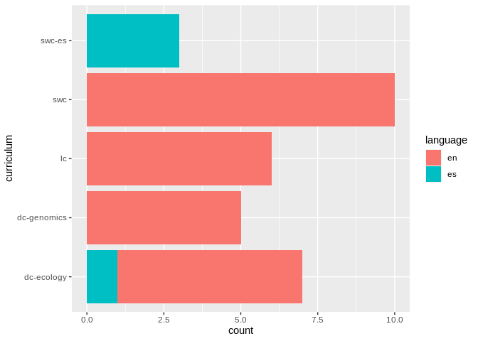

Setup
=====

The source for all the repositories is located at
<a href="https://carpentries.github.io/curriculum-feed/carpentries_lessons.json" class="uri">https://carpentries.github.io/curriculum-feed/carpentries_lessons.json</a>.
To avoid having to pull from it multiple times I’m going to set up a
folder:

``` r
library("fs")       # Filesystem navigation
library("jsonlite") # parsing JSON files
library("purrr")    # handling lists (JSON files)
```

    ## 
    ## Attaching package: 'purrr'

    ## The following object is masked from 'package:jsonlite':
    ## 
    ##     flatten

``` r
library("dplyr")    # handling data frames and magic
```

    ## 
    ## Attaching package: 'dplyr'

    ## The following objects are masked from 'package:stats':
    ## 
    ##     filter, lag

    ## The following objects are masked from 'package:base':
    ## 
    ##     intersect, setdiff, setequal, union

``` r
library("tidyr")    # separating values
library("ggplot2")  # visualization
library("forcats")  # ordering factors
library("magrittr") # for the %T>% pipe I love so well
```

    ## 
    ## Attaching package: 'magrittr'

    ## The following object is masked from 'package:tidyr':
    ## 
    ##     extract

    ## The following object is masked from 'package:purrr':
    ## 
    ##     set_names

``` r
library("gh")       # accessing GitHub's API
library("polite")   # being respectful when downloading files
library("here")     # so I can always remember where I started
```

    ## here() starts at /home/zhian/Documents/Carpentries/Git/zkamvar--postmaul

``` r
raw_data <- here::here("data", "raw")
raw_lessons <- fs::path(raw_data, "carpentries_lessons.json")
if (fs::file_exists(raw_lessons)) {
  
} else {
  fs::dir_create(raw_data)
  res <- download.file(
    url = "https://carpentries.github.io/curriculum-feed/carpentries_lessons.json",
    destfile = raw_lessons
  )
  if (res == 0L) {
    fs::file_chmod(raw_lessons, "a-wx")
  }
}
```

    ## NULL

``` r
lessons <- read_json(raw_lessons, simplifyVector = FALSE) %>%
  purrr::map_dfr(.f = dplyr::as_tibble) %>%
  dplyr::mutate_if(is.character, 
    ~dplyr::if_else(. == "NA", as.character(NA), .)) %>%
  dplyr::mutate(life_cycle = forcats::fct_relevel(life_cycle,
      "pre-alpha", "alpha", "beta", "stable", "on-hold", "deprecated"
    )) %>%
  dplyr::mutate(life_cycle = forcats::fct_explicit_na(life_cycle)) %>%
  print()
```

    ## # A tibble: 88 x 6
    ##    repository        curriculum   life_cycle language `_row` URL                
    ##    <chr>             <chr>        <fct>      <chr>    <chr>  <chr>              
    ##  1 capstone-novice-… <NA>         pre-alpha  en       1      <NA>               
    ##  2 lc-spreadsheets   lc           beta       en       2      https://github.com…
    ##  3 rr-automation     reproducibl… on-hold    en       3      https://github.com…
    ##  4 lesson-example    <NA>         stable     en       4      https://github.com…
    ##  5 git-novice-es     swc-es       stable     es       5      https://github.com…
    ##  6 shell-economics   dc-economics pre-alpha  en       6      https://github.com…
    ##  7 openrefine-ecolo… dc-ecology   stable     en       7      https://github.com…
    ##  8 python-humanitie… <NA>         pre-alpha  en       8      <NA>               
    ##  9 hg-novice         swc          stable     en       9      https://github.com…
    ## 10 spreadsheet-huma… <NA>         pre-alpha  en       10     <NA>               
    ## # … with 78 more rows

First look at available lessons
===============================

I’m going to take a look at all of the software carpentry lessons first.
There are currently 88 available lessons, but they are in different
stages of completion:

``` r
ggplot(lessons, aes(y = life_cycle, fill = curriculum)) +
  geom_bar(orientation = "y")
```


Let’s inspect the ones that are stable and then look at the ones that
are lower down, first we should filter for those that are stable and
actually have GitHub URLs:

``` r
stable <- lessons %>% filter(
  life_cycle == "stable", 
  curriculum != "instructor-training",
  !is.na(curriculum), # these are template repositories
  !is.na(URL)         # no GitHub URL is not very useful for me
)
stable
```

    ## # A tibble: 31 x 6
    ##    repository       curriculum life_cycle language `_row` URL                   
    ##    <chr>            <chr>      <fct>      <chr>    <chr>  <chr>                 
    ##  1 git-novice-es    swc-es     stable     es       5      https://github.com/sw…
    ##  2 openrefine-ecol… dc-ecology stable     en       7      https://github.com/da…
    ##  3 hg-novice        swc        stable     en       9      https://github.com/sw…
    ##  4 matlab-novice-i… swc        stable     en       11     https://github.com/sw…
    ##  5 r-novice-inflam… swc        stable     en       12     https://github.com/sw…
    ##  6 spreadsheet-eco… dc-ecology stable     en       13     https://github.com/da…
    ##  7 python-novice-g… swc        stable     en       16     https://github.com/sw…
    ##  8 lc-data-intro    lc         stable     en       19     https://github.com/Li…
    ##  9 R-ecology-lesson dc-ecology stable     en       20     https://github.com/da…
    ## 10 git-novice       swc        stable     en       24     https://github.com/sw…
    ## # … with 21 more rows

I end up with 31 repositories to play with:

``` r
ggplot(stable, aes(y = curriculum, fill = language)) +
  geom_bar(orientation = "y")
```



Inspection of repository features
=================================

I will use the {gh} package to inspect the features of each repository:

-   tags
-   directory structure
-   dependencies

I can use the GitHub API to get the contents of the repositories:
<a href="https://developer.github.com/v3/repos/contents/#get-contents" class="uri">https://developer.github.com/v3/repos/contents/#get-contents</a>.
The {gh} package allows me to write the responses to disk so that I
don’t have to query every time I want to re-run the analysis. If I
wanted to do this with fresh data, all I would need to do is to clear
the data folder.

One of the tripping points here is that not all of the repositories will
have `_episodes_rmd/` directories, so I will need to walk over these
with `purrr::possibly()`, a nice little failsafe function.

``` r
safegh <- purrr::possibly(gh::gh, otherwise = list(NA))

rmd_episodes <- function(owner, repo) {
  safegh <- purrr::slowly(
    f    = purrr::possibly(gh::gh, otherwise = list(NA)),
    rate = rate_delay(pause = 2)
  )
  OR <- glue::glue("{owner}--{repo}")
  safegh("/repos/:owner/:repo/contents/_episodes_rmd", 
    owner = owner, 
    repo = repo, 
    .destfile = here::here(fs::path("data", "rmd_JSON", OR, ext = "json"))
  )
}

has_rmd <- stable %>%
  tidyr::separate(URL, into = c(NA, NA, NA, "user", NA), sep = "/", remove = FALSE) %>%
  mutate(user = purrr::walk2(.x = user, .y = repository, .f = rmd_episodes)) %>%
  mutate(JSON = purrr::map2(.x = user, .y = repository,
    .f = ~jsonlite::read_json(
      here::here("data", "rmd_JSON", glue::glue("{.x}--{.y}.json"))
    )
  )) %>%
  filter(lengths(JSON) > 2)
```

After parsing, we find that we have RMarkdown files for a grand total of
3:

``` r
all_rmd_files <- has_rmd %>%
  select(user, repository, URL, JSON) %T>%
  print() %>%
  unnest(JSON) %>%
  unnest_wider(JSON) %>%
  filter(!grepl("^\\.git", name))
```

    ## # A tibble: 3 x 4
    ##   user       repository         URL                                    JSON     
    ##   <chr>      <chr>              <chr>                                  <list>   
    ## 1 swcarpent… r-novice-inflamma… https://github.com/swcarpentry/r-novi… <list [3…
    ## 2 swcarpent… r-novice-gapminder https://github.com/swcarpentry/r-novi… <list [1…
    ## 3 swcarpent… r-novice-gapminde… https://github.com/swcarpentry/r-novi… <list [1…

``` r
download_r_file <- purrr::slowly(function(user, repo, name, url) {
  dir <- fs::dir_create(here::here("data", "r-files", user, repo))
  if (fs::file_exists(fs::path(dir, name))) {
    # no need
    0
  } else {
    download.file(
      url = url,
      destfile = fs::path(dir, name)
    )
  }
}, rate = purrr::rate_delay(pause = 2))


all_rmd_files %>%
  select(name, download_url) %>%
  knitr::kable()
```

| name                         | download\_url                                                                                                                                                                                                                                                             |
|:-----------------------------|:--------------------------------------------------------------------------------------------------------------------------------------------------------------------------------------------------------------------------------------------------------------------------|
| 01-starting-with-data.Rmd    | <a href="https://raw.githubusercontent.com/swcarpentry/r-novice-inflammation/master/_episodes_rmd/01-starting-with-data.Rmd" class="uri">https://raw.githubusercontent.com/swcarpentry/r-novice-inflammation/master/_episodes_rmd/01-starting-with-data.Rmd</a>           |
| 02-func-R.Rmd                | <a href="https://raw.githubusercontent.com/swcarpentry/r-novice-inflammation/master/_episodes_rmd/02-func-R.Rmd" class="uri">https://raw.githubusercontent.com/swcarpentry/r-novice-inflammation/master/_episodes_rmd/02-func-R.Rmd</a>                                   |
| 03-loops-R.Rmd               | <a href="https://raw.githubusercontent.com/swcarpentry/r-novice-inflammation/master/_episodes_rmd/03-loops-R.Rmd" class="uri">https://raw.githubusercontent.com/swcarpentry/r-novice-inflammation/master/_episodes_rmd/03-loops-R.Rmd</a>                                 |
| 04-cond.Rmd                  | <a href="https://raw.githubusercontent.com/swcarpentry/r-novice-inflammation/master/_episodes_rmd/04-cond.Rmd" class="uri">https://raw.githubusercontent.com/swcarpentry/r-novice-inflammation/master/_episodes_rmd/04-cond.Rmd</a>                                       |
| 05-cmdline.Rmd               | <a href="https://raw.githubusercontent.com/swcarpentry/r-novice-inflammation/master/_episodes_rmd/05-cmdline.Rmd" class="uri">https://raw.githubusercontent.com/swcarpentry/r-novice-inflammation/master/_episodes_rmd/05-cmdline.Rmd</a>                                 |
| 06-best-practices-R.Rmd      | <a href="https://raw.githubusercontent.com/swcarpentry/r-novice-inflammation/master/_episodes_rmd/06-best-practices-R.Rmd" class="uri">https://raw.githubusercontent.com/swcarpentry/r-novice-inflammation/master/_episodes_rmd/06-best-practices-R.Rmd</a>               |
| 07-knitr-R.Rmd               | <a href="https://raw.githubusercontent.com/swcarpentry/r-novice-inflammation/master/_episodes_rmd/07-knitr-R.Rmd" class="uri">https://raw.githubusercontent.com/swcarpentry/r-novice-inflammation/master/_episodes_rmd/07-knitr-R.Rmd</a>                                 |
| 08-making-packages-R.Rmd     | <a href="https://raw.githubusercontent.com/swcarpentry/r-novice-inflammation/master/_episodes_rmd/08-making-packages-R.Rmd" class="uri">https://raw.githubusercontent.com/swcarpentry/r-novice-inflammation/master/_episodes_rmd/08-making-packages-R.Rmd</a>             |
| 09-supp-intro-rstudio.Rmd    | <a href="https://raw.githubusercontent.com/swcarpentry/r-novice-inflammation/master/_episodes_rmd/09-supp-intro-rstudio.Rmd" class="uri">https://raw.githubusercontent.com/swcarpentry/r-novice-inflammation/master/_episodes_rmd/09-supp-intro-rstudio.Rmd</a>           |
| 10-supp-addressing-data.Rmd  | <a href="https://raw.githubusercontent.com/swcarpentry/r-novice-inflammation/master/_episodes_rmd/10-supp-addressing-data.Rmd" class="uri">https://raw.githubusercontent.com/swcarpentry/r-novice-inflammation/master/_episodes_rmd/10-supp-addressing-data.Rmd</a>       |
| 11-supp-read-write-csv.Rmd   | <a href="https://raw.githubusercontent.com/swcarpentry/r-novice-inflammation/master/_episodes_rmd/11-supp-read-write-csv.Rmd" class="uri">https://raw.githubusercontent.com/swcarpentry/r-novice-inflammation/master/_episodes_rmd/11-supp-read-write-csv.Rmd</a>         |
| 12-supp-factors.Rmd          | <a href="https://raw.githubusercontent.com/swcarpentry/r-novice-inflammation/master/_episodes_rmd/12-supp-factors.Rmd" class="uri">https://raw.githubusercontent.com/swcarpentry/r-novice-inflammation/master/_episodes_rmd/12-supp-factors.Rmd</a>                       |
| 13-supp-data-structures.Rmd  | <a href="https://raw.githubusercontent.com/swcarpentry/r-novice-inflammation/master/_episodes_rmd/13-supp-data-structures.Rmd" class="uri">https://raw.githubusercontent.com/swcarpentry/r-novice-inflammation/master/_episodes_rmd/13-supp-data-structures.Rmd</a>       |
| 14-supp-call-stack.Rmd       | <a href="https://raw.githubusercontent.com/swcarpentry/r-novice-inflammation/master/_episodes_rmd/14-supp-call-stack.Rmd" class="uri">https://raw.githubusercontent.com/swcarpentry/r-novice-inflammation/master/_episodes_rmd/14-supp-call-stack.Rmd</a>                 |
| 15-supp-loops-in-depth.Rmd   | <a href="https://raw.githubusercontent.com/swcarpentry/r-novice-inflammation/master/_episodes_rmd/15-supp-loops-in-depth.Rmd" class="uri">https://raw.githubusercontent.com/swcarpentry/r-novice-inflammation/master/_episodes_rmd/15-supp-loops-in-depth.Rmd</a>         |
| arith.R                      | <a href="https://raw.githubusercontent.com/swcarpentry/r-novice-inflammation/master/_episodes_rmd/arith.R" class="uri">https://raw.githubusercontent.com/swcarpentry/r-novice-inflammation/master/_episodes_rmd/arith.R</a>                                               |
| check.R                      | <a href="https://raw.githubusercontent.com/swcarpentry/r-novice-inflammation/master/_episodes_rmd/check.R" class="uri">https://raw.githubusercontent.com/swcarpentry/r-novice-inflammation/master/_episodes_rmd/check.R</a>                                               |
| count-stdin.R                | <a href="https://raw.githubusercontent.com/swcarpentry/r-novice-inflammation/master/_episodes_rmd/count-stdin.R" class="uri">https://raw.githubusercontent.com/swcarpentry/r-novice-inflammation/master/_episodes_rmd/count-stdin.R</a>                                   |
| data                         | NA                                                                                                                                                                                                                                                                        |
| find-pattern.R               | <a href="https://raw.githubusercontent.com/swcarpentry/r-novice-inflammation/master/_episodes_rmd/find-pattern.R" class="uri">https://raw.githubusercontent.com/swcarpentry/r-novice-inflammation/master/_episodes_rmd/find-pattern.R</a>                                 |
| inflammation.R               | <a href="https://raw.githubusercontent.com/swcarpentry/r-novice-inflammation/master/_episodes_rmd/inflammation.R" class="uri">https://raw.githubusercontent.com/swcarpentry/r-novice-inflammation/master/_episodes_rmd/inflammation.R</a>                                 |
| inflammation\_fxns.R         | <a href="https://raw.githubusercontent.com/swcarpentry/r-novice-inflammation/master/_episodes_rmd/inflammation_fxns.R" class="uri">https://raw.githubusercontent.com/swcarpentry/r-novice-inflammation/master/_episodes_rmd/inflammation_fxns.R</a>                       |
| line-count.R                 | <a href="https://raw.githubusercontent.com/swcarpentry/r-novice-inflammation/master/_episodes_rmd/line-count.R" class="uri">https://raw.githubusercontent.com/swcarpentry/r-novice-inflammation/master/_episodes_rmd/line-count.R</a>                                     |
| print-args-trailing.R        | <a href="https://raw.githubusercontent.com/swcarpentry/r-novice-inflammation/master/_episodes_rmd/print-args-trailing.R" class="uri">https://raw.githubusercontent.com/swcarpentry/r-novice-inflammation/master/_episodes_rmd/print-args-trailing.R</a>                   |
| print-args.R                 | <a href="https://raw.githubusercontent.com/swcarpentry/r-novice-inflammation/master/_episodes_rmd/print-args.R" class="uri">https://raw.githubusercontent.com/swcarpentry/r-novice-inflammation/master/_episodes_rmd/print-args.R</a>                                     |
| readings-01.R                | <a href="https://raw.githubusercontent.com/swcarpentry/r-novice-inflammation/master/_episodes_rmd/readings-01.R" class="uri">https://raw.githubusercontent.com/swcarpentry/r-novice-inflammation/master/_episodes_rmd/readings-01.R</a>                                   |
| readings-02.R                | <a href="https://raw.githubusercontent.com/swcarpentry/r-novice-inflammation/master/_episodes_rmd/readings-02.R" class="uri">https://raw.githubusercontent.com/swcarpentry/r-novice-inflammation/master/_episodes_rmd/readings-02.R</a>                                   |
| readings-03.R                | <a href="https://raw.githubusercontent.com/swcarpentry/r-novice-inflammation/master/_episodes_rmd/readings-03.R" class="uri">https://raw.githubusercontent.com/swcarpentry/r-novice-inflammation/master/_episodes_rmd/readings-03.R</a>                                   |
| readings-04.R                | <a href="https://raw.githubusercontent.com/swcarpentry/r-novice-inflammation/master/_episodes_rmd/readings-04.R" class="uri">https://raw.githubusercontent.com/swcarpentry/r-novice-inflammation/master/_episodes_rmd/readings-04.R</a>                                   |
| readings-05.R                | <a href="https://raw.githubusercontent.com/swcarpentry/r-novice-inflammation/master/_episodes_rmd/readings-05.R" class="uri">https://raw.githubusercontent.com/swcarpentry/r-novice-inflammation/master/_episodes_rmd/readings-05.R</a>                                   |
| readings-06.R                | <a href="https://raw.githubusercontent.com/swcarpentry/r-novice-inflammation/master/_episodes_rmd/readings-06.R" class="uri">https://raw.githubusercontent.com/swcarpentry/r-novice-inflammation/master/_episodes_rmd/readings-06.R</a>                                   |
| readings-short.R             | <a href="https://raw.githubusercontent.com/swcarpentry/r-novice-inflammation/master/_episodes_rmd/readings-short.R" class="uri">https://raw.githubusercontent.com/swcarpentry/r-novice-inflammation/master/_episodes_rmd/readings-short.R</a>                             |
| readings-usage.R             | <a href="https://raw.githubusercontent.com/swcarpentry/r-novice-inflammation/master/_episodes_rmd/readings-usage.R" class="uri">https://raw.githubusercontent.com/swcarpentry/r-novice-inflammation/master/_episodes_rmd/readings-usage.R</a>                             |
| session-info.R               | <a href="https://raw.githubusercontent.com/swcarpentry/r-novice-inflammation/master/_episodes_rmd/session-info.R" class="uri">https://raw.githubusercontent.com/swcarpentry/r-novice-inflammation/master/_episodes_rmd/session-info.R</a>                                 |
| 01-rstudio-intro.Rmd         | <a href="https://raw.githubusercontent.com/swcarpentry/r-novice-gapminder/master/_episodes_rmd/01-rstudio-intro.Rmd" class="uri">https://raw.githubusercontent.com/swcarpentry/r-novice-gapminder/master/_episodes_rmd/01-rstudio-intro.Rmd</a>                           |
| 02-project-intro.Rmd         | <a href="https://raw.githubusercontent.com/swcarpentry/r-novice-gapminder/master/_episodes_rmd/02-project-intro.Rmd" class="uri">https://raw.githubusercontent.com/swcarpentry/r-novice-gapminder/master/_episodes_rmd/02-project-intro.Rmd</a>                           |
| 03-seeking-help.Rmd          | <a href="https://raw.githubusercontent.com/swcarpentry/r-novice-gapminder/master/_episodes_rmd/03-seeking-help.Rmd" class="uri">https://raw.githubusercontent.com/swcarpentry/r-novice-gapminder/master/_episodes_rmd/03-seeking-help.Rmd</a>                             |
| 04-data-structures-part1.Rmd | <a href="https://raw.githubusercontent.com/swcarpentry/r-novice-gapminder/master/_episodes_rmd/04-data-structures-part1.Rmd" class="uri">https://raw.githubusercontent.com/swcarpentry/r-novice-gapminder/master/_episodes_rmd/04-data-structures-part1.Rmd</a>           |
| 05-data-structures-part2.Rmd | <a href="https://raw.githubusercontent.com/swcarpentry/r-novice-gapminder/master/_episodes_rmd/05-data-structures-part2.Rmd" class="uri">https://raw.githubusercontent.com/swcarpentry/r-novice-gapminder/master/_episodes_rmd/05-data-structures-part2.Rmd</a>           |
| 06-data-subsetting.Rmd       | <a href="https://raw.githubusercontent.com/swcarpentry/r-novice-gapminder/master/_episodes_rmd/06-data-subsetting.Rmd" class="uri">https://raw.githubusercontent.com/swcarpentry/r-novice-gapminder/master/_episodes_rmd/06-data-subsetting.Rmd</a>                       |
| 07-control-flow.Rmd          | <a href="https://raw.githubusercontent.com/swcarpentry/r-novice-gapminder/master/_episodes_rmd/07-control-flow.Rmd" class="uri">https://raw.githubusercontent.com/swcarpentry/r-novice-gapminder/master/_episodes_rmd/07-control-flow.Rmd</a>                             |
| 08-plot-ggplot2.Rmd          | <a href="https://raw.githubusercontent.com/swcarpentry/r-novice-gapminder/master/_episodes_rmd/08-plot-ggplot2.Rmd" class="uri">https://raw.githubusercontent.com/swcarpentry/r-novice-gapminder/master/_episodes_rmd/08-plot-ggplot2.Rmd</a>                             |
| 09-vectorization.Rmd         | <a href="https://raw.githubusercontent.com/swcarpentry/r-novice-gapminder/master/_episodes_rmd/09-vectorization.Rmd" class="uri">https://raw.githubusercontent.com/swcarpentry/r-novice-gapminder/master/_episodes_rmd/09-vectorization.Rmd</a>                           |
| 10-functions.Rmd             | <a href="https://raw.githubusercontent.com/swcarpentry/r-novice-gapminder/master/_episodes_rmd/10-functions.Rmd" class="uri">https://raw.githubusercontent.com/swcarpentry/r-novice-gapminder/master/_episodes_rmd/10-functions.Rmd</a>                                   |
| 11-writing-data.Rmd          | <a href="https://raw.githubusercontent.com/swcarpentry/r-novice-gapminder/master/_episodes_rmd/11-writing-data.Rmd" class="uri">https://raw.githubusercontent.com/swcarpentry/r-novice-gapminder/master/_episodes_rmd/11-writing-data.Rmd</a>                             |
| 12-plyr.Rmd                  | <a href="https://raw.githubusercontent.com/swcarpentry/r-novice-gapminder/master/_episodes_rmd/12-plyr.Rmd" class="uri">https://raw.githubusercontent.com/swcarpentry/r-novice-gapminder/master/_episodes_rmd/12-plyr.Rmd</a>                                             |
| 13-dplyr.Rmd                 | <a href="https://raw.githubusercontent.com/swcarpentry/r-novice-gapminder/master/_episodes_rmd/13-dplyr.Rmd" class="uri">https://raw.githubusercontent.com/swcarpentry/r-novice-gapminder/master/_episodes_rmd/13-dplyr.Rmd</a>                                           |
| 14-tidyr.Rmd                 | <a href="https://raw.githubusercontent.com/swcarpentry/r-novice-gapminder/master/_episodes_rmd/14-tidyr.Rmd" class="uri">https://raw.githubusercontent.com/swcarpentry/r-novice-gapminder/master/_episodes_rmd/14-tidyr.Rmd</a>                                           |
| 15-knitr-markdown.Rmd        | <a href="https://raw.githubusercontent.com/swcarpentry/r-novice-gapminder/master/_episodes_rmd/15-knitr-markdown.Rmd" class="uri">https://raw.githubusercontent.com/swcarpentry/r-novice-gapminder/master/_episodes_rmd/15-knitr-markdown.Rmd</a>                         |
| 16-wrap-up.Rmd               | <a href="https://raw.githubusercontent.com/swcarpentry/r-novice-gapminder/master/_episodes_rmd/16-wrap-up.Rmd" class="uri">https://raw.githubusercontent.com/swcarpentry/r-novice-gapminder/master/_episodes_rmd/16-wrap-up.Rmd</a>                                       |
| data                         | NA                                                                                                                                                                                                                                                                        |
| 01-rstudio-intro.Rmd         | <a href="https://raw.githubusercontent.com/swcarpentry/r-novice-gapminder-es/gh-pages/_episodes_rmd/01-rstudio-intro.Rmd" class="uri">https://raw.githubusercontent.com/swcarpentry/r-novice-gapminder-es/gh-pages/_episodes_rmd/01-rstudio-intro.Rmd</a>                 |
| 02-project-intro.Rmd         | <a href="https://raw.githubusercontent.com/swcarpentry/r-novice-gapminder-es/gh-pages/_episodes_rmd/02-project-intro.Rmd" class="uri">https://raw.githubusercontent.com/swcarpentry/r-novice-gapminder-es/gh-pages/_episodes_rmd/02-project-intro.Rmd</a>                 |
| 03-seeking-help.Rmd          | <a href="https://raw.githubusercontent.com/swcarpentry/r-novice-gapminder-es/gh-pages/_episodes_rmd/03-seeking-help.Rmd" class="uri">https://raw.githubusercontent.com/swcarpentry/r-novice-gapminder-es/gh-pages/_episodes_rmd/03-seeking-help.Rmd</a>                   |
| 04-data-structures-part1.Rmd | <a href="https://raw.githubusercontent.com/swcarpentry/r-novice-gapminder-es/gh-pages/_episodes_rmd/04-data-structures-part1.Rmd" class="uri">https://raw.githubusercontent.com/swcarpentry/r-novice-gapminder-es/gh-pages/_episodes_rmd/04-data-structures-part1.Rmd</a> |
| 05-data-structures-part2.Rmd | <a href="https://raw.githubusercontent.com/swcarpentry/r-novice-gapminder-es/gh-pages/_episodes_rmd/05-data-structures-part2.Rmd" class="uri">https://raw.githubusercontent.com/swcarpentry/r-novice-gapminder-es/gh-pages/_episodes_rmd/05-data-structures-part2.Rmd</a> |
| 06-data-subsetting.Rmd       | <a href="https://raw.githubusercontent.com/swcarpentry/r-novice-gapminder-es/gh-pages/_episodes_rmd/06-data-subsetting.Rmd" class="uri">https://raw.githubusercontent.com/swcarpentry/r-novice-gapminder-es/gh-pages/_episodes_rmd/06-data-subsetting.Rmd</a>             |
| 07-control-flow.Rmd          | <a href="https://raw.githubusercontent.com/swcarpentry/r-novice-gapminder-es/gh-pages/_episodes_rmd/07-control-flow.Rmd" class="uri">https://raw.githubusercontent.com/swcarpentry/r-novice-gapminder-es/gh-pages/_episodes_rmd/07-control-flow.Rmd</a>                   |
| 08-plot-ggplot2.Rmd          | <a href="https://raw.githubusercontent.com/swcarpentry/r-novice-gapminder-es/gh-pages/_episodes_rmd/08-plot-ggplot2.Rmd" class="uri">https://raw.githubusercontent.com/swcarpentry/r-novice-gapminder-es/gh-pages/_episodes_rmd/08-plot-ggplot2.Rmd</a>                   |
| 09-vectorization.Rmd         | <a href="https://raw.githubusercontent.com/swcarpentry/r-novice-gapminder-es/gh-pages/_episodes_rmd/09-vectorization.Rmd" class="uri">https://raw.githubusercontent.com/swcarpentry/r-novice-gapminder-es/gh-pages/_episodes_rmd/09-vectorization.Rmd</a>                 |
| 10-functions.Rmd             | <a href="https://raw.githubusercontent.com/swcarpentry/r-novice-gapminder-es/gh-pages/_episodes_rmd/10-functions.Rmd" class="uri">https://raw.githubusercontent.com/swcarpentry/r-novice-gapminder-es/gh-pages/_episodes_rmd/10-functions.Rmd</a>                         |
| 11-writing-data.Rmd          | <a href="https://raw.githubusercontent.com/swcarpentry/r-novice-gapminder-es/gh-pages/_episodes_rmd/11-writing-data.Rmd" class="uri">https://raw.githubusercontent.com/swcarpentry/r-novice-gapminder-es/gh-pages/_episodes_rmd/11-writing-data.Rmd</a>                   |
| 12-plyr.Rmd                  | <a href="https://raw.githubusercontent.com/swcarpentry/r-novice-gapminder-es/gh-pages/_episodes_rmd/12-plyr.Rmd" class="uri">https://raw.githubusercontent.com/swcarpentry/r-novice-gapminder-es/gh-pages/_episodes_rmd/12-plyr.Rmd</a>                                   |
| 13-dplyr.Rmd                 | <a href="https://raw.githubusercontent.com/swcarpentry/r-novice-gapminder-es/gh-pages/_episodes_rmd/13-dplyr.Rmd" class="uri">https://raw.githubusercontent.com/swcarpentry/r-novice-gapminder-es/gh-pages/_episodes_rmd/13-dplyr.Rmd</a>                                 |
| 14-tidyr.Rmd                 | <a href="https://raw.githubusercontent.com/swcarpentry/r-novice-gapminder-es/gh-pages/_episodes_rmd/14-tidyr.Rmd" class="uri">https://raw.githubusercontent.com/swcarpentry/r-novice-gapminder-es/gh-pages/_episodes_rmd/14-tidyr.Rmd</a>                                 |
| 15-knitr-markdown.Rmd        | <a href="https://raw.githubusercontent.com/swcarpentry/r-novice-gapminder-es/gh-pages/_episodes_rmd/15-knitr-markdown.Rmd" class="uri">https://raw.githubusercontent.com/swcarpentry/r-novice-gapminder-es/gh-pages/_episodes_rmd/15-knitr-markdown.Rmd</a>               |
| 16-wrap-up.Rmd               | <a href="https://raw.githubusercontent.com/swcarpentry/r-novice-gapminder-es/gh-pages/_episodes_rmd/16-wrap-up.Rmd" class="uri">https://raw.githubusercontent.com/swcarpentry/r-novice-gapminder-es/gh-pages/_episodes_rmd/16-wrap-up.Rmd</a>                             |
| data                         | NA                                                                                                                                                                                                                                                                        |
| index.md                     | <a href="https://raw.githubusercontent.com/swcarpentry/r-novice-gapminder-es/gh-pages/_episodes_rmd/index.md" class="uri">https://raw.githubusercontent.com/swcarpentry/r-novice-gapminder-es/gh-pages/_episodes_rmd/index.md</a>                                         |
| reference.md                 | <a href="https://raw.githubusercontent.com/swcarpentry/r-novice-gapminder-es/gh-pages/_episodes_rmd/reference.md" class="uri">https://raw.githubusercontent.com/swcarpentry/r-novice-gapminder-es/gh-pages/_episodes_rmd/reference.md</a>                                 |

``` r
all_rmd_files %>%
  mutate(result = pmap_chr(list(user, repository, name, download_url), download_r_file))
```

    ## # A tibble: 70 x 14
    ##    user  repository URL   name  path  sha    size url   html_url git_url
    ##    <chr> <chr>      <chr> <chr> <chr> <chr> <int> <chr> <chr>    <chr>  
    ##  1 swca… r-novice-… http… 01-s… _epi… 47b1… 24895 http… https:/… https:…
    ##  2 swca… r-novice-… http… 02-f… _epi… 9e54… 18464 http… https:/… https:…
    ##  3 swca… r-novice-… http… 03-l… _epi… 7c3d… 12132 http… https:/… https:…
    ##  4 swca… r-novice-… http… 04-c… _epi… 6a63… 15431 http… https:/… https:…
    ##  5 swca… r-novice-… http… 05-c… _epi… a481… 15090 http… https:/… https:…
    ##  6 swca… r-novice-… http… 06-b… _epi… 03dc…  9227 http… https:/… https:…
    ##  7 swca… r-novice-… http… 07-k… _epi… 5bd0…  3746 http… https:/… https:…
    ##  8 swca… r-novice-… http… 08-m… _epi… 983f…  6978 http… https:/… https:…
    ##  9 swca… r-novice-… http… 09-s… _epi… db80…  3594 http… https:/… https:…
    ## 10 swca… r-novice-… http… 10-s… _epi… 34e3…  6219 http… https:/… https:…
    ## # … with 60 more rows, and 4 more variables: download_url <chr>, type <chr>,
    ## #   `_links` <list>, result <chr>

Session Information
===================

``` r
sessioninfo::session_info()
```

    ## ─ Session info ───────────────────────────────────────────────────────────────
    ##  setting  value                       
    ##  version  R version 3.6.3 (2020-02-29)
    ##  os       Ubuntu 18.04.4 LTS          
    ##  system   x86_64, linux-gnu           
    ##  ui       X11                         
    ##  language (EN)                        
    ##  collate  en_US.UTF-8                 
    ##  ctype    en_US.UTF-8                 
    ##  tz       America/Los_Angeles         
    ##  date     2020-03-30                  
    ## 
    ## ─ Packages ───────────────────────────────────────────────────────────────────
    ##  package     * version date       lib source        
    ##  assertthat    0.2.1   2019-03-21 [1] CRAN (R 3.6.3)
    ##  backports     1.1.5   2019-10-02 [1] CRAN (R 3.6.3)
    ##  cli           2.0.2   2020-02-28 [1] CRAN (R 3.6.3)
    ##  colorspace    1.4-1   2019-03-18 [1] CRAN (R 3.6.3)
    ##  crayon        1.3.4   2017-09-16 [1] CRAN (R 3.6.3)
    ##  digest        0.6.25  2020-02-23 [1] CRAN (R 3.6.3)
    ##  dplyr       * 0.8.5   2020-03-07 [1] CRAN (R 3.6.3)
    ##  ellipsis      0.3.0   2019-09-20 [1] CRAN (R 3.6.3)
    ##  evaluate      0.14    2019-05-28 [1] CRAN (R 3.6.3)
    ##  fansi         0.4.1   2020-01-08 [1] CRAN (R 3.6.3)
    ##  farver        2.0.3   2020-01-16 [1] CRAN (R 3.6.3)
    ##  forcats     * 0.5.0   2020-03-01 [1] CRAN (R 3.6.3)
    ##  fs          * 1.3.2   2020-03-05 [1] CRAN (R 3.6.3)
    ##  ggplot2     * 3.3.0   2020-03-05 [1] CRAN (R 3.6.3)
    ##  gh          * 1.1.0   2020-01-24 [1] CRAN (R 3.6.3)
    ##  glue          1.3.2   2020-03-12 [1] CRAN (R 3.6.3)
    ##  gtable        0.3.0   2019-03-25 [1] CRAN (R 3.6.3)
    ##  here        * 0.1     2017-05-28 [1] CRAN (R 3.6.3)
    ##  highr         0.8     2019-03-20 [1] CRAN (R 3.6.3)
    ##  htmltools     0.4.0   2019-10-04 [1] CRAN (R 3.6.3)
    ##  httr          1.4.1   2019-08-05 [1] CRAN (R 3.6.3)
    ##  jsonlite    * 1.6.1   2020-02-02 [1] CRAN (R 3.6.3)
    ##  knitr         1.28    2020-02-06 [1] CRAN (R 3.6.3)
    ##  labeling      0.3     2014-08-23 [1] CRAN (R 3.6.3)
    ##  lifecycle     0.2.0   2020-03-06 [1] CRAN (R 3.6.3)
    ##  magrittr    * 1.5     2014-11-22 [1] CRAN (R 3.6.3)
    ##  memoise       1.1.0   2017-04-21 [1] CRAN (R 3.6.3)
    ##  munsell       0.5.0   2018-06-12 [1] CRAN (R 3.6.3)
    ##  pillar        1.4.3   2019-12-20 [1] CRAN (R 3.6.3)
    ##  pkgconfig     2.0.3   2019-09-22 [1] CRAN (R 3.6.3)
    ##  polite      * 0.1.1   2019-11-30 [1] CRAN (R 3.6.3)
    ##  purrr       * 0.3.3   2019-10-18 [1] CRAN (R 3.6.3)
    ##  R6            2.4.1   2019-11-12 [1] CRAN (R 3.6.3)
    ##  ratelimitr    0.4.1   2018-10-07 [1] CRAN (R 3.6.3)
    ##  Rcpp          1.0.4   2020-03-17 [1] CRAN (R 3.6.3)
    ##  rlang         0.4.5   2020-03-01 [1] CRAN (R 3.6.3)
    ##  rmarkdown     2.1     2020-01-20 [1] CRAN (R 3.6.3)
    ##  robotstxt     0.6.2   2018-07-18 [1] CRAN (R 3.6.3)
    ##  rprojroot     1.3-2   2018-01-03 [1] CRAN (R 3.6.3)
    ##  rvest         0.3.5   2019-11-08 [1] CRAN (R 3.6.3)
    ##  scales        1.1.0   2019-11-18 [1] CRAN (R 3.6.3)
    ##  sessioninfo   1.1.1   2018-11-05 [1] CRAN (R 3.6.3)
    ##  stringi       1.4.6   2020-02-17 [1] CRAN (R 3.6.3)
    ##  stringr       1.4.0   2019-02-10 [1] CRAN (R 3.6.3)
    ##  tibble        3.0.0   2020-03-30 [1] CRAN (R 3.6.3)
    ##  tidyr       * 1.0.2   2020-01-24 [1] CRAN (R 3.6.3)
    ##  tidyselect    1.0.0   2020-01-27 [1] CRAN (R 3.6.3)
    ##  usethis       1.5.1   2019-07-04 [1] CRAN (R 3.6.3)
    ##  utf8          1.1.4   2018-05-24 [1] CRAN (R 3.6.3)
    ##  vctrs         0.2.4   2020-03-10 [1] CRAN (R 3.6.3)
    ##  withr         2.1.2   2018-03-15 [1] CRAN (R 3.6.3)
    ##  xfun          0.12    2020-01-13 [1] CRAN (R 3.6.3)
    ##  xml2          1.2.5   2020-03-11 [1] CRAN (R 3.6.3)
    ##  yaml          2.2.1   2020-02-01 [1] CRAN (R 3.6.3)
    ## 
    ## [1] /home/zhian/R/library
    ## [2] /usr/local/lib/R/site-library
    ## [3] /usr/lib/R/site-library
    ## [4] /usr/lib/R/library
